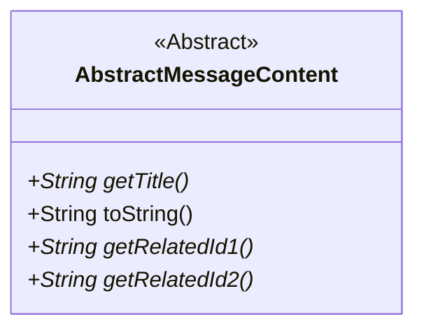
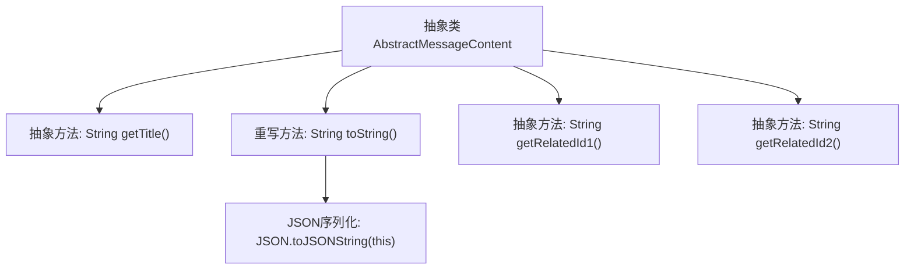

# 基础信息

|      |      |
|------|------|
| 名称 | AbstractMessageContent |
| 编码语言 | .java |
| 代码路径 | WeFe/board/board-service/src/main/java/com/welab/wefe/board/service/dto/vo/message/AbstractMessageContent.java |
| 包名 | com.welab.wefe.board.service.dto.vo.message |
| 依赖项 | ['com.alibaba.fastjson.JSON'] |
| 概述说明 | 抽象类AbstractMessageContent定义消息内容结构，包含获取标题、关联ID1和ID2的抽象方法，toString方法返回JSON字符串。 |

# 说明

该内容描述了一个名为AbstractMessageContent的抽象类，定义了消息内容的通用结构。类包含三个核心抽象方法：getTitle用于获取标题，getRelatedId1和getRelatedId2用于获取正文中关联对象的ID（如项目ID等）。类还重写了toString方法，使用JSON格式输出对象内容。这个抽象类为具体消息内容实现提供了基础模板，强调关联ID在业务场景中的重要性（如项目成员邀请场景）。

# 类列表 Class Summary

| 名称   | 类型  | 说明 |
|-------|------|-------------|
| AbstractMessageContent | class | 抽象类AbstractMessageContent定义消息内容结构，包含获取标题、关联ID1和ID2的抽象方法，并重写toString方法以JSON格式输出对象。 |

## 类 AbstractMessageContent

|      |      |
|------|------|
| 访问范围 | public abstract |
| 类型 | class |
| 名称 | AbstractMessageContent |
| 说明 | 抽象类AbstractMessageContent定义消息内容结构，包含获取标题、关联ID1和ID2的抽象方法，并重写toString方法以JSON格式输出对象。 |

### UML类图

这段类图展示了一个抽象类AbstractMessageContent，它定义了消息内容的基本结构。该类包含4个方法：1个具体方法toString()用于JSON序列化，3个抽象方法getTitle()、getRelatedId1()和getRelatedId2()需要子类实现。其中getRelatedId方法用于获取消息关联的业务对象ID，如项目ID等。该类作为消息内容的基类，通过抽象方法强制子类实现关键业务逻辑，同时提供了通用的JSON序列化能力。

### 内部方法调用关系图

这段流程图展示了抽象类AbstractMessageContent的结构，包含4个核心方法：getTitle()用于获取标题，toString()通过JSON序列化对象，getRelatedId1()和getRelatedId2()用于获取关联ID。所有方法均为抽象方法（除toString外），需要子类实现具体逻辑。toString()方法内部调用JSON工具类实现对象序列化，体现了模板方法设计模式的特点。

### 字段列表 Field List

| 名称  | 类型  | 说明 |
|-------|-------|------|

### 方法列表

| 名称  | 类型  | 说明 |
|-------|-------|------|
| toString | String | 重写toString方法，返回当前对象的JSON字符串表示。 |
| getTitle | String | 抽象方法getTitle，返回字符串类型的标题。 |
| getRelatedId1 | String | 抽象方法，返回关联ID1的字符串。 |
| getRelatedId2 | String | 抽象方法，返回关联ID2的字符串。 |

