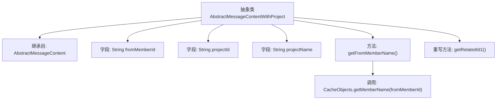

# 基础信息

|      |      |
|------|------|
| 名称 | AbstractMessageContentWithProject |
| 编码语言 | .java |
| 代码路径 | WeFe/board/board-service/src/main/java/com/welab/wefe/board/service/dto/vo/message/AbstractMessageContentWithProject.java |
| 包名 | com.welab.wefe.board.service.dto.vo.message |
| 依赖项 | ['com.welab.wefe.board.service.service.CacheObjects'] |
| 概述说明 | 抽象类AbstractMessageContentWithProject继承AbstractMessageContent，包含成员ID、项目ID和名称字段，提供获取成员名称和项目ID的方法。 |

# 说明

这是一个名为AbstractMessageContentWithProject的抽象类，继承自AbstractMessageContent。该类包含三个成员变量：fromMemberId表示发送成员ID，projectId表示项目ID，projectName表示项目名称。提供了getFromMemberName方法通过CacheObjects获取成员名称，并重写了getRelatedId1方法返回projectId。

# 类列表 Class Summary

| 名称   | 类型  | 说明 |
|-------|------|-------------|
| AbstractMessageContentWithProject | class | 抽象类AbstractMessageContentWithProject继承AbstractMessageContent，包含成员ID、项目ID和名称字段，提供获取成员名和项目ID的方法。 |


## 类 AbstractMessageContentWithProject

|      |      |
|------|------|
| 访问范围 | public abstract |
| 类型 | class |
| 名称 | AbstractMessageContentWithProject |
| 说明 | 抽象类AbstractMessageContentWithProject继承AbstractMessageContent，包含成员ID、项目ID和名称字段，提供获取成员名和项目ID的方法。 |


### UML类图

```mermaid
classDiagram
    class AbstractMessageContent {
        <<Abstract>>
        +String getRelatedId1()*
    }
    
    class AbstractMessageContentWithProject {
        <<Abstract>>
        -String fromMemberId
        -String projectId
        -String projectName
        +String getFromMemberName()
        +String getRelatedId1()
    }
    
    AbstractMessageContent <|-- AbstractMessageContentWithProject : 继承
    AbstractMessageContentWithProject ..> CacheObjects : 依赖: 调用静态方法
```

这段类图展示了抽象类`AbstractMessageContentWithProject`继承自`AbstractMessageContent`的关系。子类新增了三个字符串属性和一个获取成员名称的方法，并重写了父类的抽象方法`getRelatedId1`。图中还显示了子类对`CacheObjects`工具类的静态方法调用依赖。该设计实现了消息内容与项目信息的关联，通过继承扩展了基础消息内容的功能。


### 内部方法调用关系图



这段流程图展示了AbstractMessageContentWithProject类的结构，它是一个继承自AbstractMessageContent的抽象类。类中包含三个字符串字段：fromMemberId、projectId和projectName。定义了两个方法：getFromMemberName()方法会调用CacheObjects.getMemberName()来获取成员名称，而重写的getRelatedId1()方法直接返回projectId字段。流程图清晰地呈现了类的继承关系、字段定义和方法调用逻辑。

### 字段列表 Field List

| 名称  | 类型  | 说明 |
|-------|-------|------|
| fromMemberId | String | 成员ID来源字段，类型为字符串。 |
| projectName | String | 声明一个公共字符串变量projectName。 |
| projectId | String | 声明一个公共字符串变量projectId。 |

### 方法列表

| 名称  | 类型  | 说明 |
|-------|-------|------|
| getFromMemberName | String | 该方法通过调用CacheObjects.getMemberName，根据fromMemberId获取并返回对应的成员名称。 |
| getRelatedId1 | String | 方法getRelatedId1返回projectId的值。 |


