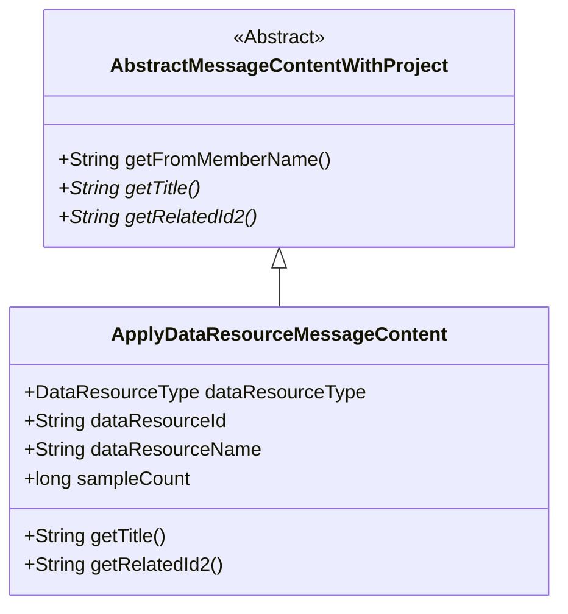
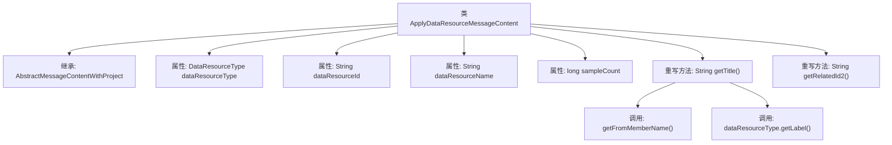

# 基础信息

|      |      |
|------|------|
| 名称 | ApplyDataResourceMessageContent |
| 编码语言 | .java |
| 代码路径 | WeFe/board/board-service/src/main/java/com/welab/wefe/board/service/dto/vo/message/ApplyDataResourceMessageContent.java |
| 包名 | com.welab.wefe.board.service.dto.vo.message |
| 依赖项 | ['com.welab.wefe.common.wefe.enums.DataResourceType'] |
| 概述说明 | ApplyDataResourceMessageContent类继承AbstractMessageContentWithProject，包含资源类型、ID、名称和样本数，重写getTitle和getRelatedId2方法用于生成标题和获取资源ID。 |

# 说明

这是一个名为ApplyDataResourceMessageContent的Java类，继承自AbstractMessageContentWithProject。类包含四个成员变量：dataResourceType表示数据类型，dataResourceId和dataResourceName分别存储数据资源的ID和名称，sampleCount记录样本数量。重写了getTitle方法生成包含成员名称、数据类型标签、资源名称和样本数量的标题字符串。还重写了getRelatedId2方法返回数据资源ID。

# 类列表 Class Summary

| 名称   | 类型  | 说明 |
|-------|------|-------------|
| ApplyDataResourceMessageContent | class | ApplyDataResourceMessageContent类继承AbstractMessageContentWithProject，包含资源类型、ID、名称和样本数，重写getTitle和getRelatedId2方法。 |

## 类 ApplyDataResourceMessageContent

|      |      |
|------|------|
| 访问范围 | public |
| 类型 | class |
| 名称 | ApplyDataResourceMessageContent |
| 说明 | ApplyDataResourceMessageContent类继承AbstractMessageContentWithProject，包含资源类型、ID、名称和样本数，重写getTitle和getRelatedId2方法。 |

### UML类图

这段类图展示了ApplyDataResourceMessageContent继承自抽象类AbstractMessageContentWithProject的关系。抽象类定义了三个方法，其中两个是抽象方法（getTitle和getRelatedId2），由子类实现。ApplyDataResourceMessageContent类包含四个公有字段和两个方法实现，分别用于获取标题和关联ID。类图清晰地反映了继承关系和类成员结构，总字符数约120字。

### 内部方法调用关系图

这段代码描述了一个继承自AbstractMessageContentWithProject的ApplyDataResourceMessageContent类，主要用于处理数据资源申请消息的内容。类包含四个属性：dataResourceType表示资源类型，dataResourceId和dataResourceName分别表示资源ID和名称，sampleCount表示样本数量。重写了getTitle()方法生成包含申请成员、资源类型、名称和样本数的标题，以及getRelatedId2()方法返回资源ID。流程图清晰展示了类继承关系、属性构成和方法调用链。

### 字段列表 Field List

| 名称  | 类型  | 说明 |
|-------|-------|------|
| dataResourceId | String | 公共字符串变量，存储数据资源ID。 |
| sampleCount | long | 变量sampleCount用于存储样本数量，类型为长整型。 |
| dataResourceType | DataResourceType | 声明一个名为dataResourceType的公共变量，类型为DataResourceType。 |
| dataResourceName | String | 声明一个公共字符串变量dataResourceName，用于存储数据资源名称。 |

### 方法列表

| 名称  | 类型  | 说明 |
|-------|-------|------|
| getTitle | String | 方法getTitle返回字符串，格式为成员【成员名】申请使用资源类型：资源名(样本数)。 |
| getRelatedId2 | String | 方法getRelatedId2返回dataResourceId的值。 |

