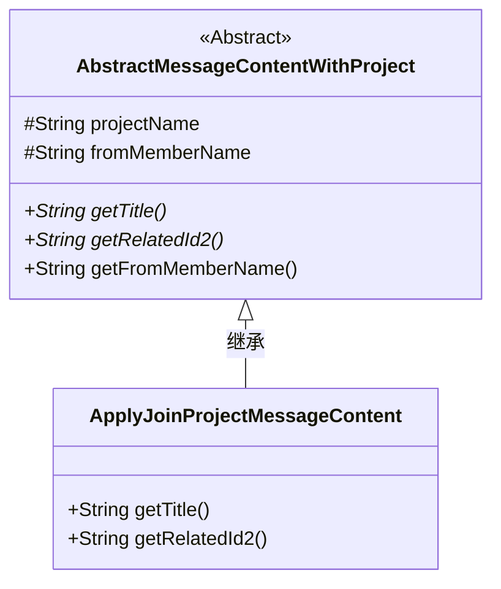
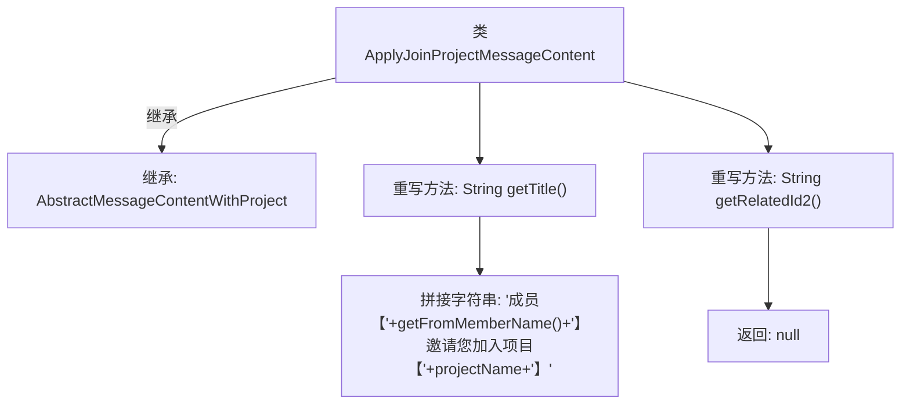

# 基础信息

|      |      |
|------|------|
| 名称 | ApplyJoinProjectMessageContent |
| 编码语言 | .java |
| 代码路径 | WeFe/board/board-service/src/main/java/com/welab/wefe/board/service/dto/vo/message/ApplyJoinProjectMessageContent.java |
| 包名 | com.welab.wefe.board.service.dto.vo.message |
| 依赖项 | [] |
| 概述说明 | ApplyJoinProjectMessageContent类继承AbstractMessageContentWithProject，生成邀请加入项目的标题，返回null的relatedId2。 |

# 说明

这是一个名为ApplyJoinProjectMessageContent的类，继承自AbstractMessageContentWithProject。它重写了两个方法：getTitle方法返回包含邀请成员名称和项目名称的字符串，格式为"成员【邀请者名称】邀请您加入项目【项目名称】"；getRelatedId2方法返回null。该类用于处理加入项目邀请的消息内容。

# 类列表 Class Summary

| 名称   | 类型  | 说明 |
|-------|------|-------------|
| ApplyJoinProjectMessageContent | class | ApplyJoinProjectMessageContent类继承AbstractMessageContentWithProject，提供获取标题方法显示成员邀请加入项目信息，getRelatedId2返回null。 |

## 类 ApplyJoinProjectMessageContent

|      |      |
|------|------|
| 访问范围 | public |
| 类型 | class |
| 名称 | ApplyJoinProjectMessageContent |
| 说明 | ApplyJoinProjectMessageContent类继承AbstractMessageContentWithProject，提供获取标题方法显示成员邀请加入项目信息，getRelatedId2返回null。 |

### UML类图

这段类图展示了ApplyJoinProjectMessageContent继承自抽象类AbstractMessageContentWithProject的关系。抽象类定义了项目名称、发起成员名称等受保护属性，以及获取标题和相关ID的抽象方法。子类实现了具体的标题生成逻辑，并返回空的相关ID2。该结构用于处理项目加入邀请的消息内容，通过继承实现消息内容的统一管理和扩展。

### 内部方法调用关系图

该流程图展示了ApplyJoinProjectMessageContent类的结构，它继承自AbstractMessageContentWithProject类，并重写了两个方法：getTitle()方法拼接成员和项目名称生成邀请标题字符串，getRelatedId2()方法直接返回null。箭头清晰表示了类继承关系和方法调用逻辑，层级结构准确反映了代码的实际组织方式。

### 字段列表 Field List

| 名称  | 类型  | 说明 |
|-------|-------|------|

### 方法列表

| 名称  | 类型  | 说明 |
|-------|-------|------|
| getRelatedId2 | String | 方法getRelatedId2重写后返回null。 |
| getTitle | String | 成员邀请加入项目 |

