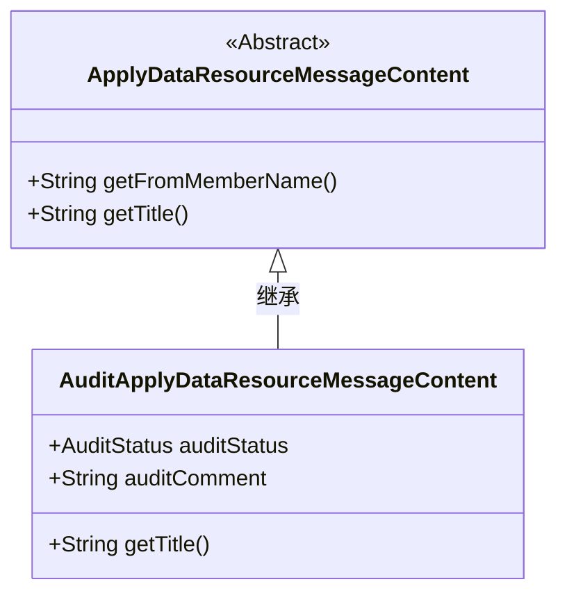
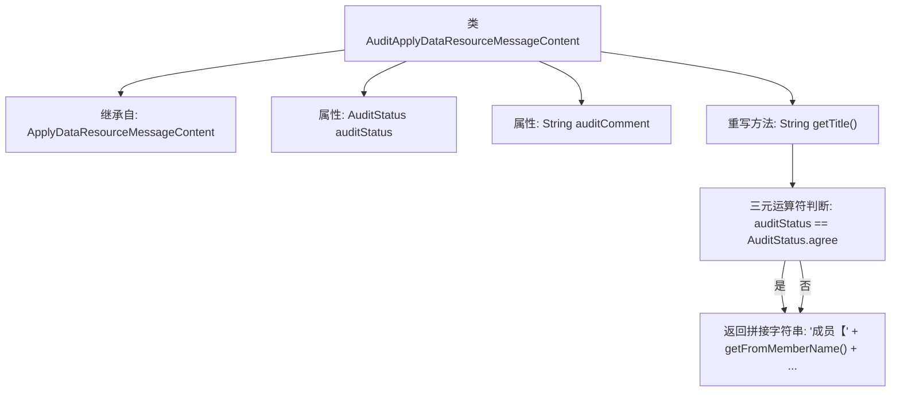

# 基础信息

|      |      |
|------|------|
| 名称 | AuditApplyDataResourceMessageContent |
| 编码语言 | .java |
| 代码路径 | WeFe/board/board-service/src/main/java/com/welab/wefe/board/service/dto/vo/message/AuditApplyDataResourceMessageContent.java |
| 包名 | com.welab.wefe.board.service.dto.vo.message |
| 依赖项 | ['com.welab.wefe.common.wefe.enums.AuditStatus'] |
| 概述说明 | AuditApplyDataResourceMessageContent类继承ApplyDataResourceMessageContent，包含审核状态和评语，重写getTitle方法生成审核结果标题，显示成员名称、审核状态、资源类型、名称、样本数和项目名称。 |

# 说明

这是一个名为AuditApplyDataResourceMessageContent的类，继承自ApplyDataResourceMessageContent。它包含两个成员变量：auditStatus表示审核状态，auditComment存储审核意见。重写了getTitle方法，根据审核状态生成标题字符串，标题内容包括成员名称、审核结果、数据类型标签、数据资源名称、样本数量和项目名称。当审核状态为同意时显示"通过"，否则显示"拒绝"。

# 类列表 Class Summary

| 名称   | 类型  | 说明 |
|-------|------|-------------|
| AuditApplyDataResourceMessageContent | class | AuditApplyDataResourceMessageContent类继承ApplyDataResourceMessageContent，包含审核状态和意见，重写getTitle方法生成审核结果标题。 |

## 类 AuditApplyDataResourceMessageContent

|      |      |
|------|------|
| 访问范围 | public |
| 类型 | class |
| 名称 | AuditApplyDataResourceMessageContent |
| 说明 | AuditApplyDataResourceMessageContent类继承ApplyDataResourceMessageContent，包含审核状态和意见，重写getTitle方法生成审核结果标题。 |

### UML类图

这段类图展示了审计申请数据资源消息内容的结构。AuditApplyDataResourceMessageContent继承自抽象类ApplyDataResourceMessageContent，新增了auditStatus和auditComment两个字段，并重写了getTitle()方法用于生成包含审核状态的标题文本。类关系清晰地体现了继承层次，子类扩展了父类的功能，特别针对数据资源审核场景实现了定制化的标题生成逻辑。

### 内部方法调用关系图

这段代码展示了一个审计申请数据资源消息内容类，继承自基础消息类，包含审计状态和评语属性。核心是重写getTitle()方法，通过判断auditStatus状态值(同意/拒绝)，动态生成包含成员名称、资源类型、资源名称、样本数和项目名称的复合标题字符串。流程图清晰呈现了类继承关系、属性定义和主要方法逻辑分支。

### 字段列表 Field List

| 名称  | 类型  | 说明 |
|-------|-------|------|
| auditStatus | AuditStatus | 审计状态字段，用于记录或标识对象的审核状态。 |
| auditComment | String | 类中定义的公共字符串变量auditComment，用于存储审核评论。 |

### 方法列表

| 名称  | 类型  | 说明 |
|-------|-------|------|
| getTitle | String | 方法返回成员审核结果标题，格式为：成员【名字】通过/拒绝同意将资源类型“资源名(样本数)”添加到项目：项目名。 |

