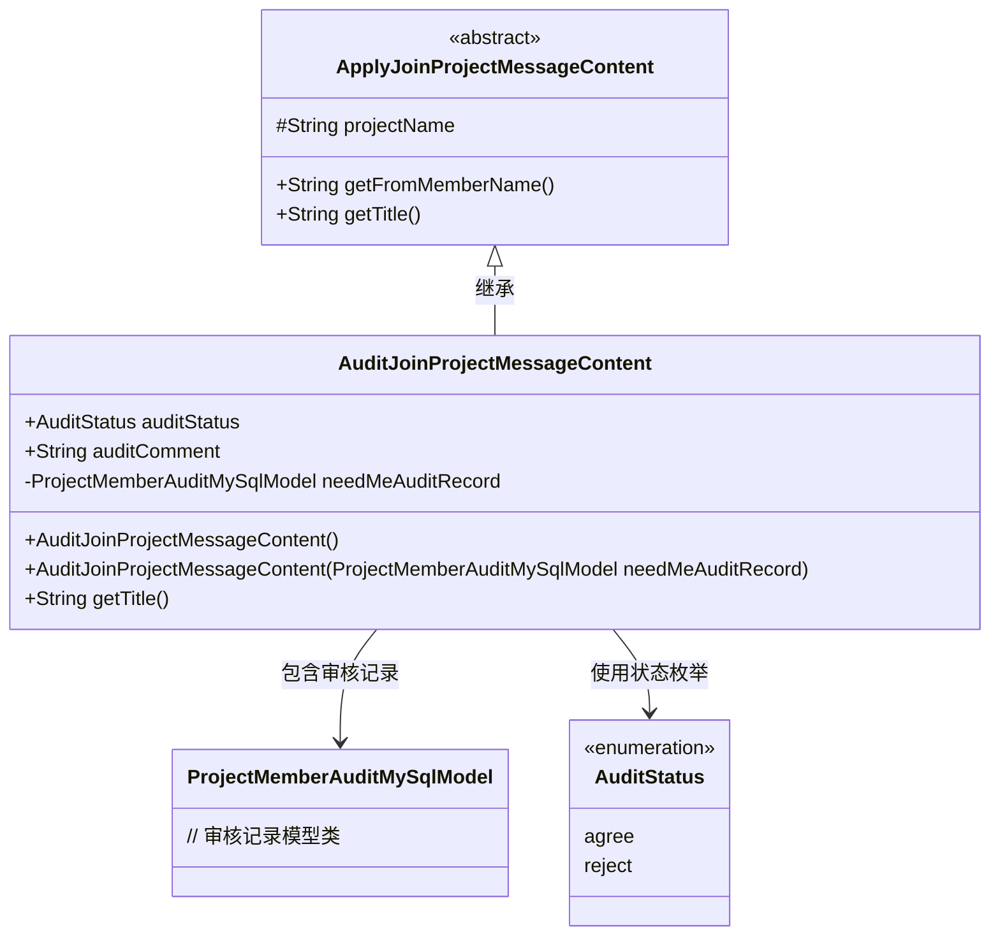
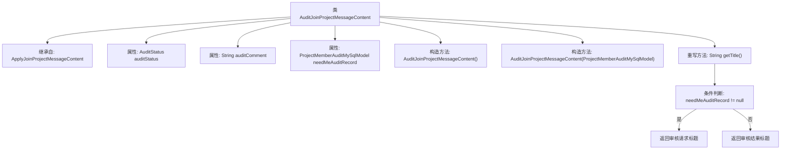

# 基础信息

|      |      |
|------|------|
| 名称 | AuditJoinProjectMessageContent |
| 编码语言 | .java |
| 代码路径 | WeFe/board/board-service/src/main/java/com/welab/wefe/board/service/dto/vo/message/AuditJoinProjectMessageContent.java |
| 包名 | com.welab.wefe.board.service.dto.vo.message |
| 依赖项 | ['com.welab.wefe.board.service.database.entity.job.ProjectMemberAuditMySqlModel', 'com.welab.wefe.common.wefe.enums.AuditStatus'] |
| 概述说明 | AuditJoinProjectMessageContent类继承自ApplyJoinProjectMessageContent，包含审核状态、审核意见及需审核记录。根据审核状态显示不同标题，提示审核或已处理结果。 |

# 说明

AuditJoinProjectMessageContent类继承自ApplyJoinProjectMessageContent，用于处理项目成员加入请求的审核消息内容。该类包含审核状态auditStatus、审核意见auditComment以及需要当前用户审核的记录needMeAuditRecord。构造函数支持初始化审核记录。getTitle方法根据审核状态和是否需要二次审核生成不同的标题：若需要审核则提示用户审核请求，否则显示成员已同意或拒绝加入项目的结果。初创成员无审核记录，后续加入成员需经正式成员审核。

# 类列表 Class Summary

| 名称   | 类型  | 说明 |
|-------|------|-------------|
| AuditJoinProjectMessageContent | class | AuditJoinProjectMessageContent类继承ApplyJoinProjectMessageContent，包含审核状态、备注及需审核记录。根据审核状态和记录生成不同标题，提示审核或显示结果。 |

## 类 AuditJoinProjectMessageContent

|      |      |
|------|------|
| 访问范围 | public |
| 类型 | class |
| 名称 | AuditJoinProjectMessageContent |
| 说明 | AuditJoinProjectMessageContent类继承ApplyJoinProjectMessageContent，包含审核状态、备注及需审核记录。根据审核状态和记录生成不同标题，提示审核或显示结果。 |

### UML类图

该类图展示了审核加入项目消息内容的结构设计。AuditJoinProjectMessageContent继承自抽象基类ApplyJoinProjectMessageContent，包含审核状态枚举、审核意见字段和私有审核记录对象。核心方法getTitle()根据审核状态和记录存在性动态生成不同标题文本，体现了处理成员加入项目审核流程的业务逻辑。类间关系清晰展示了继承、组合和枚举使用的典型场景。

### 内部方法调用关系图

该流程图展示了AuditJoinProjectMessageContent类的结构及其核心逻辑。该类继承自ApplyJoinProjectMessageContent，包含三个主要属性和两个构造方法。重点展示了重写的getTitle()方法逻辑流程：首先检查needMeAuditRecord是否为空，根据检查结果返回不同的标题字符串。若记录存在则返回审核请求标题，否则返回包含审核状态的标题。整个流程清晰反映了类的主要职责：处理项目成员加入请求的审核消息内容生成。

### 字段列表 Field List

| 名称  | 类型  | 说明 |
|-------|-------|------|
| auditStatus | AuditStatus | 审计状态变量auditStatus。 |
| auditComment | String | 公共字符串变量，用于存储审核评论。 |
| needMeAuditRecord | ProjectMemberAuditMySqlModel | 私有成员变量needMeAuditRecord，类型为ProjectMemberAuditMySqlModel，用于存储需当前用户审核的记录。 |

### 方法列表

| 名称  | 类型  | 说明 |
|-------|-------|------|
| getTitle | String | 方法getTitle根据审核状态返回不同标题：如需二次审核则提示审核请求，否则显示成员加入结果。 |

