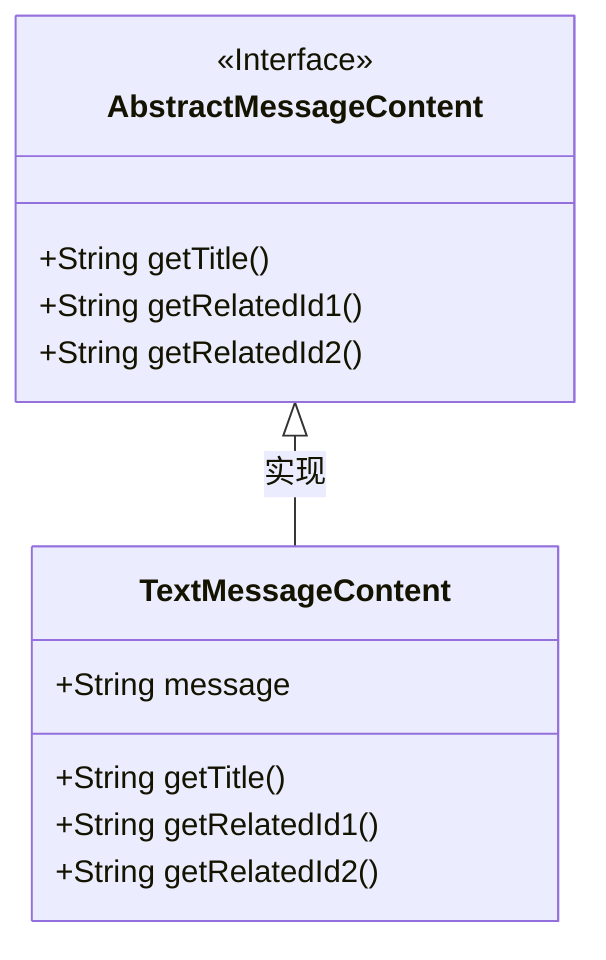
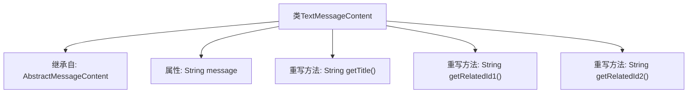

# 基础信息

|      |      |
|------|------|
| 名称 | TextMessageContent |
| 编码语言 | .java |
| 代码路径 | WeFe/board/board-service/src/main/java/com/welab/wefe/board/service/dto/vo/message/TextMessageContent.java |
| 包名 | com.welab.wefe.board.service.dto.vo.message |
| 依赖项 | [] |
| 概述说明 | TextMessageContent类继承AbstractMessageContent，包含message字符串属性，重写getTitle、getRelatedId1和getRelatedId2方法均返回null。 |

# 说明

该代码定义了一个名为TextMessageContent的类，继承自AbstractMessageContent。类中包含一个公开的字符串类型字段message，用于存储文本消息内容。该类重写了三个父类方法：getTitle、getRelatedId1和getRelatedId2，这些方法均返回null值，表明当前未实现具体功能。整个类结构简单，专注于处理纯文本消息内容。

# 类列表 Class Summary

| 名称   | 类型  | 说明 |
|-------|------|-------------|
| TextMessageContent | class | TextMessageContent类继承AbstractMessageContent，包含message字符串属性，重写getTitle、getRelatedId1、getRelatedId2方法但返回null。 |

## 类 TextMessageContent

|      |      |
|------|------|
| 访问范围 | public |
| 类型 | class |
| 名称 | TextMessageContent |
| 说明 | TextMessageContent类继承AbstractMessageContent，包含message字符串属性，重写getTitle、getRelatedId1、getRelatedId2方法但返回null。 |

### UML类图

这段类图展示了TextMessageContent类继承并实现了AbstractMessageContent接口的结构关系。AbstractMessageContent作为接口定义了三个抽象方法：getTitle()、getRelatedId1()和getRelatedId2()，而TextMessageContent作为具体实现类，除了包含一个公有字段message外，还重写了所有接口方法（当前返回null）。图中使用空心三角箭头明确表示了接口与实现类之间的继承关系，符合标准的UML类图规范。

### 内部方法调用关系图

该流程图展示了TextMessageContent类的结构，它继承自AbstractMessageContent基类，包含一个message字符串属性和三个重写方法(getTitle/getRelatedId1/getRelatedId2)。所有重写方法均返回null，表明这是一个基础实现类，需要子类提供具体逻辑。类结构清晰体现了继承关系和空方法实现的设计模式。

### 字段列表 Field List

| 名称  | 类型  | 说明 |
|-------|-------|------|
| message | String | 公共字符串变量message。 |

### 方法列表

| 名称  | 类型  | 说明 |
|-------|-------|------|
| getTitle | String | Java方法重写，返回null标题。 |
| getRelatedId2 | String | 方法getRelatedId2重写父类方法，返回null。 |
| getRelatedId1 | String | 方法getRelatedId1被重写，返回null。 |

