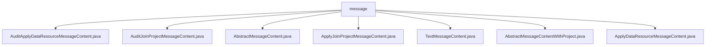

# 基础信息

|      |      |
|------|------|
| 名称 | message |
| 编码语言 | .java |
| 代码路径 | WeFe/board/board-service/src/main/java/com/welab/wefe/board/service/dto/vo/message |
| 包名 | docs.board.board-service.src.main.java.com.welab.wefe.board.service.dto.vo.message |
| 概述说明 | 消息类结构：AbstractMessageContent为基类，定义标题和关联ID方法。其子类包括处理数据审核的AuditApplyDataResourceMessageContent、项目成员审核的AuditJoinProjectMessageContent、项目邀请的ApplyJoinProjectMessageContent、纯文本的TextMessageContent。AbstractMessageContentWithProject扩展基类添加项目相关字段。ApplyDataResourceMessageContent处理数据资源申请消息。 |

# 说明

## 概述  
该模块核心职责是处理多种业务场景下的消息内容生成与管理，包括数据资源审核、项目成员加入审核等。采用分层设计，抽象基类定义通用结构，具体子类实现差异化逻辑。  

接口规范遵循模板方法模式，AbstractMessageContent要求子类实现getTitle、getRelatedId1/2等核心方法。关键数据结构包括审核状态(auditStatus)、意见(auditComment)、项目ID(projectId)等，类似事件总线中的消息载体。  

外部依赖仅涉及CacheObjects用于成员名称查询。例如AbstractMessageContentWithProject通过它获取fromMemberName。具体实现案例包括AuditApplyDataResourceMessageContent根据审核状态生成不同标题，TextMessageContent处理纯文本消息等。  

## 主要业务场景  
主要业务流程分为两类：数据资源审核流程（如AuditApplyDataResourceMessageContent）和成员加入项目流程（如AuditJoinProjectMessageContent）。前者根据审核状态动态生成标题，后者区分初创成员与需审核成员。  

交互模式统一通过getTitle方法实现消息内容组装，例如ApplyJoinProjectMessageContent生成"成员A邀请您加入项目B"的邀请文本。功能完整性体现在支持纯文本、带项目上下文、带审核结果等多种消息类型。  

典型应用模式包括：1) 数据资源共享申请及结果通知 2) 项目成员邀请与审核 3) 简单文本通知。API类型涵盖审核类(Audit*)、申请类(Apply*)和基础类(Abstract*)，集成案例如通过projectId关联消息与具体业务实体。

### 包内部结构视图

该流程图展示了message目录下的7个Java文件结构关系。所有文件都直接隶属于message目录，没有更深层级的嵌套关系。这些文件包括审计类消息内容、申请类消息内容以及抽象基类等不同类型的消息内容实现类，共同构成了一个消息内容处理的文件结构。

# 文件列表

| 名称   | 类型  | 说明 |
|-------|------|-------------|
| [AuditApplyDataResourceMessageContent.java](AuditApplyDataResourceMessageContent.md) | file | AuditApplyDataResourceMessageContent类继承ApplyDataResourceMessageContent，包含审核状态和评语，重写getTitle方法生成审核结果标题，显示成员名称、审核状态、资源类型、名称、样本数和项目名称。 |
| [AuditJoinProjectMessageContent.java](AuditJoinProjectMessageContent.md) | file | AuditJoinProjectMessageContent类继承自ApplyJoinProjectMessageContent，包含审核状态、审核意见及需审核记录。根据审核状态显示不同标题，提示审核或已处理结果。 |
| [AbstractMessageContent.java](AbstractMessageContent.md) | file | 抽象类AbstractMessageContent定义消息内容结构，包含获取标题、关联ID1和ID2的抽象方法，toString方法返回JSON字符串。 |
| [ApplyJoinProjectMessageContent.java](ApplyJoinProjectMessageContent.md) | file | ApplyJoinProjectMessageContent类继承AbstractMessageContentWithProject，生成邀请加入项目的标题，返回null的relatedId2。 |
| [TextMessageContent.java](TextMessageContent.md) | file | TextMessageContent类继承AbstractMessageContent，包含message字符串属性，重写getTitle、getRelatedId1和getRelatedId2方法均返回null。 |
| [AbstractMessageContentWithProject.java](AbstractMessageContentWithProject.md) | file | 抽象类AbstractMessageContentWithProject继承AbstractMessageContent，包含成员ID、项目ID和名称字段，提供获取成员名称和项目ID的方法。 |
| [ApplyDataResourceMessageContent.java](ApplyDataResourceMessageContent.md) | file | ApplyDataResourceMessageContent类继承AbstractMessageContentWithProject，包含资源类型、ID、名称和样本数，重写getTitle和getRelatedId2方法用于生成标题和获取资源ID。 |

