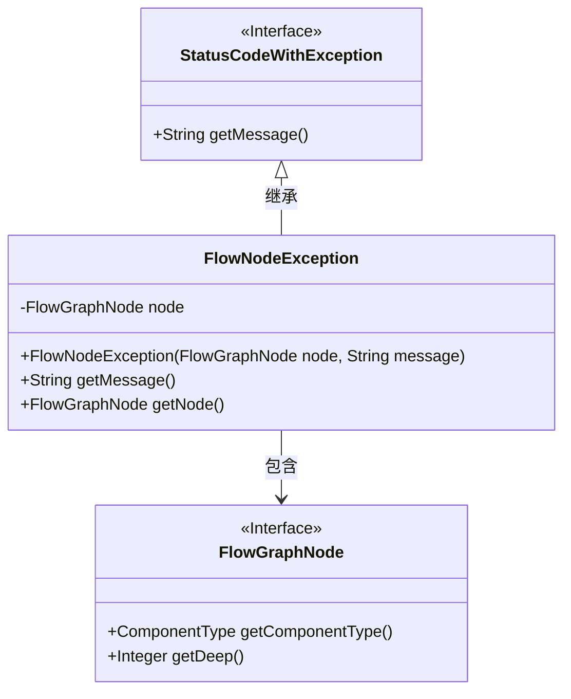
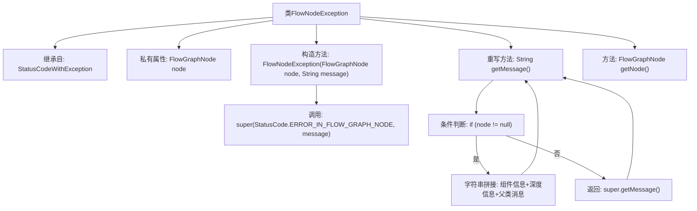

# 基础信息

|      |      |
|------|------|
| 名称 | FlowNodeException |
| 编码语言 | .java |
| 代码路径 | WeFe/board/board-service/src/main/java/com/welab/wefe/board/service/exception/FlowNodeException.java |
| 包名 | com.welab.wefe.board.service.exception |
| 依赖项 | ['com.welab.wefe.board.service.model.FlowGraphNode', 'com.welab.wefe.common.StatusCode', 'com.welab.wefe.common.exception.StatusCodeWithException'] |
| 概述说明 | FlowNodeException继承自StatusCodeWithException，包含FlowGraphNode节点信息。异常消息会显示组件类型、深度及原始消息，若无节点则返回原始消息。提供获取节点的方法。 |

# 说明

FlowNodeException继承自StatusCodeWithException，用于表示流程图中节点发生的异常。它包含一个FlowGraphNode类型的私有字段node，通过构造函数初始化节点和异常信息。重写getMessage方法，当node非空时返回包含组件类型、深度和原始信息的格式化消息，否则返回父类消息。提供getNode方法获取关联节点。

# 类列表 Class Summary

| 名称   | 类型  | 说明 |
|-------|------|-------------|
| FlowNodeException | class | FlowNodeException继承自StatusCodeWithException，包含FlowGraphNode节点信息，异常消息会显示组件类型和深度信息。 |

## 类 FlowNodeException

|      |      |
|------|------|
| 访问范围 | public |
| 类型 | class |
| 名称 | FlowNodeException |
| 说明 | FlowNodeException继承自StatusCodeWithException，包含FlowGraphNode节点信息，异常消息会显示组件类型和深度信息。 |

### UML类图

这段代码展示了一个异常处理类`FlowNodeException`，它继承自`StatusCodeWithException`接口，并包含一个`FlowGraphNode`节点对象。主要功能是封装流程图中节点发生的异常信息，通过重写`getMessage()`方法提供包含节点类型、深度等上下文的详细错误描述。当节点存在时，异常消息会包含组件类型标签和深度信息；否则返回父类的原始消息。类图清晰地反映了继承关系和对象组合关系。

### 内部方法调用关系图

这段代码定义了一个FlowNodeException异常类，继承自StatusCodeWithException。主要功能是封装流程图中节点发生的异常信息，包含节点对象和状态码。当节点非空时，getMessage()会生成包含组件类型、深度和原始消息的详细错误信息；否则返回父类基础信息。流程图展示了类继承关系、构造方法调用链和消息生成的条件分支逻辑。

### 字段列表 Field List

| 名称  | 类型  | 说明 |
|-------|-------|------|
| node | FlowGraphNode | 私有不可变的流程图形节点对象。 |

### 方法列表

| 名称  | 类型  | 说明 |
|-------|-------|------|
| getMessage | String | 方法getMessage返回异常信息，若node非空则包含组件类型和深度，否则返回父类信息。 |
| getNode | FlowGraphNode | 获取节点对象的方法，返回FlowGraphNode类型实例。 |

