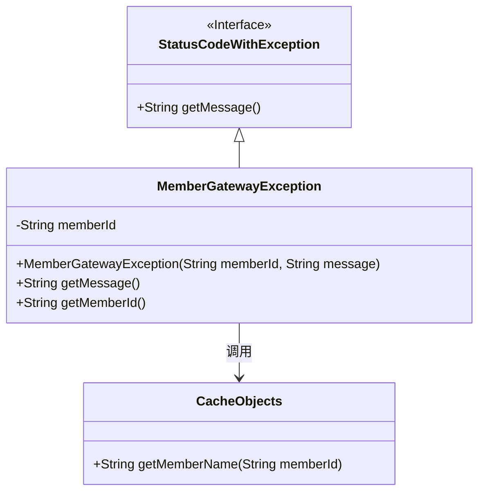
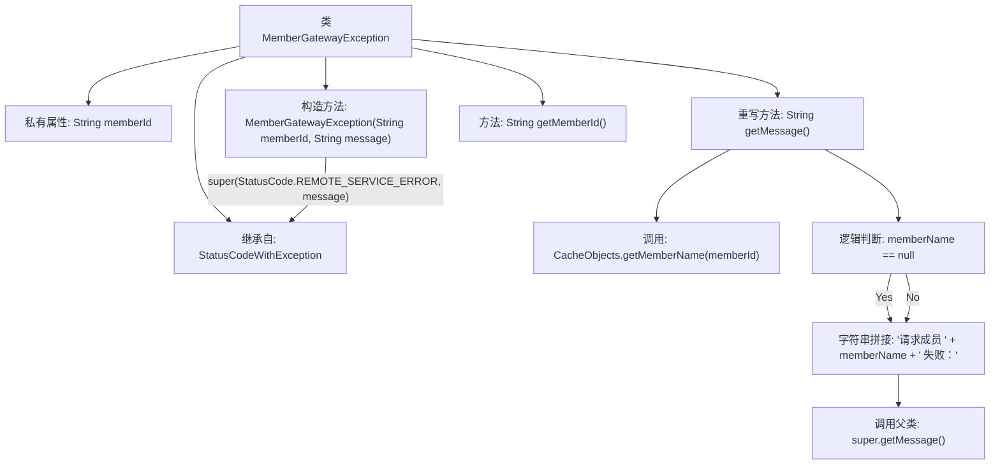

# 基础信息

|      |      |
|------|------|
| 名称 | MemberGatewayException |
| 编码语言 | .java |
| 代码路径 | WeFe/board/board-service/src/main/java/com/welab/wefe/board/service/exception/MemberGatewayException.java |
| 包名 | com.welab.wefe.board.service.exception |
| 依赖项 | ['com.welab.wefe.board.service.service.CacheObjects', 'com.welab.wefe.common.StatusCode', 'com.welab.wefe.common.exception.StatusCodeWithException'] |
| 概述说明 | MemberGatewayException继承StatusCodeWithException，包含成员ID和错误信息，重写getMessage方法返回格式化错误信息，提供获取成员ID的方法。 |

# 说明

MemberGatewayException是一个继承自StatusCodeWithException的自定义异常类，用于处理成员网关相关的错误。该类包含一个成员ID字段memberId，通过构造函数初始化成员ID和错误信息，并设置默认状态码为REMOTE_SERVICE_ERROR。重写的getMessage方法会获取成员名称，若不存在则使用成员ID，返回格式化的错误信息。还提供了获取成员ID的方法getMemberId。

# 类列表 Class Summary

| 名称   | 类型  | 说明 |
|-------|------|-------------|
| MemberGatewayException | class | MemberGatewayException继承自StatusCodeWithException，包含成员ID和错误信息，重写getMessage方法返回包含成员名称的错误信息，并提供获取成员ID的方法。 |

## 类 MemberGatewayException

|      |      |
|------|------|
| 访问范围 | public |
| 类型 | class |
| 名称 | MemberGatewayException |
| 说明 | MemberGatewayException继承自StatusCodeWithException，包含成员ID和错误信息，重写getMessage方法返回包含成员名称的错误信息，并提供获取成员ID的方法。 |

### UML类图

类图描述：MemberGatewayException继承自StatusCodeWithException接口，包含私有成员memberId和构造方法，重写了getMessage()方法以获取成员名称并格式化错误信息。该类通过调用CacheObjects的getMemberName()方法获取成员名称，若未找到则使用memberId作为默认值。整体结构展示了异常处理与缓存对象之间的协作关系。

### 内部方法调用关系图

该流程图展示了MemberGatewayException类的结构，它是一个继承自StatusCodeWithException的自定义异常类。主要包含memberId属性和三个关键方法：构造方法初始化成员ID和错误信息，getMessage()方法通过缓存获取成员名称并格式化错误消息，getMemberId()提供成员ID访问。流程图特别突出了getMessage()方法中获取成员名称、空值判断和消息拼接的逻辑流程，以及构造方法中调用父类构造器的关系。

### 字段列表 Field List

| 名称  | 类型  | 说明 |
|-------|-------|------|
| memberId | String | 私有不可变字符串成员变量memberId。 |

### 方法列表

| 名称  | 类型  | 说明 |
|-------|-------|------|
| getMessage | String | 重写getMessage方法，返回成员名或ID及错误信息。若成员名为空则使用ID。 |
| getMemberId | String | 这是一个Java方法，返回成员ID字符串。方法名为getMemberId，无参数，直接返回成员变量memberId的值。 |

