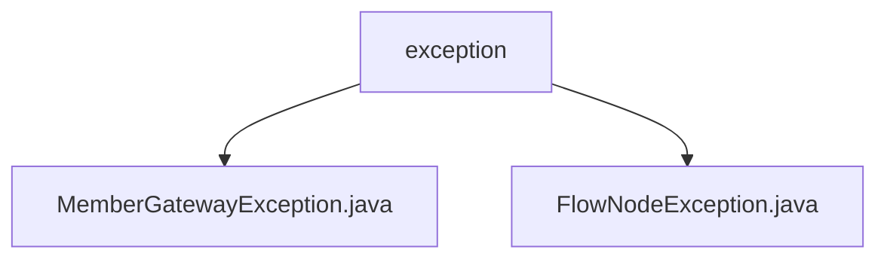

# 基础信息

|      |      |
|------|------|
| 名称 | exception |
| 编码语言 | .java |
| 代码路径 | WeFe/board/board-service/src/main/java/com/welab/wefe/board/service/exception |
| 包名 | docs.board.board-service.src.main.java.com.welab.wefe.board.service.exception |
| 概述说明 | MemberGatewayException是处理成员网关错误的异常类，含成员ID字段，构造函数初始化ID和错误信息，默认状态码REMOTE_SERVICE_ERROR，重写getMessage返回格式化信息。FlowNodeException表示流程图节点异常，含FlowGraphNode字段，构造函数初始化节点和异常信息，重写getMessage返回格式化消息，提供getNode方法。 |

# 说明

## 概述  
该模块核心职责是提供自定义异常处理机制，针对成员网关和流程图节点两类场景进行错误封装。接口规范统一继承自StatusCodeWithException，均包含特定领域对象（成员ID/流程节点）和格式化错误消息能力。关键数据结构包括MemberGatewayException的memberId字段和FlowNodeException的FlowGraphNode对象。外部依赖仅为StatusCodeWithException基类。例如MemberGatewayException会格式化包含成员名的错误信息，而FlowNodeException会组装节点深度等上下文数据。

## 主要业务场景  
主要用于处理分布式成员通信（类似RPC调用校验）和流程图执行流程中的异常场景。交互模式均采用异常捕获后提取领域对象进行诊断，例如通过getMemberId()定位问题成员，或通过getNode()获取故障节点。典型应用包括网关服务调用失败时抛出成员异常，或流程图引擎执行节点逻辑错误时触发节点异常。API类型均为检查型异常，集成案例可见于远程服务调用拦截器和流程引擎的节点处理器。

### 包内部结构视图

该流程图展示了WeFe项目中异常处理模块的层级结构。根节点"exception"包含两个子节点，分别代表两种具体的异常类：MemberGatewayException和FlowNodeException。这两个异常类都位于board-service模块的exception包下，用于处理不同的业务异常场景。整个结构简洁明了，体现了异常处理模块的基本组成。

# 文件列表

| 名称   | 类型  | 说明 |
|-------|------|-------------|
| [MemberGatewayException.java](MemberGatewayException.md) | file | MemberGatewayException继承StatusCodeWithException，包含成员ID和错误信息，重写getMessage方法返回格式化错误信息，提供获取成员ID的方法。 |
| [FlowNodeException.java](FlowNodeException.md) | file | FlowNodeException继承自StatusCodeWithException，包含FlowGraphNode节点信息。异常消息会显示组件类型、深度及原始消息，若无节点则返回原始消息。提供获取节点的方法。 |

