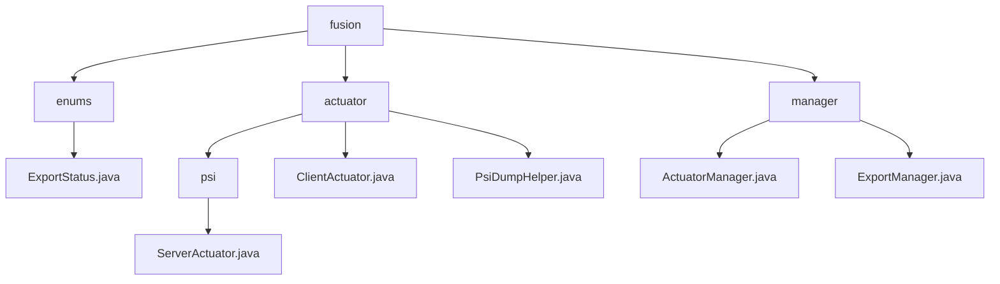

# 基础信息

|      |      |
|------|------|
| 名称 | fusion |
| 编码语言 | .java |
| 代码路径 | WeFe/board/board-service/src/main/java/com/welab/wefe/board/service/fusion |
| 包名 | docs.board.board-service.src.main.java.com.welab.wefe.board.service.fusion |
| 概述说明 | 枚举定义导出状态：失败、成功、进行中。模块实现PSI任务处理，含数据转储、状态同步和线程安全，依赖多项服务。管理执行器状态和导出进度，采用缓存优先策略，支持任务防重和进度查询。 |

# 说明

## 概述  
该模块核心职责是实现私有集合交集(PSI)任务的协同处理与状态管理，包含数据分片计算、状态同步和任务导出功能。接口规范采用分层设计：跨节点通信（如ServerCloseApi）采用异步事件模式，本地管理（如ActuatorManager）提供缓存优先的JObject查询。关键数据结构包括分片数据块、JObject状态记录和ConcurrentHashMap进度映射。外部依赖涉及GatewayService等3类服务组件及数据库/日志系统。例如ClientActuator通过ReentrantLock确保线程安全，ExportManager利用内存映射防止任务重复。

## 主要业务场景  
典型应用为多阶段PSI任务流：客户端分片处理数据，服务端转储并同步状态，最终通过双层校验机制管理导出。完整流程涵盖数据哈希转换（如PsiDumpHelper的二维列表优化）、异常处理和三种终止状态维护。交互模式融合双向同步（服务端更新数据库）与观察者模式（执行器状态跟踪），例如getTaskInfo实现缓存-数据库级联查询。功能完整性体现在全链路控制，包含8项进度指标监控和防重设计，应用于数据融合看板及批量导出场景。

### 包内部结构视图

该流程图展示了WeFe项目中fusion模块的代码结构。根节点fusion下包含enums、actuator和manager三个子模块。enums包含ExportStatus枚举类，actuator包含psi子目录和两个直接文件，psi下又有ServerActuator实现类。manager模块包含两个管理类文件。整体结构清晰展现了模块间的层级关系。

# 文件列表

| 名称   | 类型  | 说明 |
|-------|------|-------------|
| [enums](enums/_module.md) | package | 导出状态枚举：失败(failure)、成功(success)、进行中(exporting)。 |
| [manager](manager/_module.md) | package | ActuatorManager类继承ActuatorCache，通过businessId获取执行器信息，缓存或数据库查询后返回JObject。ExportManager类管理导出任务进度，使用ConcurrentHashMap缓存，提供增删查方法，数据库持久化通过ExportProgressService实现。 |
| [actuator](actuator/_module.md) | package | ServerActuator类处理数据转储和任务关闭。ClientActuator类管理PSI任务执行，支持分片处理和状态跟踪。PsiDumpHelper类负责数据转储，包括表头检查和数据保存。 |

