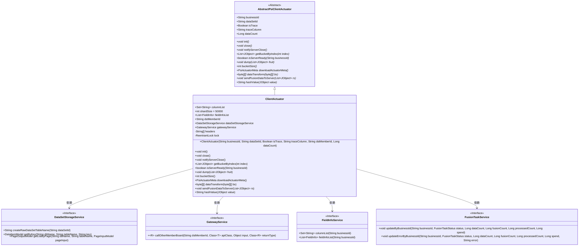

# 基础信息

|      |      |
|------|------|
| 名称 | ClientActuator |
| 编码语言 | .java |
| 代码路径 | WeFe/board/board-service/src/main/java/com/welab/wefe/board/service/fusion/actuator/ClientActuator.java |
| 包名 | com.welab.wefe.board.service.fusion.actuator |
| 依赖项 | ['java.util.List', 'java.util.Set', 'java.util.concurrent.locks.ReentrantLock', 'java.util.stream.Collectors', 'com.alibaba.fastjson.JSONObject', 'com.google.common.collect.Lists', 'com.welab.wefe.board.service.api.project.fusion.actuator.psi.DownloadBFApi', 'com.welab.wefe.board.service.api.project.fusion.actuator.psi.PsiCryptoApi', 'com.welab.wefe.board.service.api.project.fusion.actuator.psi.ReceiveResultApi', 'com.welab.wefe.board.service.api.project.fusion.actuator.psi.ServerCloseApi', 'com.welab.wefe.board.service.api.project.fusion.actuator.psi.ServerSynStatusApi', 'com.welab.wefe.board.service.dto.fusion.PsiMeta', 'com.welab.wefe.board.service.service.DataSetStorageService', 'com.welab.wefe.board.service.service.GatewayService', 'com.welab.wefe.board.service.service.fusion.FieldInfoService', 'com.welab.wefe.board.service.service.fusion.FusionTaskService', 'com.welab.wefe.board.service.util.primarykey.FieldInfo', 'com.welab.wefe.board.service.util.primarykey.PrimaryKeyUtils', 'com.welab.wefe.common.data.storage.common.Constant', 'com.welab.wefe.common.data.storage.model.DataItemModel', 'com.welab.wefe.common.data.storage.model.PageInputModel', 'com.welab.wefe.common.data.storage.model.PageOutputModel', 'com.welab.wefe.common.exception.StatusCodeWithException', 'com.welab.wefe.common.util.Base64Util', 'com.welab.wefe.common.util.JObject', 'com.welab.wefe.common.web.Launcher', 'com.welab.wefe.fusion.core.actuator.psi.AbstractPsiClientActuator', 'com.welab.wefe.fusion.core.dto.PsiActuatorMeta', 'com.welab.wefe.fusion.core.enums.FusionTaskStatus', 'com.welab.wefe.fusion.core.enums.PSIActuatorStatus'] |
| 概述说明 | ClientActuator类实现PSI客户端逻辑，包含数据分片处理、字段管理、服务通信及任务状态更新功能。通过锁机制保证线程安全，支持数据转换、传输及结果通知。 |

# 说明

ClientActuator类是一个用于处理PSI（私有集合交集）任务的执行器，继承自AbstractPsiClientActuator。它包含字段列表、分片大小、目标成员ID等属性，并通过GatewayService与其他成员通信。主要功能包括初始化数据集、分片处理数据、状态更新、数据转换和结果传输。类中使用了ReentrantLock确保线程安全，并通过多个API接口与服务器交互，如ServerCloseApi、ServerSynStatusApi等。此外，还提供了数据哈希、分片计算、结果转储等方法，支持任务状态的跟踪和错误处理。

# 类列表 Class Summary

| 名称   | 类型  | 说明 |
|-------|------|-------------|
| ClientActuator | class | ClientActuator类实现PSI客户端逻辑，包含字段列表、分片大小、数据存储服务等属性，提供初始化、关闭、数据分页获取、元数据下载、数据转换、结果发送等功能，支持多线程安全操作。 |

## 类 ClientActuator

|      |      |
|------|------|
| 访问范围 | @SuppressWarnings("SynchronizeOnNonFinalField");public |
| 类型 | class |
| 名称 | ClientActuator |
| 说明 | ClientActuator类实现PSI客户端逻辑，包含字段列表、分片大小、数据存储服务等属性，提供初始化、关闭、数据分页获取、元数据下载、数据转换、结果发送等功能，支持多线程安全操作。 |

### UML类图

类图描述：该图展示了ClientActuator类继承自AbstractPsiClientActuator抽象类，并实现了多个核心方法。ClientActuator通过依赖DataSetStorageService、GatewayService、FieldInfoService和FusionTaskService等接口完成数据分片处理、远程调用、字段信息获取和任务状态更新等功能。类结构体现了PSI（Private Set Intersection）协议执行器的典型分层设计，包含初始化、数据获取、状态同步、结果传输等关键操作。

### 内部方法调用关系图

```mermaid
graph TD
    A["类ClientActuator"]
    B["属性: Set<String> columnList"]
    C["属性: int shardSize"]
    D["属性: List<FieldInfo> fieldInfoList"]
    E["属性: String dstMemberId"]
    F["属性: DataSetStorageService dataSetStorageService"]
    G["属性: GatewayService gatewayService"]
    H["属性: String[] headers"]
    I["属性: ReentrantLock lock"]
    J["构造方法: ClientActuator(String businessId, String dataSetId, Boolean isTrace, String traceColumn, String dstMemberId, Long dataCount)"]
    K["方法: void init()"]
    L["方法: void close()"]
    M["方法: void notifyServerClose()"]
    N["方法: List<JObject> getBucketByIndex(int index)"]
    O["方法: boolean isServerReady(String businessId)"]
    P["方法: void dump(List<JObject> fruit)"]
    Q["方法: int bucketSize()"]
    R["方法: PsiActuatorMeta downloadActuatorMeta()"]
    S["方法: byte[][] dataTransform(byte[][] bs)"]
    T["方法: void sendFusionDataToServer(List<JObject> rs)"]
    U["方法: String hashValue(JObject value)"]

    A --> B
    A --> C
    A --> D
    A --> E
    A --> F
    A --> G
    A --> H
    A --> I
    A --> J
    A --> K
    A --> L
    A --> M
    A --> N
    A --> O
    A --> P
    A --> Q
    A --> R
    A --> S
    A --> T
    A --> U
```

该流程图展示了ClientActuator类的完整结构，包含11个属性和10个核心方法。类继承自AbstractPsiClientActuator，主要负责数据集的初始化、分片处理、状态同步和数据转换等PSI(Private Set Intersection)协议相关操作。关键方法包括初始化字段列表(init)、分页获取数据(getBucketByIndex)、数据转储(dump)以及与远程服务交互的多个网关调用方法，所有操作都通过ReentrantLock保证线程安全。

### 字段列表 Field List

| 名称  | 类型  | 说明 |
|-------|-------|------|
| columnList | Set<String> | 这是一个公共的字符串集合变量，用于存储列名列表。 |
| headers | String[] | 声明一个私有字符串数组变量headers。 |
| lock = new ReentrantLock(true) | ReentrantLock | 使用可重入锁ReentrantLock，支持公平锁机制。 |
| gatewayService = Launcher.getBean(GatewayService.class) | GatewayService | 获取GatewayService实例：通过Launcher的getBean方法获取GatewayService类实例。 |
| dataSetStorageService | DataSetStorageService | 数据集存储服务实例变量。 |
| shardSize = 50000 | int | 分片大小设置为5万。 |
| fieldInfoList | List<FieldInfo> | 字段信息列表，存储FieldInfo对象的集合。 |
| dstMemberId | String | 声明一个公共字符串变量dstMemberId。 |

### 方法列表

| 名称  | 类型  | 说明 |
|-------|-------|------|
| notifyServerClose | void | 方法notifyServerClose通知服务器任务结束，调用gatewayService的callOtherMemberBoard方法，处理异常。 |
| close | void | 该方法根据任务状态更新数据库记录：成功时调用updateByBusinessId，失败或中断时调用updateErrorByBusinessId，传入业务ID、状态、数据量、耗时等参数。 |
| isServerReady | boolean | 检查服务是否就绪：调用合作方接口查询业务ID状态，成功返回ready字段，失败记录异常并返回false。 |
| dump | void | 方法dump接收水果列表，记录开始日志，调用PsiDumpHelper.dump处理数据，捕获异常并记录错误日志，最后记录结束日志。 |
| getBucketByIndex | List<JObject> | 方法getBucketByIndex根据索引获取分页数据，处理为JObject列表，记录耗时并返回。异常时返回null，确保锁释放。 |
| init | void | 初始化方法：获取字段列表，计算分片大小，补充追踪字段，查询主键字段，初始化数据集表头信息。 |
| bucketSize | int | 计算桶大小：若数据量能整除分片数则取商，否则商加1。记录数据量、分片数和结果。 |
| downloadActuatorMeta | PsiActuatorMeta | 该方法通过网关服务调用远程接口下载PSI执行器元数据，处理结果后返回。包含日志记录和JSON转换。 |
| dataTransform | byte[][] | 该方法将字节数组转换为Base64字符串列表，调用远程服务处理数据后，再将结果转换回字节数组返回。 |
| sendFusionDataToServer | void | 方法将JObject列表转为Base64字符串，通过gatewayService调用远程接口发送数据，异常时记录错误日志。 |
| hashValue | String | 该方法重写hashValue函数，使用PrimaryKeyUtils根据JObject对象和字段信息列表生成哈希值。 |

