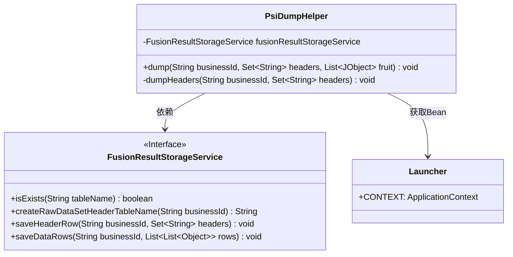
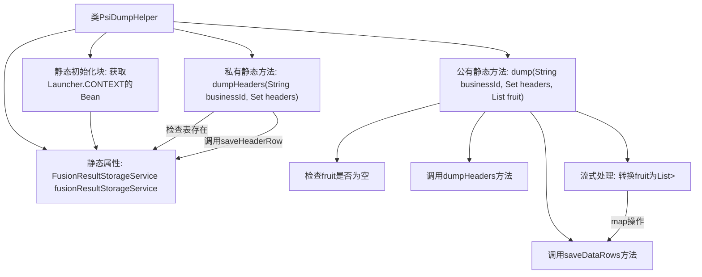

# 基础信息

|      |      |
|------|------|
| 名称 | PsiDumpHelper |
| 编码语言 | .java |
| 代码路径 | WeFe/board/board-service/src/main/java/com/welab/wefe/board/service/fusion/actuator/PsiDumpHelper.java |
| 包名 | com.welab.wefe.board.service.fusion.actuator |
| 依赖项 | ['java.util.List', 'java.util.Map', 'java.util.Set', 'java.util.stream.Collectors', 'com.google.common.collect.Lists', 'com.welab.wefe.board.service.service.fusion.FusionResultStorageService', 'com.welab.wefe.common.util.JObject', 'com.welab.wefe.common.web.Launcher'] |
| 概述说明 | PsiDumpHelper类用于存储数据，包含dumpHeaders和dump方法。dumpHeaders检查并保存表头，dump处理并保存数据行。使用FusionResultStorageService进行存储操作。 |

# 说明

PsiDumpHelper类是一个用于处理数据转储的工具类，包含静态方法dumpHeaders和dump。dumpHeaders方法检查并保存表头信息，若已存在则跳过。dump方法处理数据转储，首先检查数据是否为空，然后调用dumpHeaders保存表头，接着将输入的JObject列表转换为二维列表格式，最后通过fusionResultStorageService保存数据行。该类依赖FusionResultStorageService进行实际存储操作。

# 类列表 Class Summary

| 名称   | 类型  | 说明 |
|-------|------|-------------|
| PsiDumpHelper | class | PsiDumpHelper类用于处理数据存储，包含dumpHeaders方法检查并保存表头，dump方法格式化数据并保存。使用FusionResultStorageService进行存储操作。 |

## 类 PsiDumpHelper

|      |      |
|------|------|
| 访问范围 | public |
| 类型 | class |
| 名称 | PsiDumpHelper |
| 说明 | PsiDumpHelper类用于处理数据存储，包含dumpHeaders方法检查并保存表头，dump方法格式化数据并保存。使用FusionResultStorageService进行存储操作。 |

### UML类图

这段代码展示了一个名为`PsiDumpHelper`的工具类，主要用于处理数据转储操作。该类通过静态初始化块从Spring上下文获取`FusionResultStorageService`实例，提供两个核心方法：`dumpHeaders`用于保存表头信息，`dump`用于标准化处理水果数据并保存。代码依赖接口`FusionResultStorageService`完成实际存储操作，体现了良好的职责分离设计。流程涉及数据校验、格式转换和存储操作，适用于批量数据处理场景。

### 内部方法调用关系图

流程图描述：该流程图展示了PsiDumpHelper类的结构和工作流程。类包含静态属性fusionResultStorageService，通过静态初始化块获取Launcher.CONTEXT的Bean。dump方法首先检查输入数据fruit是否为空，然后调用dumpHeaders方法处理表头，接着通过流式操作转换fruit数据结构，最后调用saveDataRows保存数据。dumpHeaders方法会检查表是否存在并保存表头行。

### 字段列表 Field List

| 名称  | 类型  | 说明 |
|-------|-------|------|
| fusionResultStorageService | FusionResultStorageService | 私有静态常量融合结果存储服务实例。 |

### 方法列表

| 名称  | 类型  | 说明 |
|-------|-------|------|
| dumpHeaders | void | 方法`dumpHeaders`检查业务ID对应的表头是否存在，若不存在则保存表头数据。 |
| dump | void | 静态方法dump处理业务数据：检查fruit非空后调用dumpHeaders写入表头，将JObject列表转为值列表，最后通过saveDataRows存储。异常抛出。 |

