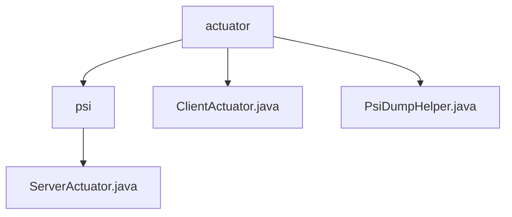

# 基础信息

|      |      |
|------|------|
| 名称 | actuator |
| 编码语言 | .java |
| 代码路径 | WeFe/board/board-service/src/main/java/com/welab/wefe/board/service/fusion/actuator |
| 包名 | docs.board.board-service.src.main.java.com.welab.wefe.board.service.fusion.actuator |
| 概述说明 | ServerActuator类处理数据转储和任务关闭。ClientActuator类管理PSI任务执行，支持分片处理和状态跟踪。PsiDumpHelper类负责数据转储，包括表头检查和数据保存。 |

# 说明

## 概述  
该模块核心职责是实现私有集合交集(PSI)任务的客户端与服务端协同处理，包含数据转储、状态同步和线程安全控制。接口规范涉及ServerCloseApi、ServerSynStatusApi等跨节点通信API，采用类似事件总线模式的异步交互。关键数据结构包括JObject列表、分片数据块和任务状态记录。外部依赖项包括GatewayService、FusionResultStorageService和FusionTaskService。例如ClientActuator通过ReentrantLock确保分片计算的线程安全。

## 主要业务场景  
典型应用模式为多节点PSI任务流水线：客户端初始化数据集并分片处理，服务端转储数据并同步状态。完整业务流程包含数据哈希转换、分片传输、异常处理和结果持久化，例如PsiDumpHelper通过二维列表转换实现高效存储。交互模式采用双向状态同步机制，如ServerActuator通过数据库更新任务终止状态。功能完整性体现在全链路错误处理，包括日志记录、异常捕获和三种终止状态管理。

### 包内部结构视图

该流程图展示了board-service项目中fusion模块下actuator目录的层级结构。actuator作为根节点，包含psi子目录和两个Java文件(ClientActuator.java/PsiDumpHelper.java)，psi目录下又包含ServerActuator.java文件。整个结构清晰地反映了PSI(Private Set Intersection)相关执行器的代码组织方式。

# 文件列表

| 名称   | 类型  | 说明 |
|-------|------|-------------|
| [ClientActuator.java](ClientActuator.md) | file | ClientActuator类实现PSI客户端逻辑，包含数据分片处理、字段管理、服务通信及任务状态更新功能。通过锁机制保证线程安全，支持数据转换、传输及结果通知。 |
| [PsiDumpHelper.java](PsiDumpHelper.md) | file | PsiDumpHelper类用于存储数据，包含dumpHeaders和dump方法。dumpHeaders检查并保存表头，dump处理并保存数据行。使用FusionResultStorageService进行存储操作。 |
| [psi](psi/_module.md) | package | ServerActuator类继承AbstractPsiServerActuator，实现dump和close方法。dump处理JObject列表数据并调用PsiDumpHelper.dump。close根据状态更新任务状态，成功调用updateByBusinessId，失败或中断调用updateErrorByBusinessId。 |

