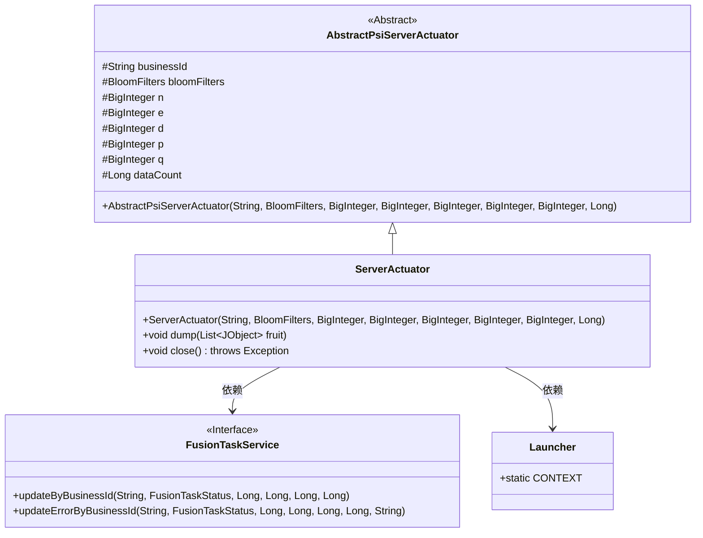
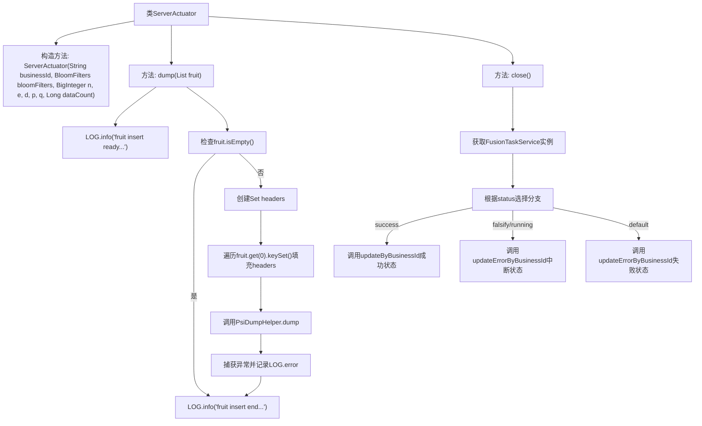

# 基础信息

|      |      |
|------|------|
| 名称 | ServerActuator |
| 编码语言 | .java |
| 代码路径 | WeFe/board/board-service/src/main/java/com/welab/wefe/board/service/fusion/actuator/psi/ServerActuator.java |
| 包名 | com.welab.wefe.board.service.fusion.actuator.psi |
| 依赖项 | ['java.math.BigInteger', 'java.util.HashSet', 'java.util.List', 'java.util.Set', 'com.alibaba.fastjson.JSON', 'com.welab.wefe.board.service.fusion.actuator.PsiDumpHelper', 'com.welab.wefe.board.service.fusion.manager.ActuatorManager', 'com.welab.wefe.board.service.service.fusion.FusionTaskService', 'com.welab.wefe.common.util.JObject', 'com.welab.wefe.common.web.Launcher', 'com.welab.wefe.fusion.core.actuator.psi.AbstractPsiServerActuator', 'com.welab.wefe.fusion.core.enums.FusionTaskStatus', 'com.welab.wefe.fusion.core.utils.bf.BloomFilters'] |
| 概述说明 | ServerActuator类继承AbstractPsiServerActuator，实现dump和close方法。dump处理JObject列表数据并调用PsiDumpHelper.dump。close根据状态更新任务状态，成功调用updateByBusinessId，失败或中断调用updateErrorByBusinessId。 |

# 说明

ServerActuator类继承自AbstractPsiServerActuator，包含构造方法和两个主要方法。dump方法处理JObject列表数据，记录日志并调用PsiDumpHelper进行数据转储，捕获异常并记录。close方法根据状态更新任务状态，通过FusionTaskService更新数据库，处理成功、中断和失败三种情况，记录数据计数、处理计数和时间等信息。

# 类列表 Class Summary

| 名称   | 类型  | 说明 |
|-------|------|-------------|
| ServerActuator | class | ServerActuator类继承AbstractPsiServerActuator，实现dump和close方法。dump处理数据插入，close更新任务状态。 |

## 类 ServerActuator

|      |      |
|------|------|
| 访问范围 | public |
| 类型 | class |
| 名称 | ServerActuator |
| 说明 | ServerActuator类继承AbstractPsiServerActuator，实现dump和close方法。dump处理数据插入，close更新任务状态。 |

### UML类图

类图描述：该图展示了ServerActuator继承自AbstractPsiServerActuator，并实现了dump和close方法。ServerActuator通过Launcher获取FusionTaskService实例，在close方法中根据状态调用不同的更新方法。FusionTaskService作为接口提供任务状态更新功能，Launcher作为上下文提供Bean获取能力。整体结构体现了PSI（Private Set Intersection）服务器的执行器实现模式。

### 内部方法调用关系图

该流程图展示了ServerActuator类的核心逻辑结构。dump方法处理数据写入流程，包含日志记录、空检查、数据头收集和异常处理；close方法根据任务状态调用不同的服务更新方法，包含三种状态分支处理。两个主要方法都继承自抽象父类，体现了状态管理和数据持久化的完整流程。

### 字段列表 Field List

| 名称  | 类型  | 说明 |
|-------|-------|------|

### 方法列表

| 名称  | 类型  | 说明 |
|-------|-------|------|
| close | void | close方法根据任务状态更新数据库：成功时调用updateByBusinessId，失败或中断时调用updateErrorByBusinessId，记录数据量、耗时等信息。 |
| dump | void | 方法dump接收水果列表，记录开始日志。若列表为空则返回。提取首元素键集合作为表头，调用PsiDumpHelper.dump写入数据，捕获异常记录错误日志，最后记录结束日志。 |

