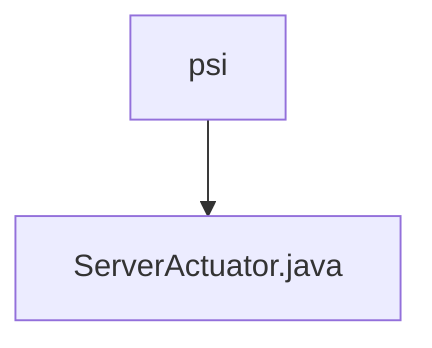

# 基础信息

|      |      |
|------|------|
| 名称 | psi |
| 编码语言 | .java |
| 代码路径 | WeFe/board/board-service/src/main/java/com/welab/wefe/board/service/fusion/actuator/psi |
| 包名 | docs.board.board-service.src.main.java.com.welab.wefe.board.service.fusion.actuator.psi |
| 概述说明 | ServerActuator类继承AbstractPsiServerActuator，实现dump和close方法。dump处理JObject列表数据并调用PsiDumpHelper.dump。close根据状态更新任务状态，成功调用updateByBusinessId，失败或中断调用updateErrorByBusinessId。 |

# 说明

ServerActuator类继承自AbstractPsiServerActuator，包含构造方法和两个主要方法。dump方法处理JObject列表数据，记录日志并调用PsiDumpHelper进行数据转储，捕获异常并记录。close方法根据状态更新任务状态，通过FusionTaskService更新数据库，处理成功、中断和失败三种情况，记录数据计数、处理计数和时间等信息。

### 包内部结构视图

该流程图展示了PSI执行器模块的层级结构，其中psi作为父目录包含一个具体的Java实现文件ServerActuator.java。这种结构常见于微服务架构中的功能模块划分，体现了单一职责原则，将PSI协议相关的服务端执行逻辑封装在独立文件中。整个结构简洁清晰，便于维护和扩展。

# 文件列表

| 名称   | 类型  | 说明 |
|-------|------|-------------|
| [ServerActuator.java](ServerActuator.md) | file | ServerActuator类继承AbstractPsiServerActuator，实现dump和close方法。dump处理JObject列表数据并调用PsiDumpHelper.dump。close根据状态更新任务状态，成功调用updateByBusinessId，失败或中断调用updateErrorByBusinessId。 |

