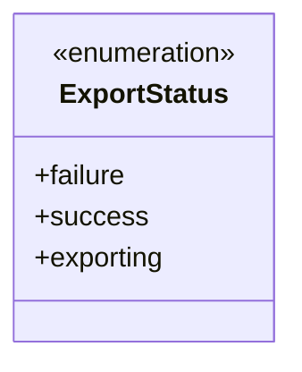
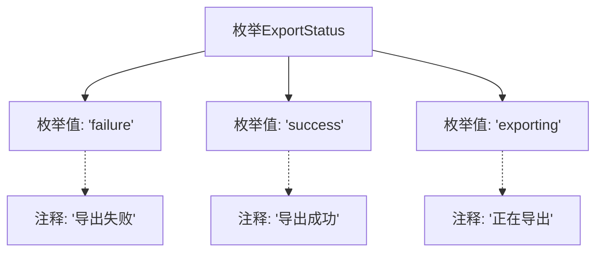

# 基础信息

|      |      |
|------|------|
| 名称 | ExportStatus |
| 编码语言 | .java |
| 代码路径 | WeFe/board/board-service/src/main/java/com/welab/wefe/board/service/fusion/enums/ExportStatus.java |
| 包名 | com.welab.wefe.board.service.fusion.enums |
| 依赖项 | [] |
| 概述说明 | 导出状态枚举：失败(failure)、成功(success)、进行中(exporting)。 |

# 说明

该枚举类型定义了三种导出状态：failure表示导出失败，success表示导出成功，exporting表示正在导出。每种状态都有对应的注释说明其含义。

# 类列表 Class Summary

| 名称   | 类型  | 说明 |
|-------|------|-------------|
| ExportStatus | enum | 导出状态枚举：失败、成功、进行中。 |

## 类 ExportStatus

|      |      |
|------|------|
| 访问范围 | public |
| 类型 | enum |
| 名称 | ExportStatus |
| 说明 | 导出状态枚举：失败、成功、进行中。 |

### UML类图

该枚举类定义了三种导出状态：failure(失败)、success(成功)和exporting(进行中)。作为状态标识，它通常用于导出操作的流程控制，通过明确的枚举值来区分不同阶段或结果。枚举类型提供了类型安全的状态表示方式，比直接使用字符串或数字常量更可靠。

### 内部方法调用关系图

该流程图展示了ExportStatus枚举的结构，包含三个枚举值：failure（导出失败）、success（导出成功）和exporting（正在导出）。每个枚举值都关联了对应的中文注释说明其业务含义，清晰地表达了导出操作可能处于的三种状态。枚举作为固定状态的集合，在此用于标准化导出流程的状态标识，便于系统进行状态判断和日志记录。

### 字段列表 Field List

| 名称  | 类型  | 说明 |
|-------|-------|------|

### 方法列表

| 名称  | 类型  | 说明 |
|-------|-------|------|

