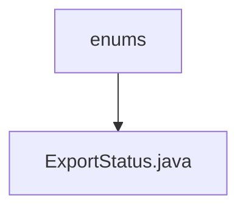

# 基础信息

|      |      |
|------|------|
| 名称 | enums |
| 编码语言 | .java |
| 代码路径 | WeFe/board/board-service/src/main/java/com/welab/wefe/board/service/fusion/enums |
| 包名 | docs.board.board-service.src.main.java.com.welab.wefe.board.service.fusion.enums |
| 概述说明 | 导出状态枚举：失败(failure)、成功(success)、进行中(exporting)。 |

# 说明

该枚举类型定义了三种导出状态：failure表示导出失败，success表示导出成功，exporting表示正在导出。每种状态都有对应的注释说明其含义。

### 包内部结构视图

该流程图展示了WeFe项目中枚举类的层级关系，顶层节点为enums文件夹，包含一个具体的枚举类文件ExportStatus.java。这种结构常用于组织项目中与状态、类型相关的枚举定义，保持代码的清晰性和可维护性。

# 文件列表

| 名称   | 类型  | 说明 |
|-------|------|-------------|
| [ExportStatus.java](ExportStatus.md) | file | 导出状态枚举：失败(failure)、成功(success)、进行中(exporting)。 |

