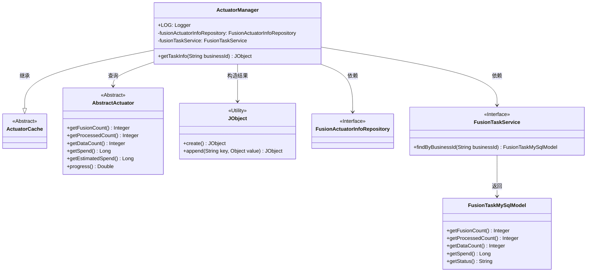
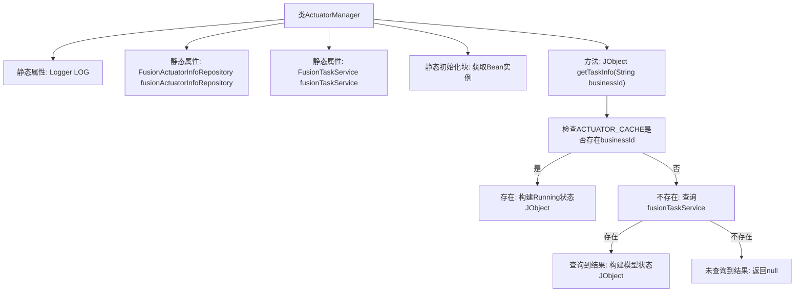

# 基础信息

|      |      |
|------|------|
| 名称 | ActuatorManager |
| 编码语言 | .java |
| 代码路径 | WeFe/board/board-service/src/main/java/com/welab/wefe/board/service/fusion/manager/ActuatorManager.java |
| 包名 | com.welab.wefe.board.service.fusion.manager |
| 依赖项 | ['com.welab.wefe.board.service.database.entity.fusion.FusionActuatorInfoMySqlModel', 'com.welab.wefe.board.service.database.entity.fusion.FusionTaskMySqlModel', 'com.welab.wefe.board.service.database.repository.fusion.FusionActuatorInfoRepository', 'com.welab.wefe.board.service.fusion.actuator.ClientActuator', 'com.welab.wefe.board.service.fusion.actuator.psi.ServerActuator', 'com.welab.wefe.board.service.service.fusion.FusionTaskService', 'com.welab.wefe.common.exception.StatusCodeWithException', 'com.welab.wefe.common.util.JObject', 'com.welab.wefe.common.web.Launcher', 'com.welab.wefe.fusion.core.actuator.AbstractActuator', 'com.welab.wefe.fusion.core.actuator.ActuatorCache', 'org.slf4j.Logger', 'org.slf4j.LoggerFactory'] |
| 概述说明 | ActuatorManager类继承ActuatorCache，通过静态方法getTaskInfo获取任务信息。若缓存存在返回运行中任务数据，否则查询数据库返回任务状态及进度。 |

# 说明

ActuatorManager类继承自ActuatorCache，包含静态Logger和两个静态成员变量fusionActuatorInfoRepository与fusionTaskService，通过Launcher.CONTEXT初始化。提供getTaskInfo方法，根据businessId获取执行器信息：若缓存中存在对应执行器，返回包含业务ID、融合计数、处理计数、数据量、耗时、状态、预估耗时和进度的JObject；若不存在则查询数据库，返回类似结构的数据；均不存在时返回null。

# 类列表 Class Summary

| 名称   | 类型  | 说明 |
|-------|------|-------------|
| ActuatorManager | class | ActuatorManager类继承ActuatorCache，通过静态方法getTaskInfo获取任务信息。若缓存中存在执行器，返回运行状态数据；否则查询数据库返回任务状态和进度。 |

## 类 ActuatorManager

|      |      |
|------|------|
| 访问范围 | public |
| 类型 | class |
| 名称 | ActuatorManager |
| 说明 | ActuatorManager类继承ActuatorCache，通过静态方法getTaskInfo获取任务信息。若缓存中存在执行器，返回运行状态数据；否则查询数据库返回任务状态和进度。 |

### UML类图

类图描述：ActuatorManager继承自ActuatorCache，负责管理执行器任务信息。它通过FusionTaskService查询数据库中的任务模型，或从缓存中获取AbstractActuator实例，最终构造JObject格式的任务信息。类图中展示了核心依赖关系，包括与接口FusionTaskService、FusionActuatorInfoRepository的交互，以及继承关系和工具类JObject的使用。

### 内部方法调用关系图

流程图描述：该流程图展示了ActuatorManager类的结构和getTaskInfo方法的主要执行流程。类包含静态日志记录器和两个通过Spring上下文初始化的Repository/Service组件。核心方法首先检查缓存中是否存在指定业务ID的执行器，存在则返回运行状态信息；否则查询数据库任务记录，存在则构建任务模型信息，都不存在则返回null。完整呈现了方法的分支判断逻辑和数据流转路径。

### 字段列表 Field List

| 名称  | 类型  | 说明 |
|-------|-------|------|
| fusionActuatorInfoRepository | FusionActuatorInfoRepository | 私有静态常量融合执行器信息仓库 |
| LOG = LoggerFactory.getLogger(ActuatorManager.class) | Logger | 定义ActuatorManager类的静态日志对象LOG，使用LoggerFactory创建。 |
| fusionTaskService | FusionTaskService | 私有静态不可变的融合任务服务实例。 |

### 方法列表

| 名称  | 类型  | 说明 |
|-------|-------|------|
| getTaskInfo | JObject | 获取任务信息方法：根据businessId从缓存或数据库查询任务状态、处理数、耗时等数据，返回JSON对象或null。 |

