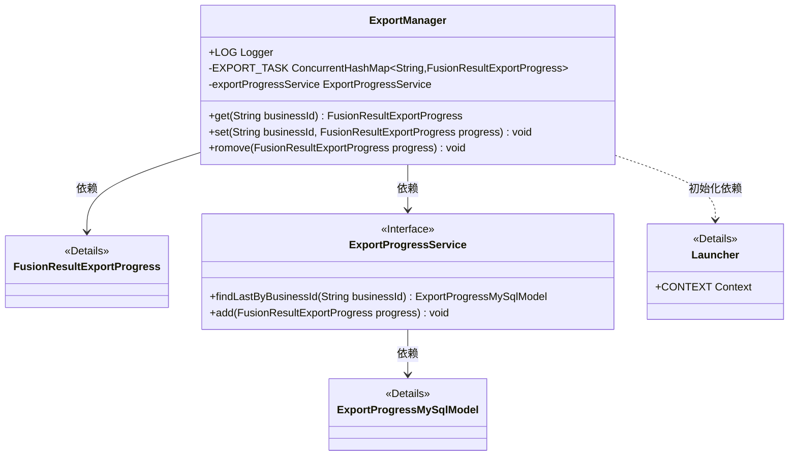
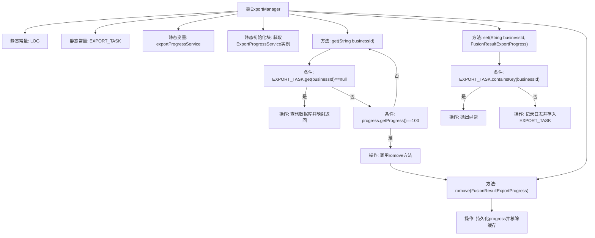

# 基础信息

|      |      |
|------|------|
| 名称 | ExportManager |
| 编码语言 | .java |
| 代码路径 | WeFe/board/board-service/src/main/java/com/welab/wefe/board/service/fusion/manager/ExportManager.java |
| 包名 | com.welab.wefe.board.service.fusion.manager |
| 依赖项 | ['com.welab.wefe.board.service.database.entity.fusion.ExportProgressMySqlModel', 'com.welab.wefe.board.service.dto.fusion.FusionResultExportProgress', 'com.welab.wefe.board.service.service.fusion.ExportProgressService', 'com.welab.wefe.common.web.Launcher', 'com.welab.wefe.common.web.util.ModelMapper', 'org.slf4j.Logger', 'org.slf4j.LoggerFactory', 'java.util.concurrent.ConcurrentHashMap'] |
| 概述说明 | ExportManager类管理导出任务进度，使用ConcurrentHashMap存储任务，支持获取、设置和移除任务，进度完成时自动移除并保存到数据库。 |

# 说明

ExportManager类是一个管理导出任务的工具类，使用ConcurrentHashMap存储业务ID与导出进度的映射关系。它包含静态方法get、set和romove。get方法根据业务ID获取导出进度，若缓存不存在则查询数据库；set方法添加新任务，禁止重复提交；romove方法将完成的任务持久化到数据库并移除缓存。类初始化时通过Spring上下文获取ExportProgressService实例，用于数据库操作。日志记录使用ActuatorManager的Logger。

# 类列表 Class Summary

| 名称   | 类型  | 说明 |
|-------|------|-------------|
| ExportManager | class | ExportManager类管理导出任务进度，使用ConcurrentHashMap存储任务，提供获取、设置和移除方法。获取时检查进度，完成则移除；设置时避免重复任务；移除时保存进度并清理缓存。 |

## 类 ExportManager

|      |      |
|------|------|
| 访问范围 | public |
| 类型 | class |
| 名称 | ExportManager |
| 说明 | ExportManager类管理导出任务进度，使用ConcurrentHashMap存储任务，提供获取、设置和移除方法。获取时检查进度，完成则移除；设置时避免重复任务；移除时保存进度并清理缓存。 |

### UML类图

这段代码描述了一个导出任务管理器ExportManager，它通过ConcurrentHashMap维护正在进行的导出任务状态，并依赖ExportProgressService接口进行持久化操作。该类提供get/set/remove方法管理任务状态，当任务进度达到100%时自动移除并持久化记录。静态初始化块通过Launcher获取服务实例，整个设计采用内存缓存+数据库备份的双重机制来保证任务状态可靠性。

### 内部方法调用关系图

该流程图展示了ExportManager类的核心结构和逻辑流程。类包含静态常量和变量初始化，通过静态块获取服务实例。主要方法get()实现缓存查询逻辑：当缓存不存在时查数据库，进度100%时触发移除；set()方法实现防重复提交校验；romove()完成持久化后清除缓存。箭头清晰表达了条件判断和操作调用关系，完整呈现了导出任务管理的业务逻辑链条。

### 字段列表 Field List

| 名称  | 类型  | 说明 |
|-------|-------|------|
| exportProgressService | ExportProgressService | 私有静态常量导出进度服务实例。 |
| EXPORT_TASK = new ConcurrentHashMap<>() | ConcurrentHashMap<String, FusionResultExportProgress> | 声明一个线程安全的全局静态映射，键为字符串，值为导出进度对象。 |
| LOG = LoggerFactory.getLogger(ActuatorManager.class) | Logger | 定义ActuatorManager类的静态日志常量LOG，使用LoggerFactory创建。 |

### 方法列表

| 名称  | 类型  | 说明 |
|-------|-------|------|
| get | FusionResultExportProgress | 根据业务ID获取导出进度，若缓存不存在则查表返回，进度100%时移除缓存。 |
| set | void | 静态方法`set`用于设置导出进度，若业务ID已存在则抛出异常，否则记录日志并存储进度。 |
| romove | void | 移除导出任务：将进度对象加入服务并从任务列表中删除对应业务ID。 |

