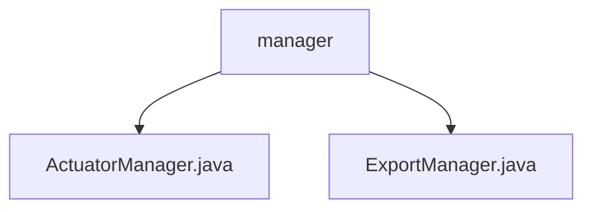

# 基础信息

|      |      |
|------|------|
| 名称 | manager |
| 编码语言 | .java |
| 代码路径 | WeFe/board/board-service/src/main/java/com/welab/wefe/board/service/fusion/manager |
| 包名 | docs.board.board-service.src.main.java.com.welab.wefe.board.service.fusion.manager |
| 概述说明 | ActuatorManager类继承ActuatorCache，通过businessId获取执行器信息，缓存或数据库查询后返回JObject。ExportManager类管理导出任务进度，使用ConcurrentHashMap缓存，提供增删查方法，数据库持久化通过ExportProgressService实现。 |

# 说明

## 概述  
该模块核心职责是管理执行器状态和导出任务进度，采用缓存优先策略提升查询效率。接口规范包括：ActuatorManager提供getTaskInfo方法返回JObject格式的执行器信息；ExportManager通过get/set/remove方法管理导出进度。关键数据结构包含JObject（存储执行器状态）和ConcurrentHashMap（维护导出进度映射）。外部依赖涉及数据库操作（通过Spring上下文获取Repository/Service实例）和日志组件（共用静态Logger）。例如ActuatorManager会优先查询缓存，而ExportManager通过内存映射避免重复提交任务。

## 主要业务场景  
模块主要处理两类流程：执行器状态跟踪（类似观察者模式）和导出任务生命周期管理。交互模式均采用"缓存-数据库"双层校验，例如getTaskInfo先查内存再查库。典型应用包括实时获取融合任务进度（含预估耗时等8项指标）和导出任务防重控制。API类型涵盖状态查询（GET类）和任务操作（SET类），集成案例可见于数据融合看板和批量导出功能。

### 包内部结构视图

该流程图展示了WeFe项目中board-service模块下fusion管理器的文件结构。manager作为父节点，包含两个Java类文件：ActuatorManager.java和ExportManager.java，分别代表执行器管理器和导出管理器功能模块。整个结构简洁清晰地呈现了管理器模块的核心文件组成。

# 文件列表

| 名称   | 类型  | 说明 |
|-------|------|-------------|
| [ActuatorManager.java](ActuatorManager.md) | file | ActuatorManager类继承ActuatorCache，通过静态方法getTaskInfo获取任务信息。若缓存存在返回运行中任务数据，否则查询数据库返回任务状态及进度。 |
| [ExportManager.java](ExportManager.md) | file | ExportManager类管理导出任务进度，使用ConcurrentHashMap存储任务，支持获取、设置和移除任务，进度完成时自动移除并保存到数据库。 |

