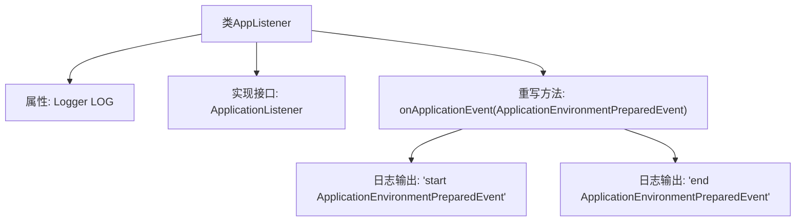

# 基础信息

|      |      |
|------|------|
| 名称 | AppListener |
| 编码语言 | .java |
| 代码路径 | WeFe/board/board-service/src/main/java/com/welab/wefe/board/service/listener/AppListener.java |
| 包名 | com.welab.wefe.board.service.listener |
| 依赖项 | ['org.slf4j.Logger', 'org.slf4j.LoggerFactory', 'org.springframework.boot.context.event.ApplicationEnvironmentPreparedEvent', 'org.springframework.context.ApplicationListener', 'org.springframework.stereotype.Component'] |
| 概述说明 | Java类AppListener监听应用环境准备事件，记录开始和结束日志。 |

# 说明

该内容描述了一个名为AppListener的Spring组件类，实现了ApplicationListener接口，监听ApplicationEnvironmentPreparedEvent事件。类中包含一个静态日志记录器，用于输出日志信息。当事件触发时，会执行onApplicationEvent方法，分别在事件开始和结束时记录日志信息。整个类结构简洁，专注于环境准备事件的监听和日志记录功能。

# 类列表 Class Summary

| 名称   | 类型  | 说明 |
|-------|------|-------------|
| AppListener | class | Java类AppListener监听应用环境准备事件，记录开始和结束日志。 |


## 类 AppListener

|      |      |
|------|------|
| 访问范围 | @Component;public |
| 类型 | class |
| 名称 | AppListener |
| 说明 | Java类AppListener监听应用环境准备事件，记录开始和结束日志。 |


### UML类图

```mermaid
classDiagram
    class ApplicationEnvironmentPreparedEvent {
        <<Event>>
    }

    class AppListener {
        -Logger LOG
        +onApplicationEvent(ApplicationEnvironmentPreparedEvent event) void
    }

    <<interface>> ApplicationListener~T~ {
        <<Interface>>
        +onApplicationEvent(T event) void
    }

    AppListener --> ApplicationListener~ApplicationEnvironmentPreparedEvent~ : 实现
    AppListener --> ApplicationEnvironmentPreparedEvent : 处理事件
```

这段类图展示了Spring框架中典型的事件监听机制。AppListener类实现了泛型接口ApplicationListener<ApplicationEnvironmentPreparedEvent>，专门处理应用环境准备事件。该监听器通过onApplicationEvent方法接收ApplicationEnvironmentPreparedEvent类型的事件对象，并在方法体内记录事件处理的开始和结束日志。类图中清晰体现了接口实现关系（使用空心三角形箭头）和事件处理依赖关系（使用虚线箭头），符合Spring应用程序启动阶段的事件处理模式。


### 内部方法调用关系图



这段代码展示了一个Spring组件类AppListener，它实现了ApplicationListener接口用于监听ApplicationEnvironmentPreparedEvent事件。流程图清晰地描述了类结构，包括日志属性声明、接口实现关系以及事件处理方法内的两个日志输出步骤。当环境准备事件触发时，会依次记录开始和结束日志，用于跟踪应用程序环境准备阶段的生命周期。

### 字段列表 Field List

| 名称  | 类型  | 说明 |
|-------|-------|------|
| LOG = LoggerFactory.getLogger(AppListener.class) | Logger | 定义AppListener类的私有静态日志常量LOG。 |

### 方法列表

| 名称  | 类型  | 说明 |
|-------|-------|------|
| onApplicationEvent | void | Java方法重写，处理应用环境准备事件，记录开始和结束日志。 |


