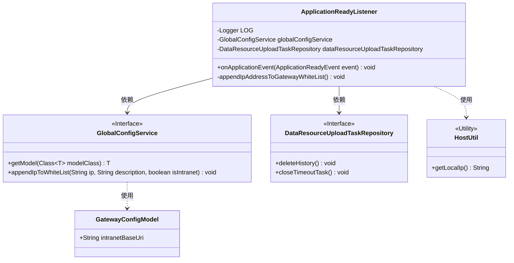
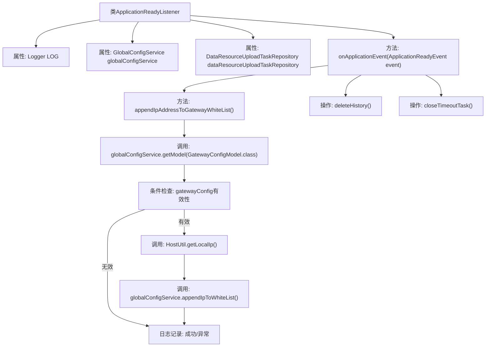

# 基础信息

|      |      |
|------|------|
| 名称 | ApplicationReadyListener |
| 编码语言 | .java |
| 代码路径 | WeFe/board/board-service/src/main/java/com/welab/wefe/board/service/listener/ApplicationReadyListener.java |
| 包名 | com.welab.wefe.board.service.listener |
| 依赖项 | ['com.welab.wefe.board.service.database.repository.data_resource.DataResourceUploadTaskRepository', 'com.welab.wefe.board.service.service.globalconfig.GlobalConfigService', 'com.welab.wefe.common.util.HostUtil', 'com.welab.wefe.common.util.StringUtil', 'com.welab.wefe.common.wefe.dto.global_config.GatewayConfigModel', 'org.slf4j.Logger', 'org.slf4j.LoggerFactory', 'org.springframework.beans.factory.annotation.Autowired', 'org.springframework.boot.context.event.ApplicationReadyEvent', 'org.springframework.context.ApplicationListener', 'org.springframework.stereotype.Component'] |
| 概述说明 | ApplicationReadyListener监听应用启动事件，执行IP白名单登记和清理历史数据任务。通过globalConfigService获取网关配置并添加本地IP到白名单，同时调用dataResourceUploadTaskRepository删除历史记录和关闭超时任务。 |

# 说明

该代码定义了一个Spring组件类ApplicationReadyListener，用于监听应用启动完成事件。主要功能包括：1.通过globalConfigService获取网关配置，将本机内网IP添加到白名单；2.通过dataResourceUploadTaskRepository删除历史记录和关闭超时任务。若网关配置缺失会记录错误日志，IP登记过程会捕获异常并记录。整个流程包含配置校验、IP获取、白名单登记等步骤。

# 类列表 Class Summary

| 名称   | 类型  | 说明 |
|-------|------|-------------|
| ApplicationReadyListener | class | ApplicationReadyListener监听应用启动事件，执行IP白名单登记和清理历史数据任务。调用globalConfigService添加内网IP至网关白名单，并通过dataResourceUploadTaskRepository删除历史记录和关闭超时任务。 |

## 类 ApplicationReadyListener

|      |      |
|------|------|
| 访问范围 | @Component;public |
| 类型 | class |
| 名称 | ApplicationReadyListener |
| 说明 | ApplicationReadyListener监听应用启动事件，执行IP白名单登记和清理历史数据任务。调用globalConfigService添加内网IP至网关白名单，并通过dataResourceUploadTaskRepository删除历史记录和关闭超时任务。 |

### UML类图

这段代码展示了一个Spring Boot应用启动监听器`ApplicationReadyListener`，它在应用准备就绪时执行两个主要操作：1) 将当前服务器IP添加到网关白名单；2) 清理数据资源上传任务历史记录。该监听器依赖`GlobalConfigService`进行网关配置管理和白名单操作，依赖`DataResourceUploadTaskRepository`进行任务管理。代码包含完善的错误处理和日志记录，通过`HostUtil`工具类获取本地IP地址，体现了对网络配置和资源清理的关注。

### 内部方法调用关系图

流程图描述：该流程图展示了Spring Boot应用启动监听器的工作流程。当监听到ApplicationReadyEvent事件时，首先调用appendIpAddressToGatewayWhiteList()方法处理网关白名单IP登记，包括获取网关配置、验证配置有效性、获取本地IP并注册到白名单。随后执行两个数据清理操作：deleteHistory()和closeTimeoutTask()。整个过程包含异常处理和日志记录环节，确保系统启动时关键初始化操作的可靠性。

### 字段列表 Field List

| 名称  | 类型  | 说明 |
|-------|-------|------|
| globalConfigService | GlobalConfigService | 使用@Autowired自动注入GlobalConfigService实例。 |
| LOG = LoggerFactory.getLogger(ApplicationReadyListener.class) | Logger | 定义静态常量LOG，使用LoggerFactory获取ApplicationReadyListener类的日志记录器实例。 |
| dataResourceUploadTaskRepository | DataResourceUploadTaskRepository | 自动注入数据资源上传任务仓库实例。 |

### 方法列表

| 名称  | 类型  | 说明 |
|-------|-------|------|
| onApplicationEvent | void | 方法重写应用启动事件，执行添加IP到网关白名单、删除历史记录和关闭超时任务。 |
| appendIpAddressToGatewayWhiteList | void | 方法将本机IP加入网关白名单。检查配置后获取本地IP并登记，成功则记录日志，失败则报错。 |

