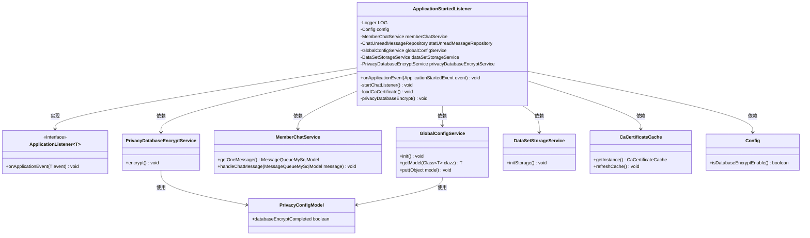

# 基础信息

|      |      |
|------|------|
| 名称 | ApplicationStartedListener |
| 编码语言 | .java |
| 代码路径 | WeFe/board/board-service/src/main/java/com/welab/wefe/board/service/listener/ApplicationStartedListener.java |
| 包名 | com.welab.wefe.board.service.listener |
| 依赖项 | ['cn.hutool.core.thread.ThreadUtil', 'com.welab.wefe.board.service.cache.CaCertificateCache', 'com.welab.wefe.board.service.constant.Config', 'com.welab.wefe.board.service.database.entity.chat.MessageQueueMySqlModel', 'com.welab.wefe.board.service.database.repository.ChatUnreadMessageRepository', 'com.welab.wefe.board.service.service.DataSetStorageService', 'com.welab.wefe.board.service.service.MemberChatService', 'com.welab.wefe.board.service.service.PrivacyDatabaseEncryptService', 'com.welab.wefe.board.service.service.globalconfig.GlobalConfigService', 'com.welab.wefe.common.wefe.dto.global_config.PrivacyConfigModel', 'org.slf4j.Logger', 'org.slf4j.LoggerFactory', 'org.springframework.beans.factory.annotation.Autowired', 'org.springframework.boot.context.event.ApplicationStartedEvent', 'org.springframework.context.ApplicationListener', 'org.springframework.stereotype.Component', 'java.util.concurrent.TimeUnit'] |
| 概述说明 | 应用启动监听器，初始化全局配置、数据库加密、数据集存储，启动聊天监听线程并加载CA证书。异常处理确保系统稳定运行。 |

# 说明

这是一个Spring应用监听器类，用于处理应用启动事件。它包含多个自动注入的服务组件，如全局配置服务、数据集存储服务和隐私数据库加密服务等。主要功能包括初始化全局配置、启动数据库加密、初始化数据存储、加载CA证书以及启动聊天消息监听线程。聊天监听器会持续从消息队列获取并处理消息。隐私数据库加密功能会检查配置状态，必要时执行加密操作。所有操作都有完善的异常处理和日志记录。

# 类列表 Class Summary

| 名称   | 类型  | 说明 |
|-------|------|-------------|
| ApplicationStartedListener | class | 应用启动监听器，初始化全局配置、数据库加密和存储服务，启动聊天消息监听线程，加载CA证书缓存。 |

## 类 ApplicationStartedListener

|      |      |
|------|------|
| 访问范围 | @Component;public |
| 类型 | class |
| 名称 | ApplicationStartedListener |
| 说明 | 应用启动监听器，初始化全局配置、数据库加密和存储服务，启动聊天消息监听线程，加载CA证书缓存。 |

### UML类图

这段类图展示了ApplicationStartedListener类及其相关依赖关系。该类实现了ApplicationListener接口，监听应用启动事件，并在启动时执行多项初始化任务，包括全局配置初始化、隐私数据库加密、数据集存储初始化等。它通过依赖注入获取多个服务实例，如GlobalConfigService、MemberChatService等，并协调这些服务完成系统启动时的关键操作。图中清晰地展示了类之间的实现和依赖关系，以及关键方法的调用路径。

### 内部方法调用关系图

这段代码是一个Spring Boot应用启动监听器，主要处理应用启动时的初始化工作。流程图展示了类结构、属性依赖和方法调用关系，包括全局配置初始化、隐私数据库加密、数据集存储初始化、聊天消息监听和CA证书加载等核心流程。监听器通过异步线程持续处理聊天消息，并在出现异常时记录日志或终止系统，体现了完整的错误处理机制和资源初始化顺序。

### 字段列表 Field List

| 名称  | 类型  | 说明 |
|-------|-------|------|
| dataSetStorageService | DataSetStorageService | 使用@Autowired自动注入DataSetStorageService实例。 |
| statUnreadMessageRepository | ChatUnreadMessageRepository | 自动注入ChatUnreadMessageRepository实例到statUnreadMessageRepository变量。 |
| config | Config | 自动注入配置对象实例。 |
| privacyDatabaseEncryptService | PrivacyDatabaseEncryptService | 使用@Autowired自动注入PrivacyDatabaseEncryptService服务实例。 |
| memberChatService | MemberChatService | 使用@Autowired自动注入MemberChatService实例。 |
| LOG = LoggerFactory.getLogger(ApplicationStartedListener.class) | Logger | 定义静态常量LOG，使用LoggerFactory获取ApplicationStartedListener类的日志记录器实例。 |
| globalConfigService | GlobalConfigService | 使用@Autowired自动注入GlobalConfigService实例。 |

### 方法列表

| 名称  | 类型  | 说明 |
|-------|-------|------|
| onApplicationEvent | void | 应用启动时初始化全局配置、加密隐私数据库、初始化数据集存储，启动聊天监听并加载CA证书，异常时记录日志。 |
| startChatListener | void | 启动聊天监听器，异步处理消息队列中的聊天消息，异常时休眠并记录错误日志。 |
| loadCaCertificate | void | 方法loadCaCertificate刷新CA证书缓存，记录开始和结束日志。 |
| privacyDatabaseEncrypt | void | 该方法用于隐私数据库加密。检查配置状态，若已完成加密但未启用则报错退出；若未启用或已完成则返回。否则执行加密并更新配置状态。异常时记录错误并退出。 |

