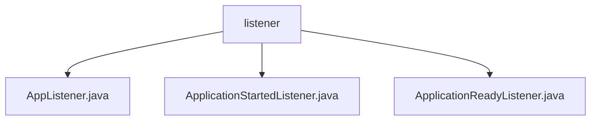

# 基础信息

|      |      |
|------|------|
| 名称 | listener |
| 编码语言 | .java |
| 代码路径 | WeFe/board/board-service/src/main/java/com/welab/wefe/board/service/listener |
| 包名 | docs.board.board-service.src.main.java.com.welab.wefe.board.service.listener |
| 概述说明 | AppListener监听环境准备事件并记录日志。ApplicationStartedListener处理应用启动，初始化配置、加密数据库、加载证书等。ApplicationReadyListener在启动完成后管理网关白名单和清理任务。 |

# 说明

## 概述  
该模块是Spring应用监听器集合，核心职责是处理应用生命周期关键事件（环境准备、启动、就绪阶段），执行初始化配置、安全校验和资源清理。接口规范遵循Spring的ApplicationListener，统一监听ApplicationEvent子类事件。关键数据结构包括全局配置、网关白名单和任务记录。外部依赖涉及Spring框架、日志组件和数据库服务。例如AppListener记录环境事件，ApplicationStartedListener初始化加密服务，ApplicationReadyListener管理IP白名单。

## 主要业务场景  
模块协同处理应用启动全流程：环境准备阶段记录日志（类似事件总线模式），启动阶段加载CA证书并初始化存储，就绪阶段维护IP白名单和清理任务。典型交互模式为事件驱动，通过监听器触发级联操作。功能完整性体现在配置管理、安全加密和资源维护三方面。API类型为Spring事件回调，集成案例包括数据库加密服务启停、消息队列监听线程启动等。例如隐私数据库加密服务会根据配置状态动态执行加密操作。

### 包内部结构视图

该流程图展示了WeFe项目中board-service模块下的listener目录结构，包含三个Java监听器文件：AppListener、ApplicationStartedListener和ApplicationReadyListener。所有文件均位于同一层级，直接隶属于listener目录，清晰地呈现了该模块的事件监听器组件分布。

# 文件列表

| 名称   | 类型  | 说明 |
|-------|------|-------------|
| [AppListener.java](AppListener.md) | file | Java类AppListener监听应用环境准备事件，记录开始和结束日志。 |
| [ApplicationStartedListener.java](ApplicationStartedListener.md) | file | 应用启动监听器，初始化全局配置、数据库加密、数据集存储，启动聊天监听线程并加载CA证书。异常处理确保系统稳定运行。 |
| [ApplicationReadyListener.java](ApplicationReadyListener.md) | file | ApplicationReadyListener监听应用启动事件，执行IP白名单登记和清理历史数据任务。通过globalConfigService获取网关配置并添加本地IP到白名单，同时调用dataResourceUploadTaskRepository删除历史记录和关闭超时任务。 |

