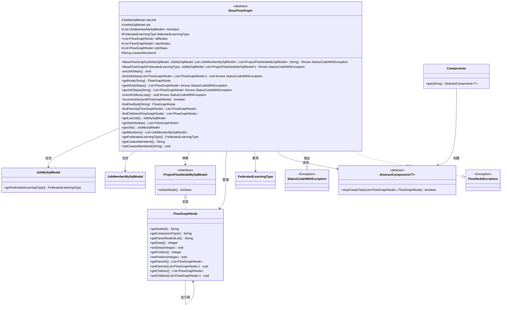

# 基础信息

|      |      |
|------|------|
| 名称 | BaseFlowGraph |
| 编码语言 | .java |
| 代码路径 | WeFe/board/board-service/src/main/java/com/welab/wefe/board/service/model/BaseFlowGraph.java |
| 包名 | com.welab.wefe.board.service.model |
| 依赖项 | ['com.welab.wefe.board.service.component.Components', 'com.welab.wefe.board.service.component.base.AbstractComponent', 'com.welab.wefe.board.service.database.entity.job.JobMemberMySqlModel', 'com.welab.wefe.board.service.database.entity.job.JobMySqlModel', 'com.welab.wefe.board.service.database.entity.job.ProjectFlowNodeMySqlModel', 'com.welab.wefe.board.service.exception.FlowNodeException', 'com.welab.wefe.common.StatusCode', 'com.welab.wefe.common.exception.StatusCodeWithException', 'com.welab.wefe.common.util.StringUtil', 'com.welab.wefe.common.web.util.ModelMapper', 'com.welab.wefe.common.wefe.enums.FederatedLearningType', 'org.apache.commons.collections4.CollectionUtils', 'java.util.ArrayList', 'java.util.Comparator', 'java.util.List', 'java.util.stream.Collectors'] |
| 概述说明 | BaseFlowGraph是抽象基类，用于管理流程图节点，包含节点关系处理、死循环检测及任务节点排序功能。支持获取执行路径节点和成员信息。 |

# 说明

BaseFlowGraph是一个抽象基类，用于管理联邦学习任务中的流程图结构。它包含当前任务、上一个任务、成员列表、联邦学习类型等核心属性，以及流程图节点集合、起始节点和执行节点列表。该类通过构造函数初始化流程图节点，处理节点间的父子关系，检查死循环，并整理待执行节点列表。提供获取节点、任务执行路径等方法，支持按深度排序节点并设置执行顺序。同时包含递归检查循环、查找父子节点等私有逻辑，以及各类属性的getter/setter方法。

# 类列表 Class Summary

| 名称   | 类型  | 说明 |
|-------|------|-------------|
| BaseFlowGraph | class | BaseFlowGraph是抽象基类，用于管理流程图节点，包含节点关系处理、死循环检查及任务执行路径排序等功能。 |

## 类 BaseFlowGraph

|      |      |
|------|------|
| 访问范围 | public abstract |
| 类型 | class |
| 名称 | BaseFlowGraph |
| 说明 | BaseFlowGraph是抽象基类，用于管理流程图节点，包含节点关系处理、死循环检查及任务执行路径排序等功能。 |

### UML类图

这段代码定义了一个抽象类BaseFlowGraph，用于管理联邦学习任务中的流程图节点。该类主要功能包括：初始化流程图节点、检查循环依赖、排序执行步骤、获取节点信息等。它通过组合方式关联JobMySqlModel、FlowGraphNode等多个模型类，并使用Components工厂获取具体组件实现。异常处理通过StatusCodeWithException和FlowNodeException实现，整体设计体现了流程图节点的层级管理和执行路径控制能力。

### 内部方法调用关系图

```mermaid
graph TD
    A["抽象类BaseFlowGraph"]
    B["属性: JobMySqlModel lastJob"]
    C["属性: JobMySqlModel job"]
    D["属性: List<JobMemberMySqlModel> members"]
    E["属性: FederatedLearningType federatedLearningType"]
    F["属性: List<FlowGraphNode> allNodes"]
    G["属性: List<FlowGraphNode> startNodes"]
    H["属性: List<FlowGraphNode> jobSteps"]
    I["属性: String creatorMemberId"]
    J["构造方法: BaseFlowGraph(JobMySqlModel, JobMySqlModel, List<JobMemberMySqlModel>, List<ProjectFlowNodeMySqlModel>, String)"]
    K["构造方法: BaseFlowGraph(FederatedLearningType, JobMySqlModel, List<ProjectFlowNodeMySqlModel>)"]
    L["私有方法: sortJobSteps()"]
    M["私有方法: findJobSteps(List<FlowGraphNode>, List<FlowGraphNode>)"]
    N["私有方法: checkEndlessLoop()"]
    O["私有方法: recursiveDescent(FlowGraphNode)"]
    P["私有方法: findOneById(String)"]
    Q["私有方法: findParents(FlowGraphNode)"]
    R["私有方法: findChildren(FlowGraphNode)"]
    S["公共方法: getNode(String)"]
    T["公共方法: getAllJobSteps()"]
    U["公共方法: getJobSteps(String)"]
    V["Getter/Setter方法"]

    A --> B
    A --> C
    A --> D
    A --> E
    A --> F
    A --> G
    A --> H
    A --> I
    A --> J
    A --> K
    K --> L
    K --> M
    K --> N
    N --> O
    K --> Q
    K --> R
    Q --> P
    R --> P
    A --> S
    A --> T
    A --> U
    A --> V
```

该流程图展示了BaseFlowGraph抽象类的核心结构和主要方法调用关系。类包含9个关键属性和2个构造方法，其中主构造方法K初始化流程图节点并触发节点关系处理、死循环检查等核心逻辑。私有方法L-M负责节点排序和执行路径查找，N-O用于死循环检测，Q-R处理父子节点关系查找。公共方法S-U提供节点查询和执行路径获取功能。整体设计采用递归下降算法处理节点拓扑关系，确保流程图无循环且执行路径有效。

### 字段列表 Field List

| 名称  | 类型  | 说明 |
|-------|-------|------|
| lastJob | JobMySqlModel | 最后工作的JobMySqlModel实例。 |
| job | JobMySqlModel | 定义了一个受保护的JobMySqlModel类型变量job。 |
| members | List<JobMemberMySqlModel> | 成员列表，存储JobMemberMySqlModel类型对象。 |
| creatorMemberId | String | 保护成员变量creatorMemberId，类型为String。 |
| startNodes | List<FlowGraphNode> | 受保护的FlowGraphNode类型列表startNodes。 |
| allNodes = new ArrayList<>() | List<FlowGraphNode> | 声明一个名为allNodes的List变量，存储FlowGraphNode类型元素，初始化为空ArrayList。 |
| federatedLearningType | FederatedLearningType | 保护的类型变量federatedLearningType，用于联邦学习类型。 |
| jobSteps = new ArrayList<>() | List<FlowGraphNode> | 定义了一个受保护的列表变量jobSteps，用于存储FlowGraphNode类型的对象。 |

### 方法列表

| 名称  | 类型  | 说明 |
|-------|-------|------|
| getLastJob | JobMySqlModel | 获取最近一次任务的MySQL模型对象。 |
| recursiveDescent | boolean | 递归检查流程图节点死循环：过滤子节点，若子节点深度小于等于父节点则判定为死循环；否则更新子节点深度并递归检查，无子节点时结束。 |
| sortJobSteps | void | 方法sortJobSteps按深度排序jobSteps，并为每个节点设置序列号。 |
| findChildren | List<FlowGraphNode> | 查找给定节点的所有子节点，通过筛选父节点ID列表包含该节点ID的节点。 |
| findJobSteps | void | 该方法递归遍历流程节点图，跳过已处理节点，根据组件规则决定是否停止生成任务，避免循环。若当前层级有新任务，则继续向上或向下探索节点。 |
| checkEndlessLoop | void | 检查流程图中是否存在死循环：起始节点若有父节点则报错，递归遍历子节点发现循环也报错。 |
| getJobSteps | List<FlowGraphNode> | 获取作业步骤列表，根据结束节点ID过滤。若ID无效或无位置信息则抛出异常。无ID时返回全部步骤。 |
| findParents | List<FlowGraphNode> | 查找节点的所有父节点。若无父节点返回null，否则根据ID列表逐个查找并返回父节点集合。 |
| getNode | FlowGraphNode | 该方法通过流式操作从节点集合中查找并返回指定ID的节点，未找到则返回null。 |
| getStartNodes | List<FlowGraphNode> | 获取流程图的起始节点列表。 |
| findOneById | FlowGraphNode | 该方法通过流式处理从节点列表中查找并返回指定ID的节点，未找到则返回null。 |
| getAllJobSteps | List<FlowGraphNode> | 获取所有任务步骤，若无参数则调用带参方法，可能抛出异常。 |
| getJob | JobMySqlModel | 获取当前job对象的方法，返回JobMySqlModel类型实例。 |
| getMembers | List<JobMemberMySqlModel> | 获取成员列表的方法，返回JobMemberMySqlModel类型的集合。 |
| getFederatedLearningType | FederatedLearningType | 这是一个Java方法，返回名为federatedLearningType的枚举类型对象。 |
| getCreatorMemberId | String | 获取创建者成员ID的方法，返回字符串类型的creatorMemberId。 |
| setCreatorMemberId | void | 设置创建者成员ID的方法，将参数值赋给类的成员变量creatorMemberId。 |

