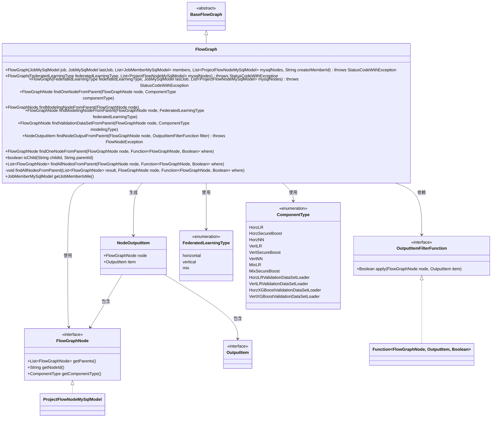

# 基础信息

|      |      |
|------|------|
| 名称 | FlowGraph |
| 编码语言 | .java |
| 代码路径 | WeFe/board/board-service/src/main/java/com/welab/wefe/board/service/model/FlowGraph.java |
| 包名 | com.welab.wefe.board.service.model |
| 依赖项 | ['com.welab.wefe.board.service.component.base.filter.OutputItemFilterFunction', 'com.welab.wefe.board.service.component.base.io.NodeOutputItem', 'com.welab.wefe.board.service.component.base.io.OutputItem', 'com.welab.wefe.board.service.database.entity.job.JobMemberMySqlModel', 'com.welab.wefe.board.service.database.entity.job.JobMySqlModel', 'com.welab.wefe.board.service.database.entity.job.ProjectFlowNodeMySqlModel', 'com.welab.wefe.board.service.exception.FlowNodeException', 'com.welab.wefe.board.service.service.CacheObjects', 'com.welab.wefe.common.exception.StatusCodeWithException', 'com.welab.wefe.common.wefe.enums.ComponentType', 'com.welab.wefe.common.wefe.enums.FederatedLearningType', 'org.apache.commons.collections4.CollectionUtils', 'java.util.ArrayList', 'java.util.List', 'java.util.function.Function'] |
| 概述说明 | FlowGraph类继承BaseFlowGraph，提供多种构造方法，支持从父节点查找特定类型节点、建模节点、验证数据集及输出项，并支持父子关系判断和成员过滤功能。 |

# 说明

FlowGraph类继承BaseFlowGraph，提供多种构造方法，支持基于任务、成员和节点列表初始化。包含查找节点功能：从父节点查找特定类型节点、建模节点、验证数据集节点及满足条件的输出项。支持判断父子节点关系，查找所有满足条件的父节点，以及从任务成员列表中获取当前用户信息。方法覆盖横向、纵向和混合联邦学习类型，处理不同组件类型的节点查找逻辑。

# 类列表 Class Summary

| 名称   | 类型  | 说明 |
|-------|------|-------------|
| FlowGraph | class | FlowGraph类继承BaseFlowGraph，提供多种构造方法，支持从父节点查找特定类型节点、验证数据集及输出项，并包含父子关系判断和成员过滤功能。 |

## 类 FlowGraph

|      |      |
|------|------|
| 访问范围 | public |
| 类型 | class |
| 名称 | FlowGraph |
| 说明 | FlowGraph类继承BaseFlowGraph，提供多种构造方法，支持从父节点查找特定类型节点、验证数据集及输出项，并包含父子关系判断和成员过滤功能。 |

### UML类图

这段代码描述了一个流程图处理类`FlowGraph`，继承自抽象基类`BaseFlowGraph`，主要用于处理联邦学习场景下的节点关系查询。类图展示了其核心功能：通过多种构造方法初始化流程图，提供节点查找方法（如按组件类型查找、查找建模节点、验证数据集节点等），支持输出项过滤和父子关系判断。通过枚举类型`FederatedLearningType`和`ComponentType`定义联邦学习类型和组件类型，与`FlowGraphNode`接口共同构成节点操作的基础。整体设计采用递归查询模式处理节点层级关系，适用于复杂的联邦学习工作流管理。

### 内部方法调用关系图

```mermaid
graph TD
    A["类FlowGraph"]
    B["继承: BaseFlowGraph"]
    C["构造方法: FlowGraph(JobMySqlModel, JobMySqlModel, List<JobMemberMySqlModel>, List<ProjectFlowNodeMySqlModel>, String)"]
    D["构造方法: FlowGraph(FederatedLearningType, List<ProjectFlowNodeMySqlModel>)"]
    E["构造方法: FlowGraph(FederatedLearningType, JobMySqlModel, List<ProjectFlowNodeMySqlModel>)"]
    F["方法: findOneNodeFromParent(FlowGraphNode, ComponentType)"]
    G["方法: findModelingNodeFromParent(FlowGraphNode)"]
    H["方法: findModelingNodeFromParent(FlowGraphNode, FederatedLearningType)"]
    I["方法: findValidationDataSetFromParent(FlowGraphNode, ComponentType)"]
    J["方法: findNodeOutputFromParent(FlowGraphNode, OutputItemFilterFunction)"]
    K["方法: findOneNodeFromParent(FlowGraphNode, Function<FlowGraphNode, Boolean>)"]
    L["方法: isChild(String, String)"]
    M["方法: findAllNodesFromParent(FlowGraphNode, Function<FlowGraphNode, Boolean>)"]
    N["私有方法: findAllNodesFromParent(List<FlowGraphNode>, FlowGraphNode, Function<FlowGraphNode, Boolean>)"]
    O["方法: getJobMemberIsMe()"]

    A --> B
    A --> C
    A --> D
    A --> E
    A --> F
    A --> G
    A --> H
    A --> I
    A --> J
    A --> K
    A --> L
    A --> M
    M --> N
    A --> O
```

流程图描述了FlowGraph类的结构及其方法调用关系。该类继承自BaseFlowGraph，包含3个构造方法和多个用于节点查找的功能方法。主要方法包括根据不同类型查找父节点(findModelingNodeFromParent)、验证数据集节点(findValidationDataSetFromParent)和输出项(findNodeOutputFromParent)等。这些方法通过递归或条件判断实现节点查找功能，支持水平/垂直/混合联邦学习类型的处理。类还包含成员信息获取和父子关系判断等辅助方法。

### 字段列表 Field List

| 名称  | 类型  | 说明 |
|-------|-------|------|

### 方法列表

| 名称  | 类型  | 说明 |
|-------|-------|------|
| isChild | boolean | 方法isChild检查childId是否为parentId的子节点，通过查找父节点是否存在匹配parentId的节点，返回布尔结果。 |
| findAllNodesFromParent | void | 递归查找满足条件的父节点，将结果存入列表。若父节点为空则返回，否则遍历检查条件并递归处理每个父节点。 |
| findOneNodeFromParent | FlowGraphNode | 方法findOneNodeFromParent通过父节点查找符合指定组件类型的节点，调用条件判断函数实现。 |
| findModelingNodeFromParent | FlowGraphNode | 根据联邦学习类型查找父节点中的建模节点，水平类型依次查找HorzLR、HorzSecureBoost、HorzNN，垂直类型查找VertLR、VertSecureBoost、VertNN，混合类型查找MixLR、MixSecureBoost。 |
| findModelingNodeFromParent | FlowGraphNode | 方法findModelingNodeFromParent通过父节点查找建模节点，调用重载方法并传入联邦学习类型参数。 |
| findValidationDataSetFromParent | FlowGraphNode | 方法根据组件类型从父节点查找对应的验证数据集加载器节点，未匹配时返回null。 |
| findNodeOutputFromParent | NodeOutputItem | 查找父节点中符合过滤条件的输出项，递归遍历所有父节点。若无匹配则返回空。 |
| findOneNodeFromParent | FlowGraphNode | 从给定父节点递归查找首个满足条件的节点，若父节点列表为空或未找到则返回null。 |
| findAllNodesFromParent | List<FlowGraphNode> | 该方法通过递归查找父节点下的所有符合条件的子节点，返回结果列表。参数为起始节点和条件函数。 |
| getJobMemberIsMe | JobMemberMySqlModel | 该方法从成员列表中筛选出当前用户且角色匹配的成员对象，若无则返回null。 |

