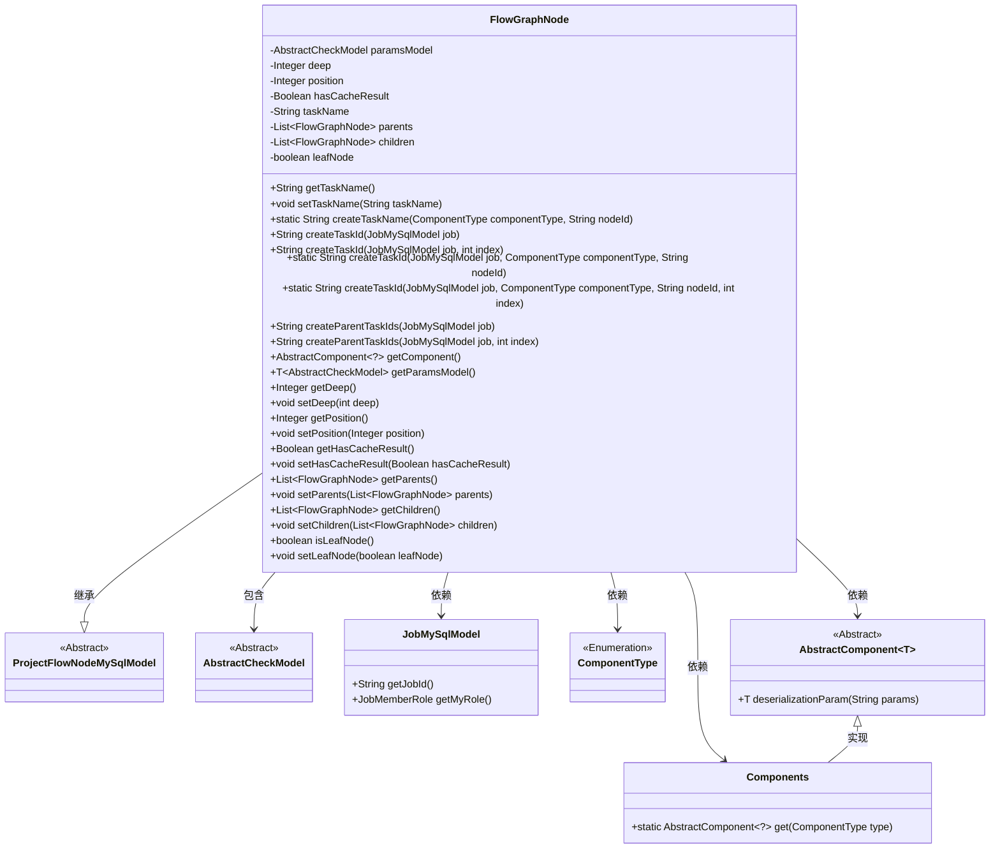
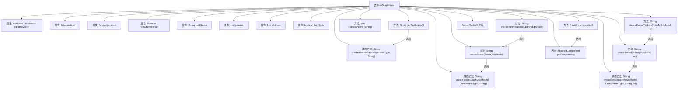

# 基础信息

|      |      |
|------|------|
| 名称 | FlowGraphNode |
| 编码语言 | .java |
| 代码路径 | WeFe/board/board-service/src/main/java/com/welab/wefe/board/service/model/FlowGraphNode.java |
| 包名 | com.welab.wefe.board.service.model |
| 依赖项 | ['cn.hutool.core.collection.CollectionUtil', 'com.welab.wefe.board.service.component.Components', 'com.welab.wefe.board.service.component.base.AbstractComponent', 'com.welab.wefe.board.service.database.entity.job.JobMySqlModel', 'com.welab.wefe.board.service.database.entity.job.ProjectFlowNodeMySqlModel', 'com.welab.wefe.common.exception.StatusCodeWithException', 'com.welab.wefe.common.fieldvalidate.AbstractCheckModel', 'com.welab.wefe.common.wefe.enums.ComponentType', 'com.welab.wefe.common.wefe.enums.JobMemberRole', 'org.apache.commons.lang3.StringUtils', 'java.util.ArrayList', 'java.util.List', 'java.util.stream.Collectors'] |
| 概述说明 | FlowGraphNode类表示流程图的节点，包含深度、位置、缓存结果等属性，支持父子节点关系管理，提供任务ID生成和参数处理功能。 |

# 说明

FlowGraphNode类继承自ProjectFlowNodeMySqlModel，用于表示流程图中的节点。主要属性包括节点参数模型paramsModel、深度deep、执行序号position、是否有缓存结果hasCacheResult、任务名称taskName、父节点列表parents、子节点列表children以及是否为叶子节点leafNode。提供了生成任务名称和任务ID的方法，支持根据组件类型和节点ID创建唯一标识。同时包含获取父任务ID列表的功能，特殊处理了仲裁者角色的无父节点情况。通过getter和setter方法管理节点深度、位置、缓存状态及父子节点关系，子节点为空时自动标记为叶子节点。

# 类列表 Class Summary

| 名称   | 类型  | 说明 |
|-------|------|-------------|
| FlowGraphNode | class | FlowGraphNode类表示流程图的节点，包含参数模型、深度、位置、缓存结果、任务名、父子节点等属性，提供任务ID生成、父任务ID拼接、组件获取等方法。 |

## 类 FlowGraphNode

|      |      |
|------|------|
| 访问范围 | public |
| 类型 | class |
| 名称 | FlowGraphNode |
| 说明 | FlowGraphNode类表示流程图的节点，包含参数模型、深度、位置、缓存结果、任务名、父子节点等属性，提供任务ID生成、父任务ID拼接、组件获取等方法。 |

### UML类图

这段代码描述了一个流程图的节点类`FlowGraphNode`，它继承自`ProjectFlowNodeMySqlModel`，用于表示工作流中的一个节点。该类包含了节点的深度、位置、缓存结果等属性，以及父节点和子节点的列表。提供了创建任务ID、父任务ID等方法，并能够获取组件对象和参数模型。该类与多个其他类有关联，包括`JobMySqlModel`、`ComponentType`、`AbstractComponent`等，形成了一个完整的工作流节点管理系统。

### 内部方法调用关系图

该流程图展示了FlowGraphNode类的完整结构，包含9个核心属性和12个主要方法。类继承自ProjectFlowNodeMySqlModel，核心功能包括任务名称/ID生成、父子节点管理、参数模型处理等。特别值得注意的是任务ID生成方法的多种重载形式，以及处理父子节点关系的双向链表结构。流程图清晰呈现了方法间的调用关系，如getTaskName()调用createTaskName()，以及各种createTaskId方法之间的关联。属性部分完整展示了节点深度、位置、缓存状态等关键状态信息。

### 字段列表 Field List

| 名称  | 类型  | 说明 |
|-------|-------|------|
| leafNode = false | boolean | 布尔变量leafNode初始化为false，表示非叶节点。 |
| taskName | String | 声明一个私有字符串变量taskName。 |
| paramsModel | AbstractCheckModel | 私有成员变量paramsModel，类型为AbstractCheckModel。 |
| deep | Integer | 私有整型变量deep |
| position | Integer | 私有整型变量position，用于存储位置信息。 |
| children = new ArrayList<>() | List<FlowGraphNode> | 声明一个私有列表变量children，用于存储FlowGraphNode类型的元素，初始化为空ArrayList。 |
| parents = new ArrayList<>() | List<FlowGraphNode> | 定义私有列表变量parents，存储FlowGraphNode类型元素，初始化为空ArrayList。 |
| hasCacheResult | Boolean | 私有布尔变量，标识是否存在缓存结果。 |

### 方法列表

| 名称  | 类型  | 说明 |
|-------|-------|------|
| getChildren | List<FlowGraphNode> | 获取子节点列表，若存在深度和子节点则更新子节点深度，子节点为空时初始化列表并返回。 |
| setChildren | void | 设置子节点列表，若为空则标记为叶子节点。 |
| isLeafNode | boolean | 方法isLeafNode返回布尔值leafNode，表示是否为叶节点。 |
| setLeafNode | void | 设置节点是否为叶子节点的方法，参数为布尔值leafNode。 |
| createParentTaskIds | String | 方法生成父任务ID：仲裁者角色返回空，其他角色收集父任务ID并用逗号连接。 |
| getComponent | AbstractComponent<?> | 方法getComponent返回通过父类类型从Components获取的抽象组件实例。 |
| createTaskId | String | 生成任务ID方法：组合任务ID、角色和组件类型节点ID。 |
| createTaskId | String | 该方法根据任务模型、组件类型和节点ID生成任务ID，调用内部方法实现。 |
| getParents | List<FlowGraphNode> | 获取父节点列表，若存在深度和父节点则设置父节点深度为当前深度减1；若父节点为空则初始化空列表并返回。 |
| setDeep | void | 这是一个Java方法，用于设置类成员变量deep的值。方法名为setDeep，接受一个int类型参数deep，并将其赋值给当前对象的deep属性。 |
| createTaskId | String | 生成任务ID方法：组合任务ID、角色、组件类型、节点ID和索引，用下划线连接。 |
| getDeep | Integer | 获取deep的整数值。 |
| createParentTaskIds | String | 方法`createParentTaskIds`根据任务角色生成父任务ID字符串。若角色为arbiter且无特殊情况（如串行横向建模），返回空字符串；否则返回所有父任务ID拼接的逗号分隔字符串。 |
| getPosition | Integer | 获取位置信息的方法，返回整型数值position。 |
| getHasCacheResult | Boolean | 方法返回布尔值hasCacheResult，表示是否有缓存结果。 |
| createTaskName | String | 该方法根据组件类型和节点ID生成任务名称，格式为"组件类型_节点ID"。 |
| getParamsModel | T | 该方法返回泛型参数模型。若paramsModel非空则直接返回；否则通过组件反序列化参数创建模型，失败返回null，成功返回模型实例。 |
| getTaskName | String | 方法getTaskName检查taskName是否为空，若为空则调用createTaskName生成新名称并返回。 |
| createTaskId | String | 方法createTaskId根据任务模型、组件类型、节点ID和索引生成任务ID，调用内部重载方法实现。 |
| setPosition | void | 设置对象的位置属性。参数为整型数值。 |
| setHasCacheResult | void | 设置缓存结果标志的方法，参数为布尔值。 |
| setParents | void | 设置父节点列表的方法，将输入参数parents赋值给当前对象的parents属性。 |
| setTaskName | void | 方法setTaskName用于设置任务名称，将传入的taskName赋值给当前对象的taskName属性。 |

