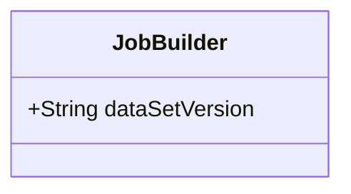
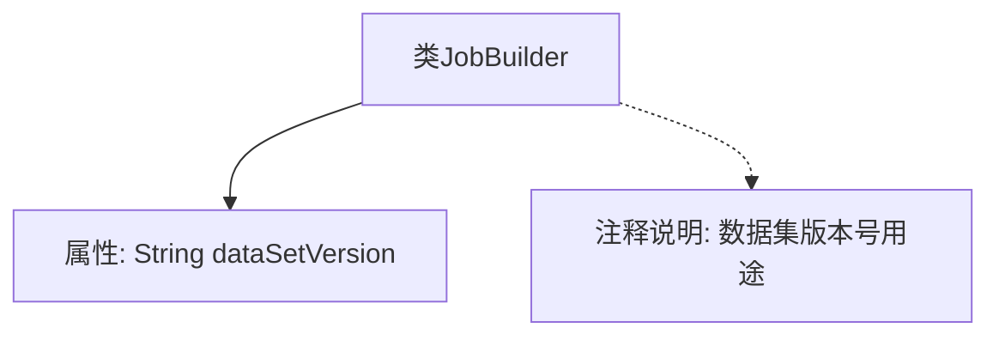

# 基础信息

|      |      |
|------|------|
| 名称 | JobBuilder |
| 编码语言 | .java |
| 代码路径 | WeFe/board/board-service/src/main/java/com/welab/wefe/board/service/model/JobBuilder.java |
| 包名 | com.welab.wefe.board.service.model |
| 依赖项 | [] |
| 概述说明 | JobBuilder类包含dataSetVersion字段，用于标记图像数据集版本号，帮助visual fl服务减少下载次数。 |

# 说明

JobBuilder类包含一个字符串类型字段dataSetVersion，用于存储数据集的版本号。该版本号主要用于图像数据集，通过标记版本号，visual fl服务可以根据版本号减少下载图像数据集的次数，从而优化性能。

# 类列表 Class Summary

| 名称   | 类型  | 说明 |
|-------|------|-------------|
| JobBuilder | class | JobBuilder类包含dataSetVersion字段，用于标记图像数据集版本号，优化下载次数。 |

## 类 JobBuilder

|      |      |
|------|------|
| 访问范围 | public |
| 类型 | class |
| 名称 | JobBuilder |
| 说明 | JobBuilder类包含dataSetVersion字段，用于标记图像数据集版本号，优化下载次数。 |

### UML类图

这段代码定义了一个简单的JobBuilder类，其中包含一个公有字符串类型成员变量dataSetVersion。该变量用于存储数据集的版本号，主要应用于图像数据集场景，通过版本号标记可以帮助visual fl服务优化图像数据集的下载次数。类图展示了JobBuilder的唯一公开属性，没有定义任何方法，是一个基础的数据承载类。

### 内部方法调用关系图

该流程图展示了JobBuilder类的核心结构，包含一个字符串类型属性dataSetVersion及其注释说明。注释明确指出该版本号用于图像数据集，通过版本标记优化visual fl服务的下载效率。类结构简洁，仅包含一个公开属性和相关文档说明，主要用于标记数据集版本以降低冗余下载。

### 字段列表 Field List

| 名称  | 类型  | 说明 |
|-------|-------|------|
| dataSetVersion | String | 数据集版本字符串变量。 |

### 方法列表

| 名称  | 类型  | 说明 |
|-------|-------|------|

