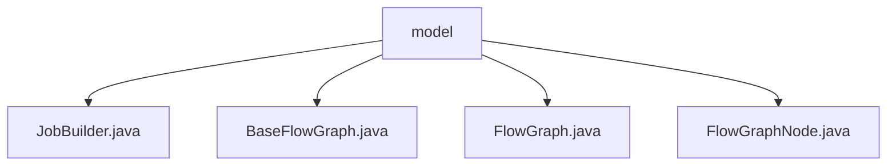

# 基础信息

|      |      |
|------|------|
| 名称 | model |
| 编码语言 | .java |
| 代码路径 | WeFe/board/board-service/src/main/java/com/welab/wefe/board/service/model |
| 包名 | docs.board.board-service.src.main.java.com.welab.wefe.board.service.model |
| 概述说明 | JobBuilder类含dataSetVersion字段标记图像数据集版本，优化下载性能。BaseFlowGraph是管理联邦学习流程图的抽象基类，含任务、节点等核心属性和方法。FlowGraph继承BaseFlowGraph，支持多种初始化及节点查找功能。FlowGraphNode表示流程图节点，含深度、父子节点等属性及任务生成方法。 |

# 说明

## 概述  
该模块核心职责是构建和管理联邦学习任务的流程图结构，支持多版本数据集处理和节点关系管理。接口规范包括流程图初始化、节点查找、父子关系处理及执行顺序设置，类似工作流引擎模式。关键数据结构包含JobBuilder的数据集版本号、BaseFlowGraph的任务属性和节点集合、FlowGraphNode的深度/位置/父子关系等属性。外部依赖涉及联邦学习任务模型和数据库实体类。例如JobBuilder通过dataSetVersion优化图像数据集下载，FlowGraphNode通过taskName生成唯一任务标识。

## 主要业务场景  
模块支持横向/纵向/混合联邦学习的流程图构建，典型场景包括：初始化任务节点并检查循环依赖（例如BaseFlowGraph的递归检查）、按深度排序执行节点（如FlowGraph的findNodesByType）、动态获取父节点数据（如FlowGraphNode的getParentTaskIds）。交互模式涵盖从成员列表获取用户信息、查找建模/验证节点等API，例如FlowGraph可定位特定类型父节点。功能完整性体现在支持仲裁者角色处理、叶子节点自动标记等边界场景。

### 包内部结构视图

该流程图展示了WeFe项目中board-service模块下model目录的层级结构。model作为根节点，包含四个Java类文件：JobBuilder、BaseFlowGraph、FlowGraph和FlowGraphNode。这些类文件均位于同一层级，没有进一步的子目录嵌套，体现了模型层核心组件的平级关系。

# 文件列表

| 名称   | 类型  | 说明 |
|-------|------|-------------|
| [JobBuilder.java](JobBuilder.md) | file | JobBuilder类包含dataSetVersion字段，用于标记图像数据集版本号，帮助visual fl服务减少下载次数。 |
| [BaseFlowGraph.java](BaseFlowGraph.md) | file | BaseFlowGraph是抽象基类，用于管理流程图节点，包含节点关系处理、死循环检测及任务节点排序功能。支持获取执行路径节点和成员信息。 |
| [FlowGraph.java](FlowGraph.md) | file | FlowGraph类继承BaseFlowGraph，提供多种构造方法，支持从父节点查找特定类型节点、建模节点、验证数据集及输出项，并支持父子关系判断和成员过滤功能。 |
| [FlowGraphNode.java](FlowGraphNode.md) | file | FlowGraphNode类表示流程图的节点，包含深度、位置、缓存结果等属性，支持父子节点关系管理，提供任务ID生成和参数处理功能。 |

