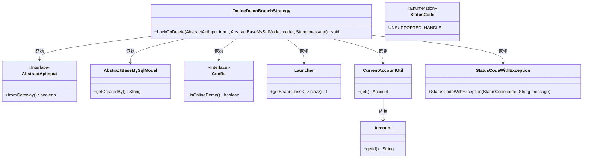

# 基础信息

|      |      |
|------|------|
| 名称 | OnlineDemoBranchStrategy |
| 编码语言 | .java |
| 代码路径 | WeFe/board/board-service/src/main/java/com/welab/wefe/board/service/onlinedemo/OnlineDemoBranchStrategy.java |
| 包名 | com.welab.wefe.board.service.onlinedemo |
| 依赖项 | ['com.welab.wefe.board.service.constant.Config', 'com.welab.wefe.board.service.database.entity.base.AbstractBaseMySqlModel', 'com.welab.wefe.common.StatusCode', 'com.welab.wefe.common.exception.StatusCodeWithException', 'com.welab.wefe.common.util.StringUtil', 'com.welab.wefe.common.web.Launcher', 'com.welab.wefe.common.web.dto.AbstractApiInput', 'com.welab.wefe.common.web.util.CurrentAccountUtil'] |
| 概述说明 | OnlineDemoBranchStrategy类防止在线演示环境误删数据，仅允许创建者删除且需非网关请求。 |

# 说明

OnlineDemoBranchStrategy类中的hackOnDelete方法用于在线演示环境下控制数据删除权限。方法首先检查是否处于在线演示模式，若否则直接返回。接着验证数据创建者字段是否为空或请求是否来自网关，满足条件则返回。核心逻辑是检查当前用户ID是否与数据创建者ID匹配，若不匹配则抛出StatusCodeWithException异常，阻止删除操作。该方法通过多层条件校验确保只有数据创建者能删除对应数据。

# 类列表 Class Summary

| 名称   | 类型  | 说明 |
|-------|------|-------------|
| OnlineDemoBranchStrategy | class | OnlineDemoBranchStrategy类中的hackOnDelete方法检查在线演示模式下数据删除权限，仅允许创建者删除数据，否则抛出异常。 |

## 类 OnlineDemoBranchStrategy

|      |      |
|------|------|
| 访问范围 | public |
| 类型 | class |
| 名称 | OnlineDemoBranchStrategy |
| 说明 | OnlineDemoBranchStrategy类中的hackOnDelete方法检查在线演示模式下数据删除权限，仅允许创建者删除数据，否则抛出异常。 |

### UML类图

这段代码定义了一个`OnlineDemoBranchStrategy`类，包含一个静态方法`hackOnDelete`，用于在在线演示环境下检查数据删除权限。该方法通过`Config`判断是否处于演示模式，验证数据创建者和当前用户是否匹配，并通过`AbstractApiInput`检查请求来源。类图中清晰展示了与接口`AbstractApiInput`、基类`AbstractBaseMySqlModel`、配置类`Config`等组件的依赖关系，以及异常处理流程。核心逻辑涉及5个条件判断，最终可能抛出`StatusCodeWithException`异常。

### 内部方法调用关系图

这段代码流程图展示了OnlineDemoBranchStrategy类中hackOnDelete方法的完整执行逻辑。方法首先获取系统配置，然后依次检查三个条件：是否在线演示模式、模型创建者是否为空、是否来自网关。只有当前两个条件为真且第三个为假时，才会比较模型创建者与当前用户ID，不匹配时抛出异常。该流程通过多层条件判断实现了对删除操作的精细化权限控制，确保在线演示环境下的数据安全。

### 字段列表 Field List

| 名称  | 类型  | 说明 |
|-------|-------|------|

### 方法列表

| 名称  | 类型  | 说明 |
|-------|-------|------|
| hackOnDelete | void | 静态方法hackOnDelete检查在线演示环境、数据创建者和请求来源，若当前用户非数据创建者则抛出异常阻止删除。 |

