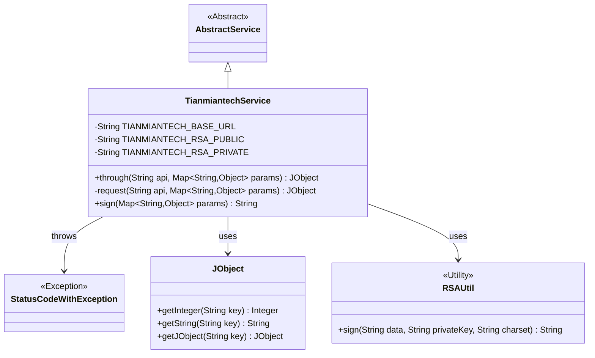
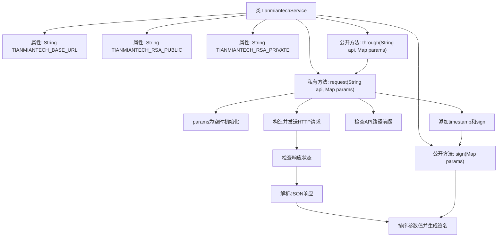

# 基础信息

|      |      |
|------|------|
| 名称 | TianmiantechService |
| 编码语言 | .java |
| 代码路径 | WeFe/board/board-service/src/main/java/com/welab/wefe/board/service/onlinedemo/TianmiantechService.java |
| 包名 | com.welab.wefe.board.service.onlinedemo |
| 依赖项 | ['com.alibaba.fastjson.JSON', 'com.alibaba.fastjson.JSONException', 'com.welab.wefe.board.service.service.AbstractService', 'com.welab.wefe.common.StatusCode', 'com.welab.wefe.common.exception.StatusCodeWithException', 'com.welab.wefe.common.http.HttpRequest', 'com.welab.wefe.common.http.HttpResponse', 'com.welab.wefe.common.util.JObject', 'com.welab.wefe.common.util.RSAUtil', 'org.springframework.beans.factory.annotation.Value', 'org.springframework.stereotype.Service', 'java.util.Arrays', 'java.util.List', 'java.util.Map', 'java.util.stream.Collectors'] |
| 概述说明 | 天冕科技服务类，继承AbstractService，通过配置API基础URL和RSA密钥，提供请求接口和签名功能。请求方法处理参数签名、异常和响应数据。 |

# 说明

该服务类用于调用天眠科技API接口，继承自抽象服务类。包含三个配置属性：基础URL、RSA公钥和私钥。提供两个核心方法：through方法作为公开接口，request方法处理实际请求。请求流程包括添加时间戳、生成签名、拼接URL、发送POST请求并处理响应。响应需验证状态码为200，否则抛出异常。sign方法实现RSA签名，对参数值排序后拼接字符串并用私钥签名。异常处理包括网络请求失败和响应数据解析错误。

# 类列表 Class Summary

| 名称   | 类型  | 说明 |
|-------|------|-------------|
| TianmiantechService | class | 天眠科技服务类，提供API调用功能，包含RSA签名和请求处理，支持参数校验与异常处理。 |

## 类 TianmiantechService

|      |      |
|------|------|
| 访问范围 | @Service;public |
| 类型 | class |
| 名称 | TianmiantechService |
| 说明 | 天眠科技服务类，提供API调用功能，包含RSA签名和请求处理，支持参数校验与异常处理。 |

### UML类图

这段代码展示了一个名为TianmiantechService的服务类，它继承自AbstractService，主要用于与天眠科技API进行交互。该类包含三个私有配置参数（API基础URL、RSA公钥和私钥），提供了through方法作为公共接口，内部通过request方法处理HTTP请求，并使用sign方法生成RSA签名。当API调用失败时会抛出StatusCodeWithException异常，返回数据使用JObject封装。该类依赖RSAUtil工具类进行签名操作，整体实现了对第三方API的安全调用和数据解析功能。

### 内部方法调用关系图

该流程图展示了TianmiantechService类的核心结构和请求处理流程。类包含3个配置属性和3个主要方法，其中through()是公开入口，内部调用request()方法完成请求处理。请求流程包括参数初始化、签名生成、API路径处理、HTTP请求发送、响应解析和状态验证等关键步骤。sign()方法负责对参数值进行排序并用RSA私钥生成签名，是整个安全验证的核心环节。所有异常情况都会通过StatusCodeWithException抛出，确保错误处理的统一性。

### 字段列表 Field List

| 名称  | 类型  | 说明 |
|-------|-------|------|
| TIANMIANTECH_RSA_PRIVATE | String | 代码定义了一个私有字符串变量TIANMIANTECH_RSA_PRIVATE，其值通过Spring的@Value注解从配置项tianmiantech.rsa.private注入，默认值为空。 |
| TIANMIANTECH_BASE_URL | String | 代码定义了一个私有字符串变量TIANMIANTECH_BASE_URL，其值通过@Value注解从配置项tianmiantech.api.base-url注入，默认值为空。 |
| TIANMIANTECH_RSA_PUBLIC | String | 代码定义了一个私有字符串变量TIANMIANTECH_RSA_PUBLIC，通过@Value注解从配置中获取RSA公钥，默认值为空。 |

### 方法列表

| 名称  | 类型  | 说明 |
|-------|-------|------|
| through | JObject | Java方法`through`调用`request`，传入API和参数，可能抛出`StatusCodeWithException`异常。 |
| request | JObject | 私有方法request发送HTTP请求到指定API，自动添加时间戳和签名。验证响应状态和JSON格式，成功返回data字段，失败抛出异常。 |
| sign | String | 方法对Map参数值排序后拼接字符串，使用RSA私钥进行签名，异常时抛出错误。 |

