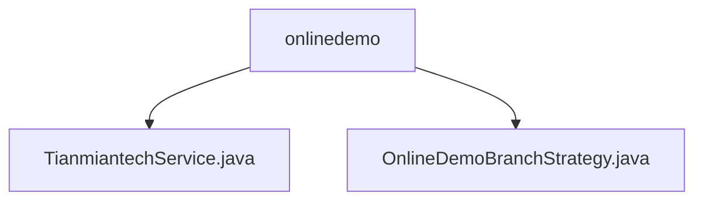

# 基础信息

|      |      |
|------|------|
| 名称 | onlinedemo |
| 编码语言 | .java |
| 代码路径 | WeFe/board/board-service/src/main/java/com/welab/wefe/board/service/onlinedemo |
| 包名 | docs.board.board-service.src.main.java.com.welab.wefe.board.service.onlinedemo |
| 概述说明 | 天眠科技服务类继承抽象类，含URL和RSA密钥配置，提供through和request方法处理签名请求。OnlineDemoBranchStrategy的hackOnDelete方法在线演示时校验用户权限，仅允许创建者删除数据。 |

# 说明

## 概述  
该模块核心职责是集成天眠科技API调用和在线演示环境的数据安全管控。接口规范包括RSA签名机制（例如对参数排序后私钥签名）和HTTP请求处理（例如验证200状态码）。关键数据结构涉及API配置属性（基础URL、RSA密钥对）和权限校验字段（用户ID、创建者ID）。外部依赖包括天眠科技API和RSA加密库。例如sign方法实现参数签名，through方法暴露为服务入口。

## 主要业务场景  
模块主要处理两类流程：API调用链（类似网关代理模式，含签名生成→请求发送→响应校验）和演示环境权限控制（类似沙箱机制）。典型交互包括通过多层条件校验数据删除权限（例如hackOnDelete方法验证用户身份），以及处理网络请求异常（例如响应解析错误）。集成案例覆盖外部API调用（如POST请求带RSA签名）和内部安全策略（如阻止非创建者删除数据）。

### 包内部结构视图

该流程图展示了WeFe项目中board-service模块下onlinedemo包的层级结构。onlinedemo作为父节点，包含两个子节点：TianmiantechService.java和OnlineDemoBranchStrategy.java两个Java类文件。整个结构清晰地呈现了在线演示功能相关的服务类与策略类之间的从属关系。

# 文件列表

| 名称   | 类型  | 说明 |
|-------|------|-------------|
| [TianmiantechService.java](TianmiantechService.md) | file | 天冕科技服务类，继承AbstractService，通过配置API基础URL和RSA密钥，提供请求接口和签名功能。请求方法处理参数签名、异常和响应数据。 |
| [OnlineDemoBranchStrategy.java](OnlineDemoBranchStrategy.md) | file | OnlineDemoBranchStrategy类防止在线演示环境误删数据，仅允许创建者删除且需非网关请求。 |

