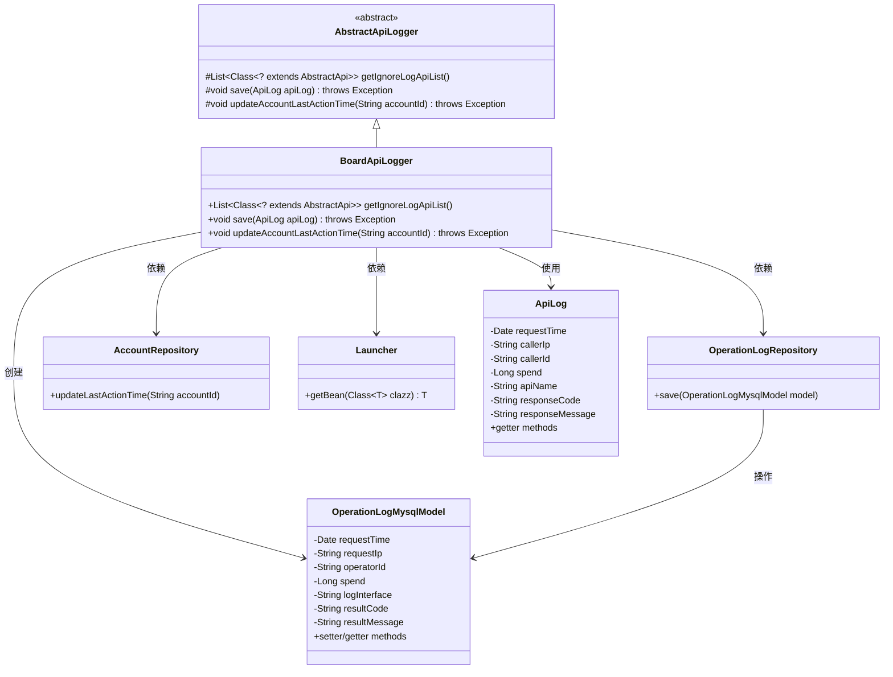
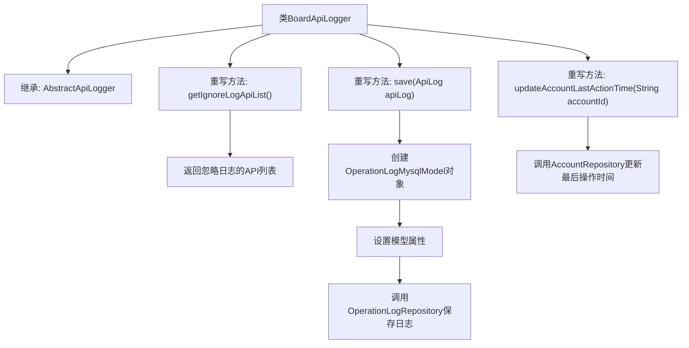

# 基础信息

|      |      |
|------|------|
| 名称 | BoardApiLogger |
| 编码语言 | .java |
| 代码路径 | WeFe/board/board-service/src/main/java/com/welab/wefe/board/service/operation/BoardApiLogger.java |
| 包名 | com.welab.wefe.board.service.operation |
| 依赖项 | ['com.welab.wefe.board.service.api.data_resource.upload_task.DataResourceUploadTaskDetailApi', 'com.welab.wefe.board.service.api.data_resource.upload_task.DataResourceUploadTaskQueryApi', 'com.welab.wefe.board.service.api.file.FileUploadApi', 'com.welab.wefe.board.service.api.file.MergeApi', 'com.welab.wefe.board.service.api.member.MemberAvailableCheckApi', 'com.welab.wefe.board.service.api.project.flow.FlowQueryApi', 'com.welab.wefe.board.service.api.project.job.GetJobProgressApi', 'com.welab.wefe.board.service.api.project.job.task.TaskProgressDetailApi', 'com.welab.wefe.board.service.api.project.member.audit.ProjectMemberAuditListApi', 'com.welab.wefe.board.service.api.service.ServiceAvailableApi', 'com.welab.wefe.board.service.database.entity.OperationLogMysqlModel', 'com.welab.wefe.board.service.database.repository.AccountRepository', 'com.welab.wefe.board.service.database.repository.OperationLogRepository', 'com.welab.wefe.common.web.Launcher', 'com.welab.wefe.common.web.api.base.AbstractApi', 'com.welab.wefe.common.web.delegate.api_log.AbstractApiLogger', 'com.welab.wefe.common.web.delegate.api_log.ApiLog', 'org.springframework.stereotype.Component', 'java.util.Arrays', 'java.util.List'] |
| 概述说明 | BoardApiLogger继承AbstractApiLogger，忽略特定API日志记录，保存操作日志到数据库并更新账户最后操作时间。 |

# 说明

BoardApiLogger是一个继承AbstractApiLogger的组件类，主要用于记录API日志。它定义了需要忽略日志记录的API列表，包括FlowQueryApi等10个具体API类。在保存日志时，会将请求时间、调用者IP、操作者ID、耗时、接口名称、响应码和消息等信息存入OperationLogMysqlModel对象，并通过OperationLogRepository进行持久化。此外，还会通过AccountRepository更新指定账户的最后操作时间。

# 类列表 Class Summary

| 名称   | 类型  | 说明 |
|-------|------|-------------|
| BoardApiLogger | class | BoardApiLogger类继承AbstractApiLogger，忽略特定API日志记录，保存操作日志到数据库并更新账户最后操作时间。 |

## 类 BoardApiLogger

|      |      |
|------|------|
| 访问范围 | @Component;public |
| 类型 | class |
| 名称 | BoardApiLogger |
| 说明 | BoardApiLogger类继承AbstractApiLogger，忽略特定API日志记录，保存操作日志到数据库并更新账户最后操作时间。 |

### UML类图

这段代码展示了一个日志记录系统，其中BoardApiLogger继承自AbstractApiLogger，负责过滤特定API的日志记录并将操作日志保存到数据库。类图清晰地展示了各组件之间的关系：BoardApiLogger通过Launcher获取Repository实例，将ApiLog转换为OperationLogMysqlModel后存储，同时更新账户最后操作时间。系统采用依赖注入方式管理组件协作，体现了良好的分层设计。

### 内部方法调用关系图

这段代码展示了一个Spring组件`BoardApiLogger`，它继承自`AbstractApiLogger`并实现了三个核心功能：1) 定义需要忽略日志记录的API列表；2) 将API调用日志转换为数据库模型并存储；3) 更新账户的最后操作时间。流程图清晰地反映了类继承关系和方法调用链，其中`save()`方法涉及多步数据转换和存储操作，而`updateAccountLastActionTime()`直接委托给仓储层处理。

### 字段列表 Field List

| 名称  | 类型  | 说明 |
|-------|-------|------|

### 方法列表

| 名称  | 类型  | 说明 |
|-------|-------|------|
| getIgnoreLogApiList | List<Class<? extends AbstractApi>> | 方法返回忽略日志记录的API类列表，包括FlowQueryApi等10个类。 |
| save | void | 该方法将ApiLog对象的数据转换为OperationLogMysqlModel对象并保存到数据库，包含请求时间、IP、操作者ID、耗时、接口名、响应码和消息等关键信息。 |
| updateAccountLastActionTime | void | 重写方法，调用AccountRepository更新指定账户的最后操作时间。 |

