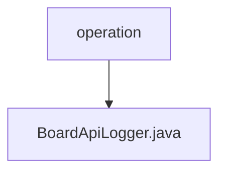

# 基础信息

|      |      |
|------|------|
| 名称 | operation |
| 编码语言 | .java |
| 代码路径 | WeFe/board/board-service/src/main/java/com/welab/wefe/board/service/operation |
| 包名 | docs.board.board-service.src.main.java.com.welab.wefe.board.service.operation |
| 概述说明 | BoardApiLogger继承AbstractApiLogger，忽略特定API日志记录，保存操作日志到数据库并更新账户最后操作时间。 |

# 说明

BoardApiLogger是一个继承AbstractApiLogger的组件类，主要用于记录API日志。它定义了需要忽略日志记录的API列表，包括FlowQueryApi等10个具体API类。在保存日志时，会将请求时间、调用者IP、操作者ID、耗时、接口名称、响应码和消息等信息存入OperationLogMysqlModel对象，并通过OperationLogRepository进行持久化。此外，还会通过AccountRepository更新指定账户的最后操作时间。

### 包内部结构视图

该流程图展示了WeFe项目中board-service模块的operation包结构，其中operation是根目录，包含一个BoardApiLogger.java文件。这种结构常见于日志记录或操作跟踪相关的服务实现，体现了单一职责原则的设计思想。

# 文件列表

| 名称   | 类型  | 说明 |
|-------|------|-------------|
| [BoardApiLogger.java](BoardApiLogger.md) | file | BoardApiLogger继承AbstractApiLogger，忽略特定API日志记录，保存操作日志到数据库并更新账户最后操作时间。 |

