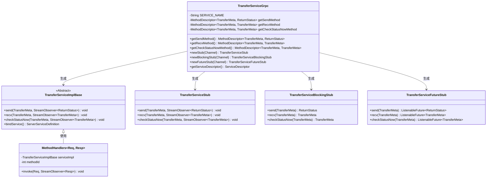

# 基础信息

|      |      |
|------|------|
| 名称 | TransferServiceGrpc |
| 编码语言 | .java |
| 代码路径 | WeFe/board/board-service/src/main/java/com/welab/wefe/board/service/proto/TransferServiceGrpc.java |
| 包名 | com.welab.wefe.board.service.proto |
| 依赖项 | ['com.welab.wefe.board.service.proto.meta.basic.BasicMetaProto', 'com.welab.wefe.board.service.proto.meta.basic.GatewayMetaProto', 'io.grpc.MethodDescriptor.generateFullMethodName', 'io.grpc.stub.ClientCalls.asyncUnaryCall', 'io.grpc.stub.ClientCalls.blockingUnaryCall', 'io.grpc.stub.ClientCalls.futureUnaryCall', 'io.grpc.stub.ServerCalls.asyncUnaryCall', 'io.grpc.stub.ServerCalls.asyncUnimplementedUnaryCall'] |
| 概述说明 | TransferServiceGrpc类定义了gRPC服务，包含send、recv和checkStatusNow三个方法，支持异步、阻塞和Future调用方式。 |

# 说明

该代码定义了一个gRPC服务TransferServiceGrpc，包含三个方法：send、recv和checkStatusNow。send方法接收TransferMeta请求并返回ReturnStatus响应；recv和checkStatusNow方法均接收并返回TransferMeta类型数据。服务支持异步、阻塞和Future三种调用方式，通过静态方法创建对应stub。类中还包含方法描述符的懒加载逻辑和服务描述符的构建过程，确保线程安全。所有方法均为UNARY调用类型，使用Protocol Buffers进行序列化。

# 类列表 Class Summary

| 名称   | 类型  | 说明 |
|-------|------|-------------|
| TransferServiceGrpc | class | TransferServiceGrpc类，基于gRPC 1.29.0生成，提供send、recv和checkStatusNow三个UNARY方法，支持异步、阻塞和Future三种调用方式。 |

## 类 TransferServiceGrpc

|      |      |
|------|------|
| 访问范围 | @javax.annotation.Generated(;    value = "by gRPC proto compiler (version 1.29.0)",;    comments = "Source: gateway-service.proto");public final |
| 类型 | class |
| 名称 | TransferServiceGrpc |
| 说明 | TransferServiceGrpc类，基于gRPC 1.29.0生成，提供send、recv和checkStatusNow三个UNARY方法，支持异步、阻塞和Future三种调用方式。 |

### UML类图

这段代码是gRPC框架生成的TransferService服务端和客户端存根类。核心类TransferServiceGrpc提供静态方法创建三种存根（异步、同步、Future模式），并定义了三个RPC方法描述符。TransferServiceImplBase是服务端实现基类，三个Stub类分别对应不同调用方式。MethodHandlers实现了服务端方法路由逻辑，通过methodId区分不同RPC方法调用。整个结构体现了gRPC典型的服务定义-存根生成-方法路由模式，支持多种调用方式。

### 内部方法调用关系图

```mermaid
graph TD
    A["类TransferServiceGrpc"]
    B["常量: SERVICE_NAME"]
    C["静态方法: getSendMethod"]
    D["静态方法: getRecvMethod"]
    E["静态方法: getCheckStatusNowMethod"]
    F["工厂方法: newStub"]
    G["工厂方法: newBlockingStub"]
    H["工厂方法: newFutureStub"]
    I["内部类: TransferServiceImplBase"]
    J["内部类: TransferServiceStub"]
    K["内部类: TransferServiceBlockingStub"]
    L["内部类: TransferServiceFutureStub"]
    M["内部类: MethodHandlers"]
    N["内部类: TransferServiceBaseDescriptorSupplier"]
    O["静态方法: getServiceDescriptor"]

    A --> B
    A --> C
    A --> D
    A --> E
    A --> F
    A --> G
    A --> H
    A --> I
    A --> J
    A --> K
    A --> L
    A --> M
    A --> N
    A --> O

    C --> C1["双重检查锁定创建MethodDescriptor"]
    D --> D1["双重检查锁定创建MethodDescriptor"]
    E --> E1["双重检查锁定创建MethodDescriptor"]
    I --> I1["实现bindService()注册gRPC方法"]
    J --> J1["实现异步调用send/recv/checkStatusNow"]
    K --> K1["实现阻塞调用send/recv/checkStatusNow"]
    L --> L1["实现Future调用send/recv/checkStatusNow"]
    M --> M1["根据methodId路由到具体实现"]
    O --> O1["双重检查锁定创建ServiceDescriptor"]
```

该流程图展示了gRPC服务端桩代码的核心结构。TransferServiceGrpc类通过静态工厂方法创建三种客户端桩(异步/阻塞/Future)，内部使用双重检查锁定模式延迟初始化MethodDescriptor。核心功能由内部类实现：TransferServiceImplBase处理服务绑定，三个Stub子类处理不同调用方式，MethodHandlers实现方法路由。服务描述符同样采用双重检查保证线程安全初始化。

### 字段列表 Field List

| 名称  | 类型  | 说明 |
|-------|-------|------|
| getSendMethod | io.grpc.MethodDescriptor<GatewayMetaProto.TransferMeta,
      BasicMetaProto.ReturnStatus> | 私有静态可变grpc方法描述符，用于GatewayMetaProto.TransferMeta到BasicMetaProto.ReturnStatus的发送方法。 |
| serviceDescriptor | io.grpc.ServiceDescriptor | 私有静态易变变量，存储gRPC服务描述符。 |
| METHODID_CHECK_STATUS_NOW = 2 | int | 私有静态常量METHODID_CHECK_STATUS_NOW值为2，用于标识即时状态检查方法。 |
| SERVICE_NAME = "com.welab.wefe.gateway.api.service.proto.TransferService" | String | 定义静态常量SERVICE_NAME，值为TransferService的完整协议服务名。 |
| METHODID_RECV = 1 | int | 私有静态常量METHODID_RECV值为1。 |
| METHODID_SEND = 0 | int | 私有静态常量METHODID_SEND值为0。 |
| getCheckStatusNowMethod | io.grpc.MethodDescriptor<GatewayMetaProto.TransferMeta,
      GatewayMetaProto.TransferMeta> | 私有静态易变变量，存储gRPC方法描述符，用于处理TransferMeta类型的请求和响应。 |
| getRecvMethod | io.grpc.MethodDescriptor<GatewayMetaProto.TransferMeta,
      GatewayMetaProto.TransferMeta> | 私有静态易变变量getRecvMethod，类型为io.grpc.MethodDescriptor，处理GatewayMetaProto.TransferMeta的传输。 |

### 方法列表

| 名称  | 类型  | 说明 |
|-------|-------|------|
| getCheckStatusNowMethod | io.grpc.MethodDescriptor<GatewayMetaProto.TransferMeta,
      GatewayMetaProto.TransferMeta> | 定义gRPC方法getCheckStatusNowMethod，用于检查状态，请求和响应类型均为TransferMeta，采用UNARY调用模式，通过双重检查锁确保线程安全。 |
| newBlockingStub | TransferServiceBlockingStub | 创建gRPC阻塞存根TransferServiceBlockingStub的静态方法，通过工厂模式实例化并返回基于指定通道的存根对象。 |
| getSendMethod | io.grpc.MethodDescriptor<GatewayMetaProto.TransferMeta,
      BasicMetaProto.ReturnStatus> | 定义gRPC单次调用方法send，请求类型为TransferMeta，返回类型为ReturnStatus，通过双重检查锁确保线程安全初始化方法描述符。 |
| newStub | TransferServiceStub | 创建TransferServiceStub静态方法，通过工厂模式生成gRPC存根实例，接收Channel参数并返回新存根对象。 |
| getRecvMethod | io.grpc.MethodDescriptor<GatewayMetaProto.TransferMeta,
      GatewayMetaProto.TransferMeta> | 定义gRPC方法recv，请求和响应类型均为TransferMeta，方法类型为UNARY，通过双重检查锁确保线程安全。 |
| newFutureStub | TransferServiceFutureStub | 创建一个返回TransferServiceFutureStub的静态方法，通过gRPC通道和工厂模式实现实例化。 |
| getServiceDescriptor | io.grpc.ServiceDescriptor | 获取gRPC服务描述符的静态方法，采用双重检查锁确保线程安全，包含Send、Recv和CheckStatusNow三个方法。 |

