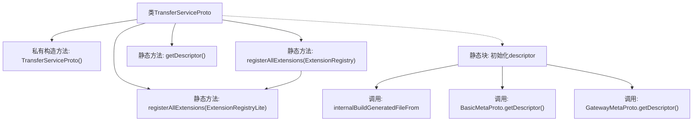

# 基础信息

|      |      |
|------|------|
| 名称 | TransferServiceProto |
| 编码语言 | .java |
| 代码路径 | WeFe/board/board-service/src/main/java/com/welab/wefe/board/service/proto/TransferServiceProto.java |
| 包名 | com.welab.wefe.board.service.proto |
| 依赖项 | ['com.welab.wefe.board.service.proto.meta.basic.BasicMetaProto', 'com.welab.wefe.board.service.proto.meta.basic.GatewayMetaProto'] |
| 概述说明 | TransferServiceProto类定义了数据传输服务，包含send、recv和checkStatusNow方法，用于处理TransferMeta和ReturnStatus消息。同时包含NetworkDataTransferProxyService服务，提供push和pushDataSource方法。 |

# 说明

这是一个名为TransferServiceProto的Java类，用于定义Protobuf服务描述。该类包含静态方法registerAllExtensions用于注册扩展，以及getDescriptor方法获取文件描述符。文件描述符通过静态代码块初始化，引用了gateway-service.proto、basic-meta.proto和gateway-meta.proto三个协议文件。该类定义了两个gRPC服务：TransferService提供send、recv和checkStatusNow方法；NetworkDataTransferProxyService提供push和pushDataSource方法，均使用TransferMeta作为请求和响应类型。最后通过Protobuf机制生成描述符并注册相关依赖。

# 类列表 Class Summary

| 名称   | 类型  | 说明 |
|-------|------|-------------|
| TransferServiceProto | class | TransferServiceProto类定义了数据传输服务协议，包含注册扩展方法、文件描述符及静态初始化块，涉及TransferMeta和ReturnStatus等元数据交互。 |


## 类 TransferServiceProto

|      |      |
|------|------|
| 访问范围 | public final |
| 类型 | class |
| 名称 | TransferServiceProto |
| 说明 | TransferServiceProto类定义了数据传输服务协议，包含注册扩展方法、文件描述符及静态初始化块，涉及TransferMeta和ReturnStatus等元数据交互。 |


### UML类图

```mermaid
classDiagram
    class TransferServiceProto {
        -TransferServiceProto()
        +registerAllExtensions(ExtensionRegistryLite registry) void
        +registerAllExtensions(ExtensionRegistry registry) void
        +getDescriptor() FileDescriptor
        -descriptor: FileDescriptor
        -static descriptorData: String[]
        -static {...}
    }
    class ExtensionRegistryLite {
        <<Interface>>
    }
    class ExtensionRegistry {
        <<Interface>>
    }
    class FileDescriptor {
        <<Interface>>
    }
    class BasicMetaProto {
        +getDescriptor() FileDescriptor
    }
    class GatewayMetaProto {
        +getDescriptor() FileDescriptor
    }

    TransferServiceProto --> ExtensionRegistryLite : 依赖
    TransferServiceProto --> ExtensionRegistry : 依赖
    TransferServiceProto --> FileDescriptor : 依赖
    TransferServiceProto --> BasicMetaProto : 依赖
    TransferServiceProto --> GatewayMetaProto : 依赖
```

这段代码定义了一个名为TransferServiceProto的final类，主要用于处理Protocol Buffers相关的服务注册和描述符管理。该类包含静态方法用于注册扩展和获取文件描述符，同时依赖于ExtensionRegistryLite、ExtensionRegistry、FileDescriptor等接口，以及与BasicMetaProto和GatewayMetaProto的交互。代码的核心功能集中在静态初始化块中，通过descriptorData构建文件描述符，并关联到基础元数据和网关元数据描述符。


### 内部方法调用关系图



该流程图展示了TransferServiceProto类的核心结构，重点描述了静态初始化流程和扩展注册功能。类通过静态块初始化协议描述符，调用Protobuf内部方法构建文件描述符，并依赖BasicMetaProto和GatewayMetaProto的元数据。注册方法通过重载支持两种注册表类型，其中带类型转换的调用体现了向下兼容设计。

### 字段列表 Field List

| 名称  | 类型  | 说明 |
|-------|-------|------|
| descriptor | com.google.protobuf.Descriptors.FileDescriptor | 私有静态变量descriptor，类型为com.google.protobuf.Descriptors.FileDescriptor。 |

### 方法列表

| 名称  | 类型  | 说明 |
|-------|-------|------|
| getDescriptor | com.google.protobuf.Descriptors.FileDescriptor | 这是一个静态方法，返回Protocol Buffers文件描述符对象descriptor。 |
| registerAllExtensions | void | 静态方法registerAllExtensions用于向Protobuf的ExtensionRegistryLite注册扩展，当前为空实现。 |
| registerAllExtensions | void | 这是一个Java静态方法，用于将所有扩展注册到给定的Protocol Buffers扩展注册表中。方法内部调用了另一个重载方法，将完整注册表转换为轻量级注册表进行注册。 |


