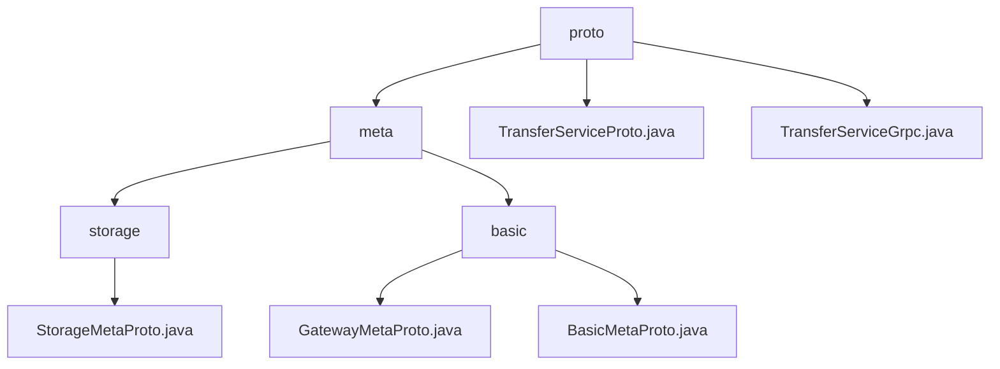

# 基础信息

|      |      |
|------|------|
| 名称 | proto |
| 编码语言 | .java |
| 代码路径 | WeFe/board/board-service/src/main/java/com/welab/wefe/board/service/proto |
| 包名 | docs.board.board-service.src.main.java.com.welab.wefe.board.service.proto |
| 概述说明 | 分布式通信与存储元数据协议，含端点管理、状态机、存储定位器。基于Protobuf，支持异步事件驱动，用于跨节点路由和异构存储访问。含gRPC服务接口。 |

# 说明

## 概述  
该模块是分布式通信与存储的元数据协议体系，核心职责包括标准化网络端点管理、传输状态控制及异构存储抽象。采用Protobuf编码实现跨语言通信，类似服务发现机制与消息总线的混合架构。  

接口规范分为通信型（TransferServiceGrpc的send/recv）和存储型（StorageLocator解析），均基于Protobuf序列化。关键数据结构含网络端点三元组、传输状态机（6种枚举）、存储四元组定位器及TransferMeta分片控制单元。  

外部依赖仅为Protobuf和gRPC框架。例如TransferServiceProto集成gateway-meta.proto定义服务，TransferServiceGrpc实现UNARY调用模式，支持异步/阻塞双通道。  

## 主要业务场景  
典型流程为：1）终端注册（Endpoints）2）数据传输（TransferMeta分片）3）状态回调（ReturnStatus）。交互模式类似消息队列，通过TransferService的send/recv方法实现双向流控，NetworkDataProxyService则提供push推送模式。  

功能完整性体现在三层次：网络寻址（端点三元组）、传输控制（分片状态机）、存储适配（LMDB/CLICK_HOUSE枚举）。例如大数据场景组合KeyValueData分片与TransferStatus跟踪，存储操作通过StorageType动态切换引擎。

### 包内部结构视图

该流程图展示了WeFe项目中proto目录下的层级结构。根节点proto包含meta子目录和两个服务文件，meta目录下又分为storage和basic两个子目录。storage目录包含StorageMetaProto.java文件，basic目录则包含GatewayMetaProto.java和BasicMetaProto.java两个基础元数据文件。整体结构清晰地反映了proto模块中元数据和服务文件的组织方式。

# 文件列表

| 名称   | 类型  | 说明 |
|-------|------|-------------|
| [TransferServiceProto.java](TransferServiceProto.md) | file | TransferServiceProto类定义了数据传输服务，包含send、recv和checkStatusNow方法，用于处理TransferMeta和ReturnStatus消息。同时包含NetworkDataTransferProxyService服务，提供push和pushDataSource方法。 |
| [TransferServiceGrpc.java](TransferServiceGrpc.md) | file | TransferServiceGrpc类定义了gRPC服务，包含send、recv和checkStatusNow三个方法，支持异步、阻塞和Future调用方式。 |
| [meta](meta/_module.md) | package | StorageMetaProto是Java类，定义存储元数据协议，含StorageType枚举和StorageLocator消息，支持序列化及构建器模式。模块标准化网络端点信息，含基础型和网关专用型消息结构，依赖Protobuf，用于跨节点数据路由。 |

