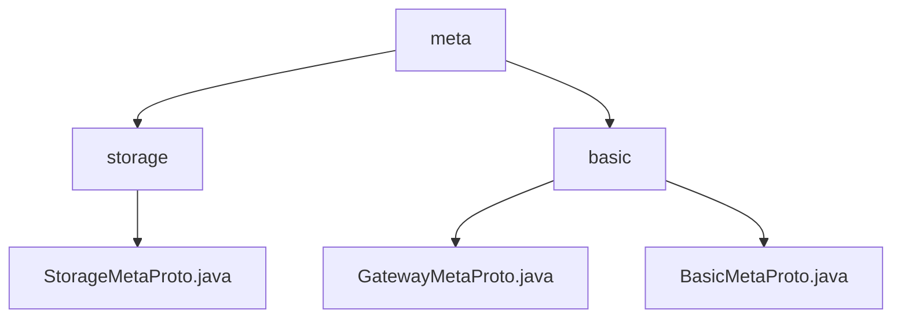

# 基础信息

|      |      |
|------|------|
| 名称 | meta |
| 编码语言 | .java |
| 代码路径 | WeFe/board/board-service/src/main/java/com/welab/wefe/board/service/proto/meta |
| 包名 | docs.board.board-service.src.main.java.com.welab.wefe.board.service.proto.meta |
| 概述说明 | StorageMetaProto是Java类，定义存储元数据协议，含StorageType枚举和StorageLocator消息，支持序列化及构建器模式。模块标准化网络端点信息，含基础型和网关专用型消息结构，依赖Protobuf，用于跨节点数据路由。 |

# 说明

## 概述  
该模块是分布式通信与存储的元数据协议体系，核心职责包括标准化网络端点信息、传输状态管理以及存储元数据定义。协议采用Protobuf编码，支持终端地址管理（类似服务发现机制）和存储类型抽象化。  

接口规范涵盖两类：通信型（Endpoint/TransferMeta）和存储型（StorageLocator）。关键数据结构包括网络端点三元组（IP、端口、主机名）、传输状态机枚举（6种状态）、存储类型枚举（LMDB/CLICK_HOUSE）及四元组定位器（类型/命名空间/名称/分片）。  

外部依赖仅为Protobuf框架。例如BasicMetaProto处理通信元数据，StorageMetaProto定义存储协议，两者通过构建器模式和序列化能力实现数据交换。  

## 主要业务场景  
典型应用包含跨节点数据路由和异构存储访问。完整流程涉及：终端注册（Endpoints）、传输初始化（TransferMeta分片标记）、存储定位（StorageLocator解析）和状态同步（ReturnStatus回调）。交互模式采用异步事件驱动，类似消息队列的发布/订阅机制。  

功能完整性体现在：1）网络层（端点寻址）2）传输层（分片控制）3）存储层（类型适配）。例如大数据传输组合使用KeyValueData分片与TransferStatus跟踪，而存储操作通过StorageType枚举实现多引擎切换。

### 包内部结构视图

该流程图展示了WeFe项目中proto元数据文件的层级结构。根节点"meta"下包含"storage"和"basic"两个子目录，其中storage目录包含StorageMetaProto.java文件，basic目录则包含GatewayMetaProto.java和BasicMetaProto.java两个元数据协议文件。整个结构清晰地反映了协议文件的分类存储方式。

# 文件列表

| 名称   | 类型  | 说明 |
|-------|------|-------------|
| [basic](basic/_module.md) | package | GatewayMetaProto定义网关通信元数据协议，含传输状态、成员信息、内容体和核心元数据结构。BasicMetaProto包含端点信息、返回状态和键值对数据，适用于网络通信。 |
| [storage](storage/_module.md) | package | StorageMetaProto定义了存储元数据协议，包含StorageLocator消息和StorageType枚举。StorageLocator包含类型、命名空间、名称和分片信息。StorageType支持LMDB和CLICK_HOUSE两种存储类型。 |

