# 基础信息

|      |      |
|------|------|
| 名称 | GatewayMetaProto |
| 编码语言 | .java |
| 代码路径 | WeFe/board/board-service/src/main/java/com/welab/wefe/board/service/proto/meta/basic/GatewayMetaProto.java |
| 包名 | com.welab.wefe.board.service.proto.meta.basic |
| 依赖项 | [] |
| 概述说明 | GatewayMetaProto定义了网关传输元数据的协议结构，包含以下核心部分：1. TransferStatus枚举：定义了6种传输状态（未处理/初始化中/处理中/完成/错误/已取消）2. Member消息：表示成员信息，包含成员ID、名称和终端节点3. Content消息：传输内容载体，支持字符串/二进制数据或键值对列表4. TransferMeta消息：网关传输元数据，包含：   - 发送方和接收方Member信息   - 传输内容Content   - 处理器名称、传输状态、会话ID   - 时间戳、序列号、标签等控制字段该协议用于网关服务间的结构化数据传输，支持大数据分片传输和状态跟踪。 |

# 说明

GatewayMetaProto 是一个用于网关通信的元数据协议，定义了数据传输相关的消息结构和枚举类型。主要包含以下内容：

1. TransferStatus 枚举：定义了传输状态，包括未处理、初始化中、处理中、完成、错误和已取消等状态。

2. Member 消息：表示成员信息，包含成员ID、成员名称和终端地址。

3. Content 消息：表示传输内容，支持小数据类型（字符串和二进制数据）和大型数据（键值对列表）。

4. TransferMeta 消息：网关传输的核心元数据结构，包含以下字段：
   - 发送方和接收方信息
   - 传输内容体
   - 处理器名称（替代旧版action字段）
   - 传输状态
   - 会话ID
   - 接收时间和过期时间
   - 大数据分片序号和结束标志
   - 标签变量名、标签和扩展字段

该协议支持注册扩展功能，提供了全面的数据传输控制能力，包括状态跟踪、数据分片和过期管理等特性。

# 类列表 Class Summary

| 名称   | 类型  | 说明 |
|-------|------|-------------|
| GatewayMetaProto | class | GatewayMetaProto定义了网关传输元数据的协议结构，包含Member（成员信息）、Content（传输内容）和TransferMeta（传输元数据）三个主要部分。TransferStatus枚举定义了传输状态（未处理、初始化中、处理中、完成、错误、已取消）。TransferMeta包含发送方、接收方、内容体、处理器、状态、会话ID、时间戳等字段，用于描述网关间数据传输的完整上下文。 |


## 类 GatewayMetaProto

|      |      |
|------|------|
| 访问范围 | public final |
| 类型 | class |
| 名称 | GatewayMetaProto |
| 说明 | GatewayMetaProto定义了网关传输元数据的协议结构，包含Member（成员信息）、Content（传输内容）和TransferMeta（传输元数据）三个主要部分。TransferStatus枚举定义了传输状态（未处理、初始化中、处理中、完成、错误、已取消）。TransferMeta包含发送方、接收方、内容体、处理器、状态、会话ID、时间戳等字段，用于描述网关间数据传输的完整上下文。 |


### UML类图

```mermaid
classDiagram
    class GatewayMetaProto {
        <<final>>
        -GatewayMetaProto()
        +registerAllExtensions(ExtensionRegistryLite registry) void
        +registerAllExtensions(ExtensionRegistry registry) void
    }

    enum TransferStatus {
        <<enumeration>>
        NOT_PROCESSED = 0
        INITIALIZING = 1
        PROCESSING = 2
        COMPLETE = 3
        ERROR = 4
        CANCELLED = 5
        UNRECOGNIZED = -1
    }

    interface MemberOrBuilder {
        <<Interface>>
        +getMemberId() String
        +getMemberIdBytes() ByteString
        +getMemberName() String
        +getMemberNameBytes() ByteString
        +hasEndpoint() boolean
        +getEndpoint() Endpoint
        +getEndpointOrBuilder() EndpointOrBuilder
    }

    class Member {
        -String memberId_
        -String memberName_
        -Endpoint endpoint_
        +Member(GeneratedMessageV3.Builder~?~ builder)
        +getMemberId() String
        +getMemberIdBytes() ByteString
        +getMemberName() String
        +getMemberNameBytes() ByteString
        +hasEndpoint() boolean
        +getEndpoint() Endpoint
        +getEndpointOrBuilder() EndpointOrBuilder
    }

    interface ContentOrBuilder {
        <<Interface>>
        +getStrData() String
        +getStrDataBytes() ByteString
        +getByteData() ByteString
        +getKeyValueDatasList() List~KeyValueData~
        +getKeyValueDatasCount() int
    }

    class Content {
        -String strData_
        -ByteString byteData_
        -List~KeyValueData~ keyValueDatas_
        +Content(GeneratedMessageV3.Builder~?~ builder)
        +getStrData() String
        +getStrDataBytes() ByteString
        +getByteData() ByteString
        +getKeyValueDatasList() List~KeyValueData~
    }

    interface TransferMetaOrBuilder {
        <<Interface>>
        +hasSrc() boolean
        +getSrc() Member
        +getSrcOrBuilder() MemberOrBuilder
        +hasDst() boolean
        +getDst() Member
        +getDstOrBuilder() MemberOrBuilder
        +hasContent() boolean
        +getContent() Content
        +getContentOrBuilder() ContentOrBuilder
        +getProcessor() String
        +getProcessorBytes() ByteString
        +getTransferStatusValue() int
        +getTransferStatus() TransferStatus
        +getSessionId() String
        +getSessionIdBytes() ByteString
        +getReceiveDate() long
        +getExpireDate() long
        +getSequenceNo() int
        +getSequenceIsEnd() boolean
        +getTaggedVariableName() ByteString
        +getTag() String
        +getTagBytes() ByteString
        +getExtField() String
        +getExtFieldBytes() ByteString
    }

    class TransferMeta {
        -Member src_
        -Member dst_
        -Content content_
        -String processor_
        -int transferStatus_
        -String sessionId_
        -long receiveDate_
        -long expireDate_
        -int sequenceNo_
        -boolean sequenceIsEnd_
        -ByteString taggedVariableName_
        -String tag_
        -String extField_
        +TransferMeta(GeneratedMessageV3.Builder~?~ builder)
        +hasSrc() boolean
        +getSrc() Member
        +getSrcOrBuilder() MemberOrBuilder
        +hasDst() boolean
        +getDst() Member
        +getDstOrBuilder() MemberOrBuilder
        +hasContent() boolean
        +getContent() Content
        +getContentOrBuilder() ContentOrBuilder
        +getProcessor() String
        +getProcessorBytes() ByteString
        +getTransferStatusValue() int
        +getTransferStatus() TransferStatus
        +getSessionId() String
        +getSessionIdBytes() ByteString
        +getReceiveDate() long
        +getExpireDate() long
        +getSequenceNo() int
        +getSequenceIsEnd() boolean
        +getTaggedVariableName() ByteString
        +getTag() String
        +getTagBytes() ByteString
        +getExtField() String
        +getExtFieldBytes() ByteString
    }

    Member --> Endpoint : contains
    Content --> KeyValueData : contains
    TransferMeta --> Member : contains
    TransferMeta --> Content : contains
    Member ..|> MemberOrBuilder : implements
    Content ..|> ContentOrBuilder : implements
    TransferMeta ..|> TransferMetaOrBuilder : implements
```

该代码定义了一个网关元数据协议的结构，主要包括以下核心组件：
1. GatewayMetaProto 是主类，包含注册扩展方法
2. TransferStatus 枚举定义了6种传输状态
3. Member 类表示成员信息，包含ID、名称和终端点
4. Content 类封装传输内容，支持字符串、二进制和键值对数据
5. TransferMeta 是核心传输元数据，包含发送方、接收方、内容、状态等完整传输信息
这些类通过接口和实现分离的设计，提供了灵活的扩展能力，支持网关系统的数据传输需求。


### 内部方法调用关系图

```mermaid
graph TD
    A["类GatewayMetaProto"]
    B["枚举TransferStatus"]
    C["接口MemberOrBuilder"]
    D["类Member"]
    E["接口ContentOrBuilder"]
    F["类Content"]
    G["接口TransferMetaOrBuilder"]
    H["类TransferMeta"]

    A --> B
    A --> D
    A --> F
    A --> H
    D --> C
    F --> E
    H --> G
    B -->|包含| B1["NOT_PROCESSED=0"]
    B -->|包含| B2["INITIALIZING=1"]
    B -->|包含| B3["PROCESSING=2"]
    B -->|包含| B4["COMPLETE=3"]
    B -->|包含| B5["ERROR=4"]
    B -->|包含| B6["CANCELLED=5"]
    D -->|属性| D1["String memberId"]
    D -->|属性| D2["String memberName"]
    D -->|属性| D3["Endpoint endpoint"]
    F -->|属性| F1["String strData"]
    F -->|属性| F2["bytes byteData"]
    F -->|属性| F3["repeated KeyValueData keyValueDatas"]
    H -->|属性| H1["Member src"]
    H -->|属性| H2["Member dst"]
    H -->|属性| H3["Content content"]
    H -->|属性| H4["String processor"]
    H -->|属性| H5["TransferStatus transferStatus"]
    H -->|属性| H6["String sessionId"]
    H -->|属性| H7["long receiveDate"]
    H -->|属性| H8["long expireDate"]
    H -->|属性| H9["int sequenceNo"]
    H -->|属性| H10["bool sequenceIsEnd"]
    H -->|属性| H11["bytes taggedVariableName"]
    H -->|属性| H12["String tag"]
    H -->|属性| H13["String extField"]
```



这段代码定义了网关通信的元数据结构，包含四个主要部分：1) 传输状态枚举(TransferStatus)定义6种状态；2) Member类表示成员信息，包含ID、名称和终端点；3) Content类作为数据传输载体，支持字符串/二进制/键值对多种格式；4) TransferMeta是核心传输元数据，包含收发方、内容、处理器、状态等完整传输上下文。该结构通过Protocol Buffers实现高效序列化，支持大数据分片传输(sequenceNo/sequenceIsEnd)，并提供扩展字段(tag/extField)增强灵活性。

### 字段列表 Field List

| 名称  | 类型  | 说明 |
|-------|-------|------|
| descriptor | com.google.protobuf.Descriptors.FileDescriptor | 静态变量descriptor，类型为com.google.protobuf.Descriptors.FileDescriptor。 |
| internal_static_com_welab_wefe_gateway_api_meta_basic_TransferMeta_fieldAccessorTable | com.google.protobuf.GeneratedMessageV3.FieldAccessorTable | 私有静态常量，类型为Protobuf生成的FieldAccessorTable，用于内部元数据TransferMeta的字段访问。 |
| internal_static_com_welab_wefe_gateway_api_meta_basic_Content_descriptor | com.google.protobuf.Descriptors.Descriptor | 私有静态最终变量，描述符类型，用于定义Content类的协议缓冲区结构。 |
| internal_static_com_welab_wefe_gateway_api_meta_basic_Member_descriptor | com.google.protobuf.Descriptors.Descriptor | 私有静态常量，描述Member类的协议缓冲区元数据。 |
| internal_static_com_welab_wefe_gateway_api_meta_basic_Content_fieldAccessorTable | com.google.protobuf.GeneratedMessageV3.FieldAccessorTable | Protobuf生成的Content类字段访问器表，用于内部元数据操作。 |
| internal_static_com_welab_wefe_gateway_api_meta_basic_TransferMeta_descriptor | com.google.protobuf.Descriptors.Descriptor | 私有静态终态描述符变量，定义TransferMeta的内部结构描述。 |
| internal_static_com_welab_wefe_gateway_api_meta_basic_Member_fieldAccessorTable | com.google.protobuf.GeneratedMessageV3.FieldAccessorTable | 私有静态final字段，类型为protobuf的FieldAccessorTable，用于Member类的元数据访问。 |

### 方法列表

| 名称  | 类型  | 说明 |
|-------|-------|------|
| registerAllExtensions | void | 这是一个静态方法，用于将所有扩展注册到给定的Protobuf扩展注册表中。方法内部调用了另一个重载方法，将注册表转换为Lite版本进行处理。 |
| registerAllExtensions | void | 静态方法registerAllExtensions用于向Protobuf扩展注册表注册扩展，当前为空实现。 |
| getDescriptor | com.google.protobuf.Descriptors.FileDescriptor | 这是一个静态方法，返回Protocol Buffers文件描述符对象。 |


