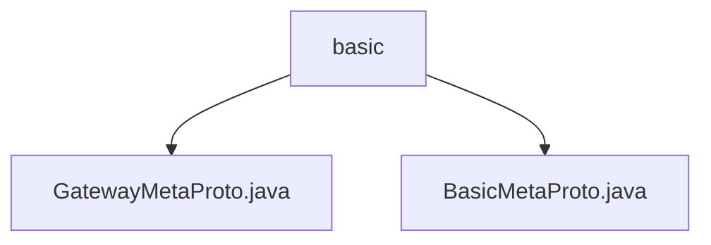

# 基础信息

|      |      |
|------|------|
| 名称 | basic |
| 编码语言 | .java |
| 代码路径 | WeFe/board/board-service/src/main/java/com/welab/wefe/board/service/proto/meta/basic |
| 包名 | docs.board.board-service.src.main.java.com.welab.wefe.board.service.proto.meta.basic |
| 概述说明 | GatewayMetaProto定义网关通信元数据协议，含传输状态、成员信息、内容体和核心元数据结构。BasicMetaProto包含端点信息、返回状态和键值对数据，适用于网络通信。 |

# 说明

## 概述  
该模块是面向分布式网关通信的元数据协议体系，核心职责是标准化网络端点信息、传输状态和内容格式。协议采用Protobuf编码，提供终端地址管理（类似服务发现机制）和传输全生命周期监控能力。  

接口规范包含两类消息结构：基础型（Endpoint/ReturnStatus）和网关专用型（TransferMeta/Member）。关键数据结构包括网络端点三元组（IP、端口、主机名）、传输状态机枚举（6种状态）和分片式内容载体（支持键值对和二进制数据）。  

外部依赖仅Protobuf序列化框架。例如BasicMetaProto处理基础通信元数据，GatewayMetaProto扩展了大数据分片和会话管理功能，两者通过统一的状态码机制实现联动。  

## 主要业务场景  
典型应用是跨节点数据路由，完整流程包含：终端注册（通过Endpoints）、传输初始化（构建TransferMeta）、分片处理（Content分片序号标记）和状态同步（ReturnStatus回调）。交互模式采用异步事件驱动，类似消息队列的发布/订阅机制。  

功能完整性体现在：1）网络层（Endpoint寻址）2）传输层（分片/超时控制）3）业务层（标签/扩展字段）。例如大数据传输时会组合使用KeyValueData分片和TransferStatus状态跟踪，而简单查询直接通过ReturnStatus返回结果。

### 包内部结构视图

该流程图展示了WeFe项目中proto元数据文件的层级关系。根节点"basic"包含两个Java文件：GatewayMetaProto.java和BasicMetaProto.java，这两个文件位于同一目录层级下，属于基础元数据协议定义文件。整个结构简洁明了，体现了proto文件在项目中的组织方式。

# 文件列表

| 名称   | 类型  | 说明 |
|-------|------|-------------|
| [GatewayMetaProto.java](GatewayMetaProto.md) | file | GatewayMetaProto定义了网关传输元数据的协议结构，包含以下核心部分：1. TransferStatus枚举：定义了6种传输状态（未处理/初始化中/处理中/完成/错误/已取消）2. Member消息：表示成员信息，包含成员ID、名称和终端节点3. Content消息：传输内容载体，支持字符串/二进制数据或键值对列表4. TransferMeta消息：网关传输元数据，包含：   - 发送方和接收方Member信息   - 传输内容Content   - 处理器名称、传输状态、会话ID   - 时间戳、序列号、标签等控制字段该协议用于网关服务间的结构化数据传输，支持大数据分片传输和状态跟踪。 |
| [BasicMetaProto.java](BasicMetaProto.md) | file | BasicMetaProto定义了网络端点、返回状态和键值数据的基本结构。Endpoint包含IP、端口和主机名；Endpoints是Endpoint的列表；ReturnStatus包含状态码、消息、会话ID和数据；KeyValueData包含键值对。这些结构用于网关API的元数据交互。 |

