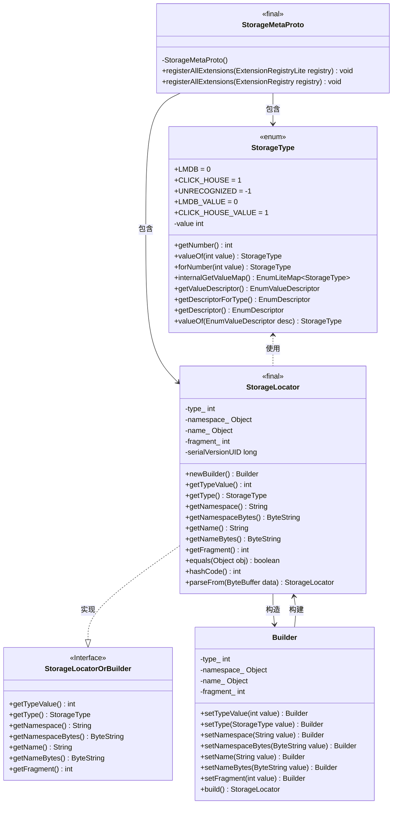

# 基础信息

|      |      |
|------|------|
| 名称 | StorageMetaProto |
| 编码语言 | .java |
| 代码路径 | WeFe/board/board-service/src/main/java/com/welab/wefe/board/service/proto/meta/storage/StorageMetaProto.java |
| 包名 | com.welab.wefe.board.service.proto.meta.storage |
| 依赖项 | [] |
| 概述说明 | StorageMetaProto定义了存储元数据协议，包含StorageLocator消息和StorageType枚举。StorageLocator包含类型、命名空间、名称和分片信息。StorageType支持LMDB和CLICK_HOUSE两种存储类型。 |

# 说明

StorageMetaProto 是一个基于 Protocol Buffers 的 Java 类，用于定义存储元数据协议。它包含一个枚举类型 StorageType（支持 LMDB 和 CLICK_HOUSE 两种存储类型）和一个消息类型 StorageLocator。StorageLocator 包含四个字段：type（存储类型枚举值）、namespace（命名空间字符串）、name（名称字符串）和 fragment（分片标识整数）。该类提供了完整的序列化、反序列化、构建器模式支持，并实现了 equals、hashCode 等方法。通过 Protocol Buffers 的代码生成机制，该类能够高效处理二进制数据交换。

# 类列表 Class Summary

| 名称   | 类型  | 说明 |
|-------|------|-------------|
| StorageMetaProto | class | StorageMetaProto定义了存储元数据协议，包含StorageLocator消息体和StorageType枚举，支持LMDB和CLICK_HOUSE两种存储类型。StorageLocator包含类型、命名空间、名称和分片信息。 |

## 类 StorageMetaProto

|      |      |
|------|------|
| 访问范围 | public final |
| 类型 | class |
| 名称 | StorageMetaProto |
| 说明 | StorageMetaProto定义了存储元数据协议，包含StorageLocator消息体和StorageType枚举，支持LMDB和CLICK_HOUSE两种存储类型。StorageLocator包含类型、命名空间、名称和分片信息。 |

### UML类图

该代码实现了一个基于Protocol Buffers的存储元数据协议，包含StorageType枚举定义和StorageLocator消息结构。StorageLocator通过Builder模式构建，包含type、namespace、name和fragment字段，并实现了序列化/反序列化功能。类图展示了核心类之间的关系，包括枚举定义、接口实现和建造者模式的应用，整体构成一个完整的protobuf消息定义体系。

### 内部方法调用关系图

```mermaid
graph TD
    A["类StorageMetaProto"]
    B["私有构造方法: StorageMetaProto()"]
    C["静态方法: registerAllExtensions(ExtensionRegistryLite)"]
    D["静态方法: registerAllExtensions(ExtensionRegistry)"]
    E["枚举类: StorageType"]
    F["枚举值: LMDB(0)"]
    G["枚举值: CLICK_HOUSE(1)"]
    H["枚举值: UNRECOGNIZED(-1)"]
    I["枚举方法: getNumber()"]
    J["枚举方法: valueOf(int)"]
    K["枚举方法: forNumber(int)"]
    L["枚举方法: internalGetValueMap()"]
    M["接口: StorageLocatorOrBuilder"]
    N["方法: getTypeValue()"]
    O["方法: getType()"]
    P["方法: getNamespace()"]
    Q["方法: getNamespaceBytes()"]
    R["方法: getName()"]
    S["方法: getNameBytes()"]
    T["方法: getFragment()"]
    U["静态内部类: StorageLocator"]
    V["构造方法: StorageLocator(GeneratedMessageV3.Builder)"]
    W["构造方法: StorageLocator()"]
    X["方法: getTypeValue()"]
    Y["方法: getType()"]
    Z["方法: getNamespace()"]
    AA["方法: getNamespaceBytes()"]
    AB["方法: getName()"]
    AC["方法: getNameBytes()"]
    AD["方法: getFragment()"]
    AE["方法: writeTo(CodedOutputStream)"]
    AF["方法: equals(Object)"]
    AG["方法: hashCode()"]
    AH["静态内部类: Builder"]
    AI["构造方法: Builder()"]
    AJ["构造方法: Builder(BuilderParent)"]
    AK["方法: setTypeValue(int)"]
    AL["方法: setType(StorageType)"]
    AM["方法: setNamespace(String)"]
    AN["方法: setNamespaceBytes(ByteString)"]
    AO["方法: setName(String)"]
    AP["方法: setNameBytes(ByteString)"]
    AQ["方法: setFragment(int)"]

    A --> B
    A --> C
    A --> D
    A --> E
    E --> F
    E --> G
    E --> H
    E --> I
    E --> J
    E --> K
    E --> L
    A --> M
    M --> N
    M --> O
    M --> P
    M --> Q
    M --> R
    M --> S
    M --> T
    A --> U
    U --> V
    U --> W
    U --> X
    U --> Y
    U --> Z
    U --> AA
    U --> AB
    U --> AC
    U --> AD
    U --> AE
    U --> AF
    U --> AG
    U --> AH
    AH --> AI
    AH --> AJ
    AH --> AK
    AH --> AL
    AH --> AM
    AH --> AN
    AH --> AO
    AH --> AP
    AH --> AQ
```

该流程图展示了StorageMetaProto类的完整结构，包含私有构造方法、扩展注册方法、StorageType枚举定义以及核心的StorageLocator消息结构。StorageLocator作为主要消息类，包含类型、命名空间、名称和分片等字段，通过Builder模式提供链式构造能力，并实现了序列化、相等性比较等核心功能。整个结构体现了Protocol Buffers消息定义的典型模式，包含字段访问、序列化处理和构建器模式等关键组件。

### 字段列表 Field List

| 名称  | 类型  | 说明 |
|-------|-------|------|
| internal_static_com_welab_gateway_api_meta_storage_StorageLocator_descriptor | com.google.protobuf.Descriptors.Descriptor | 私有静态终态描述符，定义StorageLocator类的元数据存储结构。 |
| internal_static_com_welab_gateway_api_meta_storage_StorageLocator_fieldAccessorTable | com.google.protobuf.GeneratedMessageV3.FieldAccessorTable | Protobuf生成的StorageLocator字段访问器表，用于元数据存储网关API。 |
| descriptor | com.google.protobuf.Descriptors.FileDescriptor | 静态常量描述符，类型为protobuf文件描述符。 |

### 方法列表

| 名称  | 类型  | 说明 |
|-------|-------|------|
| registerAllExtensions | void | 这是一个Java静态方法，用于将所有扩展注册到Protobuf的扩展注册表中。方法接受一个ExtensionRegistry参数，并调用另一个重载方法完成注册。 |
| registerAllExtensions | void | 静态方法registerAllExtensions用于向Protobuf的ExtensionRegistryLite注册扩展，当前为空实现。 |
| getDescriptor | com.google.protobuf.Descriptors.FileDescriptor | Java方法：返回protobuf文件描述符。 |

