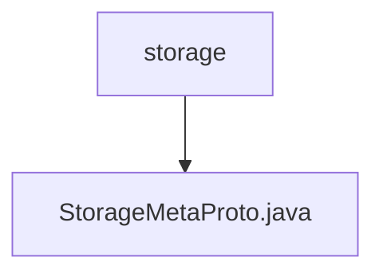

# 基础信息

|      |      |
|------|------|
| 名称 | storage |
| 编码语言 | .java |
| 代码路径 | WeFe/board/board-service/src/main/java/com/welab/wefe/board/service/proto/meta/storage |
| 包名 | docs.board.board-service.src.main.java.com.welab.wefe.board.service.proto.meta.storage |
| 概述说明 | StorageMetaProto定义了存储元数据协议，包含StorageLocator消息和StorageType枚举。StorageLocator包含类型、命名空间、名称和分片信息。StorageType支持LMDB和CLICK_HOUSE两种存储类型。 |

# 说明

StorageMetaProto 是一个基于 Protocol Buffers 的 Java 类，用于定义存储元数据协议。它包含一个枚举类型 StorageType（支持 LMDB 和 CLICK_HOUSE 两种存储类型）和一个消息类型 StorageLocator。StorageLocator 包含四个字段：type（存储类型枚举值）、namespace（命名空间字符串）、name（名称字符串）和 fragment（分片标识整数）。该类提供了完整的序列化、反序列化、构建器模式支持，并实现了 equals、hashCode 等方法。通过 Protocol Buffers 的代码生成机制，该类能够高效处理二进制数据交换。

### 包内部结构视图

该流程图展示了WeFe项目中存储元数据相关的文件结构。根节点为storage文件夹，其下包含一个StorageMetaProto.java文件，表示存储元数据的协议缓冲区定义文件。这种结构常用于定义数据存储格式和协议，是微服务架构中常见的数据定义方式。

# 文件列表

| 名称   | 类型  | 说明 |
|-------|------|-------------|
| [StorageMetaProto.java](StorageMetaProto.md) | file | StorageMetaProto定义了存储元数据协议，包含StorageLocator消息和StorageType枚举。StorageLocator包含类型、命名空间、名称和分片信息。StorageType支持LMDB和CLICK_HOUSE两种存储类型。 |

