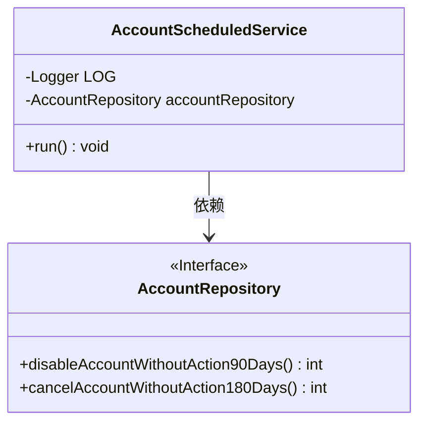
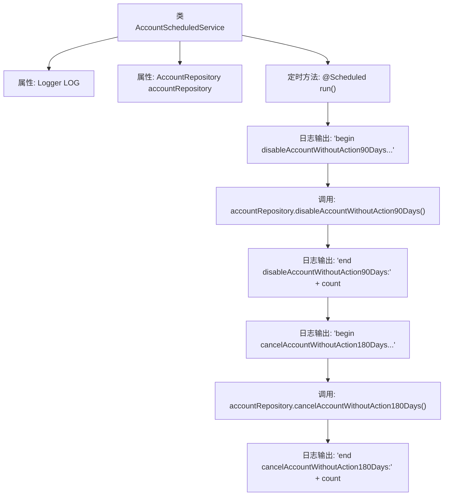

# 基础信息

|      |      |
|------|------|
| 名称 | AccountScheduledService |
| 编码语言 | .java |
| 代码路径 | WeFe/board/board-service/src/main/java/com/welab/wefe/board/service/scheduled/AccountScheduledService.java |
| 包名 | com.welab.wefe.board.service.scheduled |
| 依赖项 | ['com.welab.wefe.board.service.database.repository.AccountRepository', 'org.slf4j.Logger', 'org.slf4j.LoggerFactory', 'org.springframework.beans.factory.annotation.Autowired', 'org.springframework.context.annotation.Lazy', 'org.springframework.scheduling.annotation.Scheduled', 'org.springframework.stereotype.Component'] |
| 概述说明 | AccountScheduledService是一个定时任务类，每小时执行一次，初始延迟10秒。它调用accountRepository方法禁用90天未活动的账户和注销180天未活动的账户，并记录执行日志。 |

# 说明

该内容描述了一个名为AccountScheduledService的Spring组件类，用于定时执行账户管理任务。该类被标记为非延迟初始化，并包含一个自动装配的AccountRepository依赖。通过@Scheduled注解配置了一个每小时执行一次的定时任务，初始延迟为10秒。任务执行时会先后调用两个仓库方法：禁用90天无活动的账户和注销180天无活动的账户，并在操作前后记录日志信息。日志会输出每个操作的开始、结束状态及处理结果计数。

# 类列表 Class Summary

| 名称   | 类型  | 说明 |
|-------|------|-------------|
| AccountScheduledService | class | AccountScheduledService定时任务类，每小时执行一次，延迟10秒启动，自动注入AccountRepository，检查并禁用90天无活动账户，注销180天无活动账户，记录执行日志。 |

## 类 AccountScheduledService

|      |      |
|------|------|
| 访问范围 | @Component;@Lazy(false);public |
| 类型 | class |
| 名称 | AccountScheduledService |
| 说明 | AccountScheduledService定时任务类，每小时执行一次，延迟10秒启动，自动注入AccountRepository，检查并禁用90天无活动账户，注销180天无活动账户，记录执行日志。 |

### UML类图

这段代码展示了一个定时任务服务类AccountScheduledService，它通过Spring的@Scheduled注解定期执行账户管理操作。该类依赖AccountRepository接口来执行具体的数据库操作，包括禁用90天无活动的账户和注销180天无活动的账户。类图中清晰地展示了这种依赖关系，其中AccountRepository作为接口被明确标注，而AccountScheduledService作为具体实现类包含日志记录和定时任务方法。

### 内部方法调用关系图

这段代码展示了一个Spring定时任务类，通过@Scheduled注解实现每小时执行一次的定时任务。流程图清晰呈现了任务执行顺序：先禁用90天无活动的账户，再注销180天无活动的账户，每个操作前后都有日志记录。类依赖AccountRepository执行具体数据库操作，并通过Logger输出执行过程信息。

### 字段列表 Field List

| 名称  | 类型  | 说明 |
|-------|-------|------|
| accountRepository | AccountRepository | 使用@Autowired自动注入AccountRepository实例。 |
| LOG = LoggerFactory.getLogger(this.getClass()) | Logger | 定义当前类的日志记录器实例，使用protected final修饰确保子类可访问且不可修改。 |

### 方法列表

| 名称  | 类型  | 说明 |
|-------|-------|------|
| run | void | 定时任务每小时执行，初始延迟10秒，禁用90天未活跃账户并注销180天未活跃账户，记录执行数量。 |

