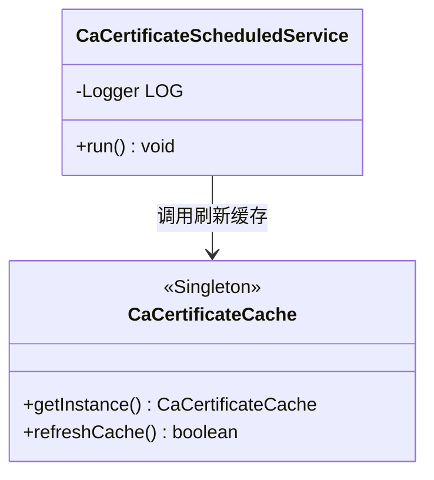
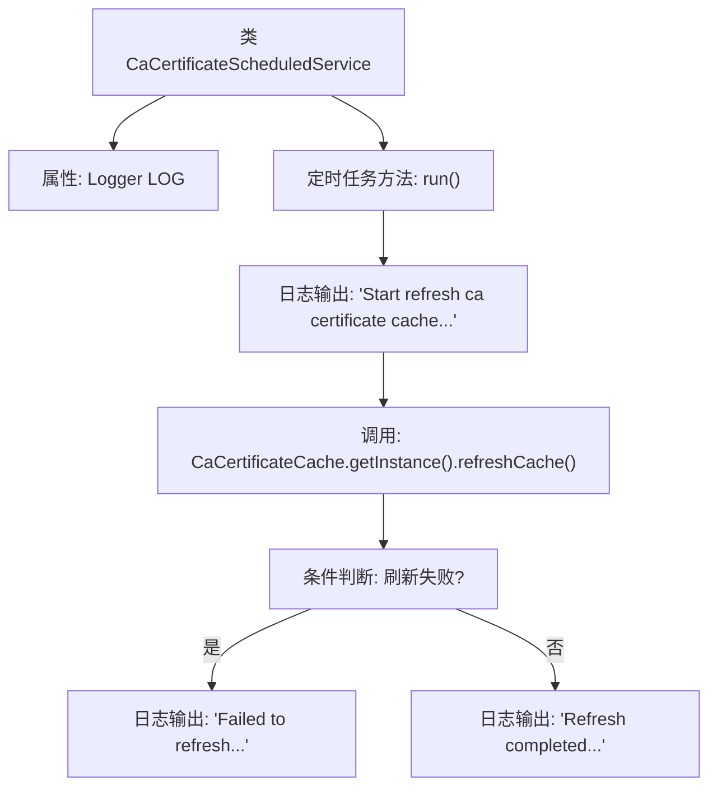

# 基础信息

|      |      |
|------|------|
| 名称 | CaCertificateScheduledService |
| 编码语言 | .java |
| 代码路径 | WeFe/board/board-service/src/main/java/com/welab/wefe/board/service/scheduled/CaCertificateScheduledService.java |
| 包名 | com.welab.wefe.board.service.scheduled |
| 依赖项 | ['com.welab.wefe.board.service.cache.CaCertificateCache', 'org.slf4j.Logger', 'org.slf4j.LoggerFactory', 'org.springframework.scheduling.annotation.Scheduled', 'org.springframework.stereotype.Component'] |
| 概述说明 | 定时任务类CaCertificateScheduledService，每30秒执行一次刷新CA证书缓存操作，成功或失败均记录日志。 |

# 说明

这是一个名为CaCertificateScheduledService的Spring组件类，包含一个定时任务方法run。该方法每30秒执行一次，用于刷新CA证书缓存。执行时会记录开始日志，若刷新失败则记录错误日志，成功则记录完成日志。通过CaCertificateCache单例实例的refreshCache方法实现缓存刷新功能。

# 类列表 Class Summary

| 名称   | 类型  | 说明 |
|-------|------|-------------|
| CaCertificateScheduledService | class | 定时任务类CaCertificateScheduledService每30秒执行一次，刷新CA证书缓存并记录成功或失败日志。 |

## 类 CaCertificateScheduledService

|      |      |
|------|------|
| 访问范围 | @Component;public |
| 类型 | class |
| 名称 | CaCertificateScheduledService |
| 说明 | 定时任务类CaCertificateScheduledService每30秒执行一次，刷新CA证书缓存并记录成功或失败日志。 |

### UML类图

该类图展示了一个定时服务组件CaCertificateScheduledService与单例缓存类CaCertificateCache的交互关系。定时服务通过@Scheduled注解每30秒执行run方法，调用缓存类的refreshCache方法更新证书缓存，并根据返回结果记录不同级别的日志。CaCertificateCache采用单例模式提供全局唯一的缓存实例，暴露刷新接口供外部调用。图中清晰体现了Spring组件与单例工具类的依赖关系及方法调用链路。

### 内部方法调用关系图

该流程图描述了CaCertificateScheduledService类的核心逻辑结构。类包含一个Logger属性和一个被@Scheduled注解标记的run方法。方法启动时会先记录日志，然后调用CaCertificateCache的refreshCache方法更新缓存，根据返回结果分别输出成功或失败的日志信息。整个流程展示了定时任务从启动到完成的条件分支处理过程，体现了缓存刷新功能的完整执行路径。

### 字段列表 Field List

| 名称  | 类型  | 说明 |
|-------|-------|------|
| LOG = LoggerFactory.getLogger(this.getClass()) | Logger | 定义当前类的日志记录器实例，用于输出日志信息。 |

### 方法列表

| 名称  | 类型  | 说明 |
|-------|-------|------|
| run | void | 定时任务每30秒刷新CA证书缓存，成功或失败均记录日志。 |

