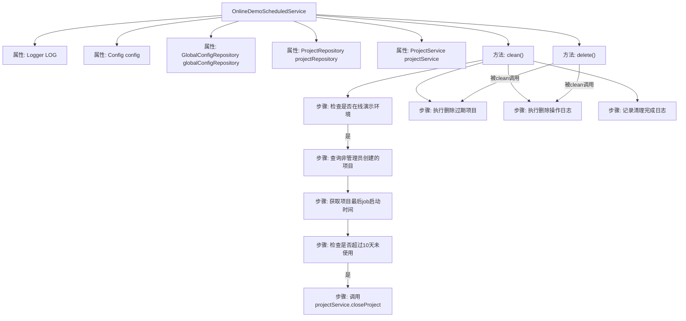
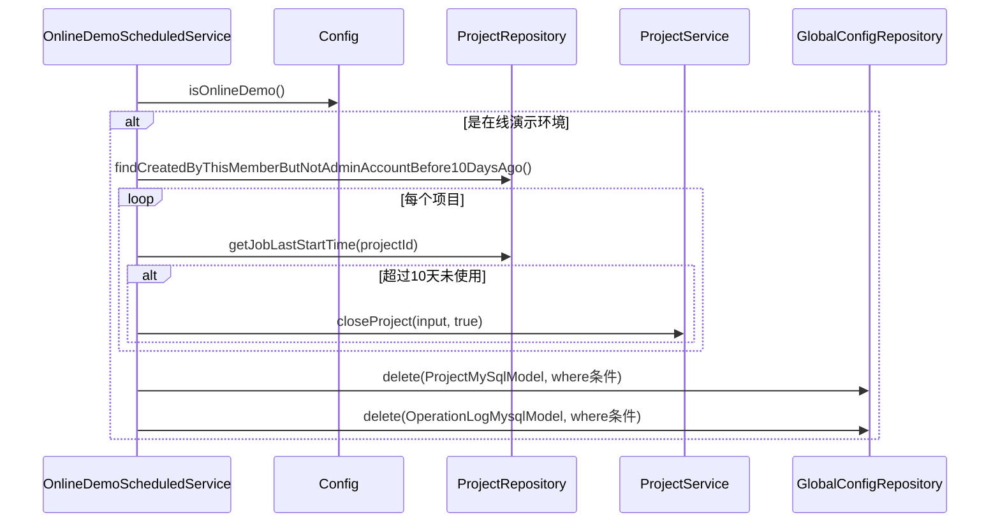

# 基础信息

|      |      |
|------|------|
| 名称 | OnlineDemoScheduledService |
| 编码语言 | .java |
| 代码路径 | WeFe/board/board-service/src/main/java/com/welab/wefe/board/service/scheduled/OnlineDemoScheduledService.java |
| 包名 | com.welab.wefe.board.service.scheduled |
| 依赖项 | ['com.welab.wefe.board.service.api.project.project.CloseProjectApi', 'com.welab.wefe.board.service.constant.Config', 'com.welab.wefe.board.service.database.entity.OperationLogMysqlModel', 'com.welab.wefe.board.service.database.entity.base.AbstractMySqlModel', 'com.welab.wefe.board.service.database.entity.job.ProjectMySqlModel', 'com.welab.wefe.board.service.database.repository.GlobalConfigRepository', 'com.welab.wefe.board.service.database.repository.ProjectRepository', 'com.welab.wefe.board.service.service.ProjectService', 'com.welab.wefe.common.TimeSpan', 'org.slf4j.Logger', 'org.slf4j.LoggerFactory', 'org.springframework.beans.factory.annotation.Autowired', 'org.springframework.context.annotation.Lazy', 'org.springframework.scheduling.annotation.Scheduled', 'org.springframework.stereotype.Component', 'org.springframework.transaction.annotation.Transactional', 'javax.persistence.Entity', 'javax.persistence.Table', 'java.util.Date'] |
| 概述说明 | OnlineDemoScheduledService类定时清理demo环境无效数据：检查非管理员创建且10天未活动的项目并关闭；删除10天未使用且无流程的项目；清理90天前的操作日志。使用@Scheduled注解每10分钟执行一次。 |

# 说明

OnlineDemoScheduledService是一个Spring组件，用于定期清理在线演示环境中的无效数据。主要功能包括：每10分钟执行一次清理任务，首先检查是否为演示环境。清理逻辑分为三部分：1) 关闭超过10天未活动的非管理员创建项目；2) 删除创建超过10天且无流程或已关闭的项目；3) 删除超过90天的操作日志。通过@Scheduled注解配置定时任务，使用JPA实现数据删除操作，每次删除限制1000条记录以避免超时。所有操作都记录日志，并在出现异常时进行错误处理。

# 类列表 Class Summary

| 名称   | 类型  | 说明 |
|-------|------|-------------|
| OnlineDemoScheduledService | class | 在线Demo定时服务类，非懒加载，每10分钟清理无效数据：关闭10天未活动的非管理员项目，删除10天未更新或无流程的项目，清理90天前的操作日志。使用事务确保数据安全。 |


## 类 OnlineDemoScheduledService

|      |      |
|------|------|
| 访问范围 | @Component;@Lazy(false);public |
| 类型 | class |
| 名称 | OnlineDemoScheduledService |
| 说明 | 在线Demo定时服务类，非懒加载，每10分钟清理无效数据：关闭10天未活动的非管理员项目，删除10天未更新或无流程的项目，清理90天前的操作日志。使用事务确保数据安全。 |


### UML类图

```mermaid
classDiagram
    class OnlineDemoScheduledService {
        -Logger LOG
        -Config config
        -GlobalConfigRepository globalConfigRepository
        -ProjectRepository projectRepository
        -ProjectService projectService
        +clean()
        +delete(Class~? extends AbstractMySqlModel~ clazz, String where)
    }

    class Config {
        <<Interface>>
        +isOnlineDemo() boolean
    }

    class GlobalConfigRepository {
        <<Interface>>
        +deleteByQuery(String sql, Class~?~ clazz) int
    }

    class ProjectRepository {
        <<Interface>>
        +findCreatedByThisMemberButNotAdminAccountBefore10DaysAgo() List~ProjectMySqlModel~
        +getJobLastStartTime(String projectId) Date
    }

    class ProjectService {
        <<Interface>>
        +closeProject(CloseProjectApi.Input input, boolean flag)
    }

    class AbstractMySqlModel {
        <<Abstract>>
    }

    class ProjectMySqlModel {
        +getProjectId() String
    }

    class OperationLogMysqlModel {
    }

    class CloseProjectApi {
        class Input {
            +setProjectId(String projectId)
        }
    }

    OnlineDemoScheduledService --> Config : 依赖
    OnlineDemoScheduledService --> GlobalConfigRepository : 依赖
    OnlineDemoScheduledService --> ProjectRepository : 依赖
    OnlineDemoScheduledService --> ProjectService : 依赖
    OnlineDemoScheduledService --> AbstractMySqlModel : 依赖
    ProjectMySqlModel --|> AbstractMySqlModel
    OperationLogMysqlModel --|> AbstractMySqlModel
    CloseProjectApi.Input --> ProjectMySqlModel : 使用
```

这段代码展示了一个定时清理服务`OnlineDemoScheduledService`，主要用于清理体验环境中产生的无效数据。该服务依赖多个仓储接口和配置服务，通过定时任务执行数据清理逻辑，包括关闭过期项目、删除长期未使用的数据等。类图清晰地展示了服务与各依赖组件的关系，以及核心的数据模型继承结构。


### 内部方法调用关系图





这段代码实现了一个定时清理服务，主要功能是定期清理在线演示环境中产生的过期数据。流程图展示了类结构和主要方法调用关系，时序图详细描述了clean()方法的执行过程。服务首先检查是否为演示环境，然后分两个阶段清理数据：1) 关闭超过10天未使用的非管理员项目；2) 直接删除符合条件(创建超过10天且未更新/已关闭)的项目和超过90天的操作日志。删除操作通过统一的delete方法实现，该方法使用JPA查询后删除的方式确保数据安全。整个清理过程有详细的日志记录。

### 字段列表 Field List

| 名称  | 类型  | 说明 |
|-------|-------|------|
| projectRepository | ProjectRepository | 使用@Autowired自动注入ProjectRepository实例。 |
| config | Config | 使用@Autowired自动注入Config配置类的实例。 |
| globalConfigRepository | GlobalConfigRepository | 自动注入全局配置仓库实例。 |
| projectService | ProjectService | 使用@Autowired自动注入ProjectService实例。 |
| LOG = LoggerFactory.getLogger(this.getClass()) | Logger | 类中定义了一个受保护的final日志记录器实例，用于当前类的日志输出。 |

### 方法列表

| 名称  | 类型  | 说明 |
|-------|-------|------|
| clean | void | 定时任务清理demo数据：非管理员创建且10天未活动的项目关闭；10天未更新且无流程的项目删除；3个月前的操作日志删除。仅在线demo环境执行。 |
| delete | void | 使用事务注解的方法，通过注解获取表名并构建SQL查询，限制1000条数据后执行删除操作，记录删除数量。 |


