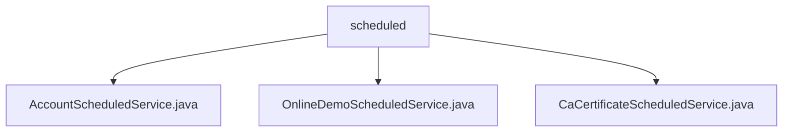

# 基础信息

|      |      |
|------|------|
| 名称 | scheduled |
| 编码语言 | .java |
| 代码路径 | WeFe/board/board-service/src/main/java/com/welab/wefe/board/service/scheduled |
| 包名 | docs.board.board-service.src.main.java.com.welab.wefe.board.service.scheduled |
| 概述说明 | AccountScheduledService定时管理账户，每小时执行禁用90天和注销180天无活动账户。OnlineDemoScheduledService每10分钟清理演示环境数据，包括项目及日志。CaCertificateScheduledService每30秒刷新CA证书缓存。 |

# 说明

## 概述  
该模块由多个Spring定时任务组件构成，核心职责是执行周期性的系统维护操作，类似后台守护进程。接口规范统一采用@Scheduled注解配置执行频率，支持初始延迟设置。关键数据结构包括账户状态、项目生命周期和CA证书缓存。外部依赖项包含AccountRepository、JPA和CaCertificateCache。例如AccountScheduledService每小时处理闲置账户，OnlineDemoScheduledService每10分钟清理演示数据，CaCertificateScheduledService每30秒刷新证书缓存。

## 主要业务场景  
模块主要处理三类定时任务：账户生命周期管理（禁用/注销闲置账户）、演示环境维护（清理过期项目和日志）、证书缓存更新。采用统一交互模式：任务触发→环境检查→批量处理→结果记录。例如OnlineDemoScheduledService分阶段删除过期数据，每次限制1000条防止超时。典型应用包括系统资源回收（类似GC机制）和关键数据刷新，所有操作均具备完整的日志追踪和异常处理能力。

### 包内部结构视图

该流程图展示了WeFe项目中board-service模块下scheduled目录的层级结构。scheduled作为父节点，包含三个定时任务服务类：AccountScheduledService处理账户相关定时任务，OnlineDemoScheduledService管理在线演示任务，CaCertificateScheduledService负责CA证书的定时处理。所有子节点均为Java类文件，直接隶属于scheduled目录。

# 文件列表

| 名称   | 类型  | 说明 |
|-------|------|-------------|
| [AccountScheduledService.java](AccountScheduledService.md) | file | AccountScheduledService是一个定时任务类，每小时执行一次，初始延迟10秒。它调用accountRepository方法禁用90天未活动的账户和注销180天未活动的账户，并记录执行日志。 |
| [OnlineDemoScheduledService.java](OnlineDemoScheduledService.md) | file | OnlineDemoScheduledService类定时清理demo环境无效数据：检查非管理员创建且10天未活动的项目并关闭；删除10天未使用且无流程的项目；清理90天前的操作日志。使用@Scheduled注解每10分钟执行一次。 |
| [CaCertificateScheduledService.java](CaCertificateScheduledService.md) | file | 定时任务类CaCertificateScheduledService，每30秒执行一次刷新CA证书缓存操作，成功或失败均记录日志。 |

