# 基础信息

|      |      |
|------|------|
| 名称 | AbstractUnionService |
| 编码语言 | .java |
| 代码路径 | WeFe/board/board-service/src/main/java/com/welab/wefe/board/service/sdk/AbstractUnionService.java |
| 包名 | com.welab.wefe.board.service.sdk |
| 依赖项 | ['com.alibaba.fastjson.JSON', 'com.alibaba.fastjson.JSONException', 'com.alibaba.fastjson.JSONObject', 'com.welab.wefe.board.service.api.union.MemberListApi', 'com.welab.wefe.board.service.api.union.member_auth.MemberRealnameAuthApi', 'com.welab.wefe.board.service.constant.Config', 'com.welab.wefe.board.service.service.AbstractService', 'com.welab.wefe.board.service.service.CacheObjects', 'com.welab.wefe.board.service.service.globalconfig.GlobalConfigService', 'com.welab.wefe.common.StatusCode', 'com.welab.wefe.common.constant.SecretKeyType', 'com.welab.wefe.common.exception.StatusCodeWithException', 'com.welab.wefe.common.http.HttpContentType', 'com.welab.wefe.common.http.HttpRequest', 'com.welab.wefe.common.http.HttpResponse', 'com.welab.wefe.common.util', 'com.welab.wefe.common.wefe.dto.global_config.MemberInfoModel', 'net.jodah.expiringmap.ExpiringMap', 'org.apache.http.entity.ContentType', 'org.apache.http.entity.mime.content.InputStreamBody', 'org.springframework.beans.factory.annotation.Autowired', 'org.springframework.util.MultiValueMap', 'org.springframework.web.multipart.MultipartFile', 'java.io.IOException', 'java.util.Map', 'java.util.TreeMap', 'java.util.concurrent.TimeUnit'] |
| 概述说明 | AbstractUnionService是一个抽象类，提供成员信息管理功能，包括初始化系统、上传信息、重置公钥、分页查询等。使用缓存优化查询性能，支持RSA签名和文件上传，通过HTTP请求与Union API交互。 |

# 说明

AbstractUnionService是一个抽象类，继承自AbstractService，主要用于处理成员信息管理和与Union API的交互。它包含一个60秒过期、最大容量500的缓存ExpiringMap，并注入了Config和GlobalConfigService。主要功能包括：初始化系统、上报成员信息、重置公钥、更新成员信息（含或不含logo）、分页查询成员、实名认证相关操作以及文件上传。所有API请求都支持签名验证，处理HTTP请求和响应，包括错误处理和JSON解析。

# 类列表 Class Summary

| 名称   | 类型  | 说明 |
|-------|------|-------------|
| AbstractUnionService | class | AbstractUnionService是一个抽象类，提供成员信息管理功能，包括初始化系统、上传信息、重置公钥、分页查询等，使用缓存和签名机制确保安全。 |


## 类 AbstractUnionService

|      |      |
|------|------|
| 访问范围 | public abstract |
| 类型 | class |
| 名称 | AbstractUnionService |
| 说明 | AbstractUnionService是一个抽象类，提供成员信息管理功能，包括初始化系统、上传信息、重置公钥、分页查询等，使用缓存和签名机制确保安全。 |


### UML类图

```mermaid
classDiagram
    class AbstractService {
        <<abstract>>
    }

    class AbstractUnionService {
        <<abstract>>
        -ExpiringMap~String, Object~ CACHE_MAP
        -Config config
        -GlobalConfigService globalConfigService
        +initializeSystem(MemberInfoModel model) void
        +uploadMemberInfo(MemberInfoModel model) void
        +resetPublicKey(MemberInfoModel model) void
        +uploadMemberInfoExcludeLogo(MemberInfoModel model) void
        +updateMemberLogo(MemberInfoModel model) void
        +queryMembers(MemberListApi.Input input) JSONObject
        +queryMemberById(String id) JSONObject
        +queryMember(String id, String name) JSONObject
        +queryMember(int pageIndex, int pageSize) JSONObject
        +queryMemberByPage(int pageIndex, int pageSize, String id, String name) JSONObject
        +request(String api) JSONObject
        +request(String api, JSONObject params) JSONObject
        #request(String api, JSONObject params, boolean needSign) JSONObject
        +queryMemberAuthTypeList() JSONObject
        +realnameAuth(MemberRealnameAuthApi.Input input) JSONObject
        +realnameAuthInfoQuery() JSONObject
        +realnameAuthAgreementTemplateQuery() JSONObject
        +uploadFile(MultiValueMap~String, MultipartFile~ files, JObject params) JSONObject
        -request(String api, JSONObject params, MultiValueMap~String, MultipartFile~ files, boolean needSign) JSONObject
    }

    class MemberInfoModel {
        +String memberId
        +String memberName
        +String memberMobile
        +Boolean memberAllowPublicDataSet
        +String rsaPublicKey
        +String memberEmail
        +String memberGatewayUri
        +String memberLogo
        +Boolean memberHidden
        +SecretKeyType secretKeyType
        +Boolean memberGatewayTlsEnable
    }

    class MemberListApi {
        class Input {
            +Integer pageIndex
            +Integer pageSize
            +String name
            +String id
        }
    }

    class MemberRealnameAuthApi {
        class Input {
            // 字段根据实际补充
        }
    }

    class ExpiringMap~K, V~ {
        <<Map>>
    }

    class Config {
        +String unionBaseUrl
    }

    class GlobalConfigService {
        // 服务方法
    }

    class JSONObject {
        // JSON对象方法
    }

    class JObject {
        +create() JObject
        +put(String key, Object value) JObject
    }

    class HttpResponse {
        +boolean success()
        +String getError()
        +int getCode()
        +String getMessage()
        +String getUrl()
        +JSONObject getBodyAsJson()
        +String getBodyAsString()
    }

    class HttpRequest {
        +create(String url) HttpRequest
        +setBody(String data) HttpRequest
        +postJson() HttpResponse
        +setContentType(String type) HttpRequest
        +appendParameter(String name, InputStreamBody body) HttpRequest
        +post() HttpResponse
    }

    class MultipartFile {
        +String getContentType()
        +String getOriginalFilename()
        +InputStream getInputStream()
    }

    class InputStreamBody {
        +InputStreamBody(InputStream stream, ContentType type, String filename)
    }

    AbstractUnionService --|> AbstractService
    AbstractUnionService --> Config : 依赖
    AbstractUnionService --> GlobalConfigService : 依赖
    AbstractUnionService --> MemberInfoModel : 使用
    AbstractUnionService --> MemberListApi : 使用
    AbstractUnionService --> MemberRealnameAuthApi : 使用
    AbstractUnionService --> ExpiringMap : 使用
    AbstractUnionService --> JSONObject : 返回
    AbstractUnionService --> JObject : 使用
    AbstractUnionService --> HttpResponse : 使用
    AbstractUnionService --> HttpRequest : 使用
    AbstractUnionService --> MultipartFile : 使用
    AbstractUnionService --> InputStreamBody : 使用
    MemberListApi *-- Input
    MemberRealnameAuthApi *-- Input
```

该代码展示了一个抽象类`AbstractUnionService`，它继承自`AbstractService`，主要用于处理成员信息的初始化、上传、查询等操作。类中使用了缓存机制`ExpiringMap`来优化查询性能，并通过`HttpRequest`与远程API交互。核心功能包括成员信息管理、实名认证和文件上传，通过多种重载的`request`方法处理不同类型的HTTP请求。类图清晰地展示了其与配置服务、数据模型和网络工具类之间的依赖关系。


### 内部方法调用关系图

```mermaid
graph TD
    A["抽象类AbstractUnionService"]
    B["静态缓存: ExpiringMap<String, Object> CACHE_MAP"]
    C["依赖注入: Config config"]
    D["依赖注入: GlobalConfigService globalConfigService"]
    E["方法: initializeSystem(MemberInfoModel)"]
    F["方法: uploadMemberInfo(MemberInfoModel)"]
    G["方法: resetPublicKey(MemberInfoModel)"]
    H["方法: uploadMemberInfoExcludeLogo(MemberInfoModel)"]
    I["方法: updateMemberLogo(MemberInfoModel)"]
    J["方法: queryMembers(MemberListApi.Input)"]
    K["方法: queryMemberById(String)"]
    L["方法: queryMember(String, String)"]
    M["方法: queryMember(int, int)"]
    N["方法: queryMemberByPage(int, int, String, String)"]
    O["方法: request(String)"]
    P["方法: request(String, JSONObject)"]
    Q["方法: request(String, JSONObject, boolean)"]
    R["方法: queryMemberAuthTypeList()"]
    S["方法: realnameAuth(MemberRealnameAuthApi.Input)"]
    T["方法: realnameAuthInfoQuery()"]
    U["方法: realnameAuthAgreementTemplateQuery()"]
    V["方法: uploadFile(MultiValueMap, JObject)"]
    W["私有方法: request(String, JSONObject, MultiValueMap, boolean)"]

    A --> B
    A --> C
    A --> D
    A --> E
    A --> F
    A --> G
    A --> H
    A --> I
    A --> J
    A --> K
    K --> L
    A --> L
    A --> M
    M --> N
    A --> N
    A --> O
    O --> P
    P --> Q
    A --> R
    R --> Q
    A --> S
    S --> Q
    A --> T
    T --> Q
    A --> U
    U --> Q
    A --> V
    V --> W
    J --> Q
    E --> Q
    F --> Q
    G --> Q
    H --> Q
    I --> Q
```



该流程图展示了AbstractUnionService类的核心结构和调用关系。这个抽象类主要提供成员信息管理服务，包含初始化系统、上传/更新成员信息、密钥重置、分页查询等核心功能。所有操作最终通过request方法实现HTTP请求，支持带签名和文件上传的特殊处理。缓存机制CACHE_MAP用于优化分页查询性能，依赖注入的config和globalConfigService提供基础配置支持。类中方法呈现明显的分层结构，基础查询方法会调用更底层的分页查询实现。

### 字段列表 Field List

| 名称  | 类型  | 说明 |
|-------|-------|------|
| globalConfigService | GlobalConfigService | 自动注入全局配置服务实例。 |
| CACHE_MAP = ExpiringMap            .builder()            .expiration(60, TimeUnit.SECONDS)            .maxSize(500)            .build() | ExpiringMap<String, Object> | 定义一个受保护的静态常量CACHE_MAP，使用ExpiringMap实现，设置60秒过期时间，最大容量500。 |
| config | Config | 自动注入配置对象实例。 |

### 方法列表

| 名称  | 类型  | 说明 |
|-------|-------|------|
| uploadMemberInfo | void | 上传会员信息方法，接收MemberInfoModel参数，构建包含会员ID、姓名、手机号等字段的JSON对象，调用member/update接口提交数据。可能抛出StatusCodeWithException异常。 |
| realnameAuth | JSONObject | 实名认证接口，接收输入参数并返回JSON结果，可能抛出异常。 |
| queryMembers | JSONObject | 同步方法queryMembers通过输入参数查询成员信息，先检查缓存，命中则返回缓存数据，未命中则构建请求参数并调用API，结果存入缓存后返回。 |
| realnameAuthInfoQuery | JSONObject | 查询实名认证信息的方法，调用接口member/realname/authInfo/query，返回JSONObject，可能抛出异常。 |
| queryMember | JSONObject | 查询会员信息的方法，通过ID和名称参数调用分页查询接口，返回JSON对象，可能抛出异常。 |
| resetPublicKey | void | 方法resetPublicKey更新成员公钥，传入MemberInfoModel参数，构建包含成员ID和RSA公钥的JSON请求，调用member/update_public_key接口。可能抛出StatusCodeWithException异常。 |
| initializeSystem | void | 初始化系统方法，通过MemberInfoModel参数构建JSON对象并请求member/add接口，包含成员ID、姓名、手机号等字段。 |
| uploadMemberInfoExcludeLogo | void | 上传会员信息（不含Logo），包括ID、姓名、手机、公钥等字段，调用member/update_exclude_logo接口。 |
| request | JSONObject | Java方法：通过API请求返回JSONObject，可抛出StatusCodeWithException异常，默认参数为null和true。 |
| queryMember | JSONObject | 方法queryMember通过分页查询成员信息，调用queryMemberByPage并传递页码和大小，空字符串作为其他参数，可能抛出StatusCodeWithException异常。 |
| queryMemberById | JSONObject | 方法queryMemberById通过id查询成员信息，返回JSONObject，可能抛出StatusCodeWithException异常。内部调用queryMember方法，第二个参数为空字符串。 |
| request | JSONObject | 这是一个Java方法，用于向指定API发送请求并返回JSONObject结果。方法接收API路径和参数，可能抛出StatusCodeWithException异常。内部调用另一个重载方法，默认启用某种功能。 |
| request | JSONObject | 该方法用于向指定API发送请求，处理参数签名、发送请求及响应验证。若需签名，使用RSA对数据签名并封装请求体。检查响应状态和返回码，失败时抛出异常，成功返回JSON结果。 |
| queryMemberAuthTypeList | JSONObject | 查询会员认证类型列表，返回JSON对象，可能抛出StatusCodeWithException异常。 |
| queryMemberByPage | JSONObject | 分页查询成员信息，支持按ID和名称筛选，返回JSON格式结果。参数包括页码、页大小、ID和名称，非必填。 |
| realnameAuthAgreementTemplateQuery | JSONObject | 查询实名认证协议模板的接口，返回JSON对象，可能抛出异常。 |
| updateMemberLogo | void | 更新会员Logo方法：接收MemberInfoModel参数，构建包含会员ID和Logo的JSON对象，调用member/update_logo接口。异常时抛出StatusCodeWithException。 |
| uploadFile | JSONObject | Java方法uploadFile接收文件与参数，调用request接口上传文件至member/file/upload路径，可能抛出异常。 |
| request | JSONObject | 该方法用于发送HTTP请求，处理参数签名和文件上传，验证响应状态和返回JSON结果。若需签名则生成RSA签名，支持带文件的多部分请求，失败时抛出异常。 |


