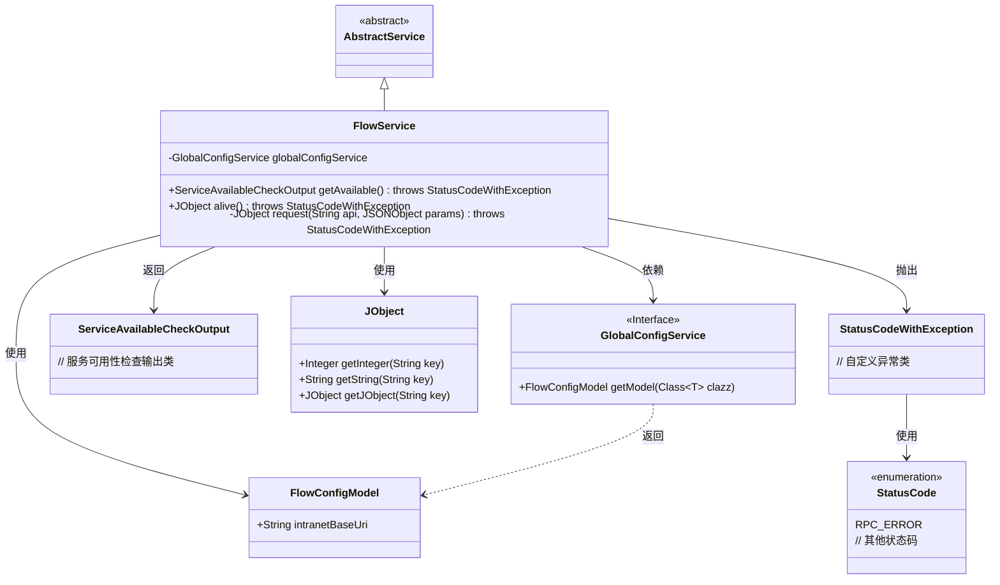
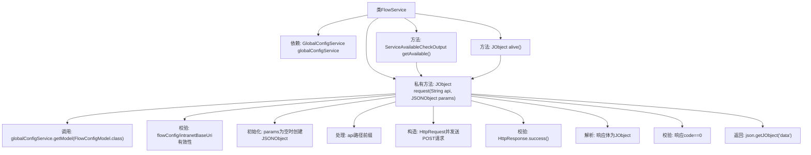

# 基础信息

|      |      |
|------|------|
| 名称 | FlowService |
| 编码语言 | .java |
| 代码路径 | WeFe/board/board-service/src/main/java/com/welab/wefe/board/service/sdk/FlowService.java |
| 包名 | com.welab.wefe.board.service.sdk |
| 依赖项 | ['com.alibaba.fastjson.JSONException', 'com.alibaba.fastjson.JSONObject', 'com.welab.wefe.board.service.service.AbstractService', 'com.welab.wefe.board.service.service.globalconfig.GlobalConfigService', 'com.welab.wefe.common.StatusCode', 'com.welab.wefe.common.exception.StatusCodeWithException', 'com.welab.wefe.common.http.HttpRequest', 'com.welab.wefe.common.http.HttpResponse', 'com.welab.wefe.common.util.JObject', 'com.welab.wefe.common.util.StringUtil', 'com.welab.wefe.common.wefe.checkpoint.dto.ServiceAvailableCheckOutput', 'com.welab.wefe.common.wefe.dto.global_config.FlowConfigModel', 'org.springframework.beans.factory.annotation.Autowired', 'org.springframework.stereotype.Service'] |
| 概述说明 | FlowService提供检查服务可用性和存活状态的方法，通过内网地址调用API并处理响应，若配置缺失或请求失败则抛出异常。 |

# 说明

FlowService是一个继承自AbstractService的服务类，用于处理与flow服务相关的HTTP请求。它通过globalConfigService获取flow服务的配置信息，包括内网地址。主要提供两个公共方法：getAvailable用于检查服务可用性，返回ServiceAvailableCheckOutput对象；alive用于检测服务存活状态，返回JObject对象。内部request方法处理具体请求逻辑，包括参数校验、地址拼接、HTTP请求发送及响应处理。若配置缺失或请求失败，会抛出StatusCodeWithException异常。成功响应需包含code为0的JSON数据，否则同样抛出异常。

# 类列表 Class Summary

| 名称   | 类型  | 说明 |
|-------|------|-------------|
| FlowService | class | FlowService提供两个API：getAvailable检查服务可用性，alive检查存活状态。内部request方法处理HTTP请求，验证配置和响应，异常时抛出状态码错误。 |

## 类 FlowService

|      |      |
|------|------|
| 访问范围 | @Service;public |
| 类型 | class |
| 名称 | FlowService |
| 说明 | FlowService提供两个API：getAvailable检查服务可用性，alive检查存活状态。内部request方法处理HTTP请求，验证配置和响应，异常时抛出状态码错误。 |

### UML类图

这段代码展示了一个FlowService类，它继承自AbstractService，主要用于与远程服务进行HTTP通信。该类通过GlobalConfigService获取配置信息，提供了getAvailable()和alive()两个公共方法，以及一个私有的request()方法处理实际的HTTP请求。代码中包含了详细的错误处理逻辑，会检查配置有效性、HTTP响应状态和返回数据的格式，并在出现问题时抛出StatusCodeWithException异常。类图中清晰地展示了这些类之间的关系和依赖。

### 内部方法调用关系图

流程图描述：该流程图展示了FlowService类的核心处理逻辑，重点描述了request方法的完整调用链。从获取全局配置开始，经过参数校验、请求构造、响应处理等多个步骤，最终返回有效数据或抛出异常。其中包含对HTTP请求的完整生命周期管理和严格的错误处理机制。

### 字段列表 Field List

| 名称  | 类型  | 说明 |
|-------|-------|------|
| globalConfigService | GlobalConfigService | 使用@Autowired自动注入GlobalConfigService实例。 |

### 方法列表

| 名称  | 类型  | 说明 |
|-------|-------|------|
| getAvailable | ServiceAvailableCheckOutput | 该方法通过请求"/service/available"接口获取服务可用性状态，返回ServiceAvailableCheckOutput对象，可能抛出StatusCodeWithException异常。 |
| alive | JObject | 检查服务存活状态，调用"/service/alive"接口，无参数，返回JObject对象，可能抛出StatusCodeWithException异常。 |
| request | JObject | 该方法用于向指定API发送POST请求。首先检查全局配置中的内网地址，若未设置则报错。处理参数后发送请求，失败时抛出异常。解析响应JSON，检查状态码非0时抛出异常，成功则返回数据部分。 |

